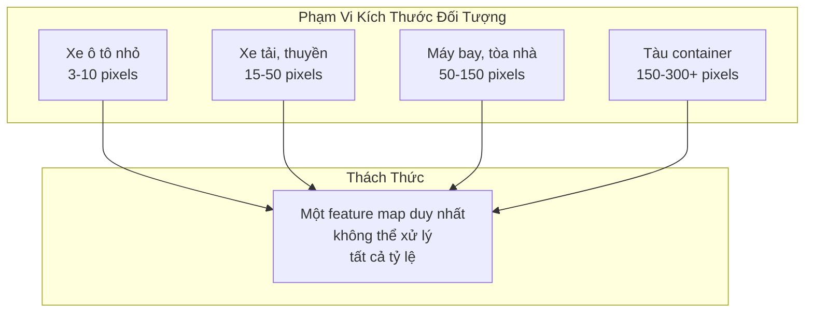
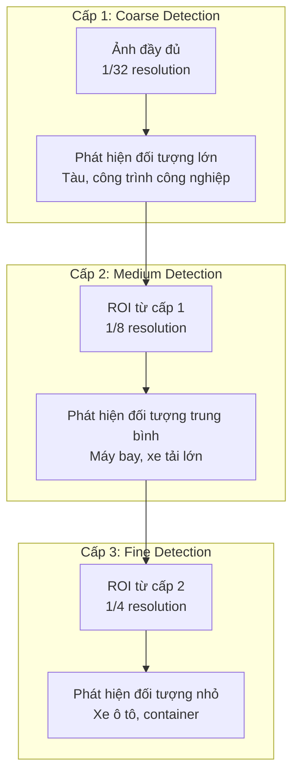
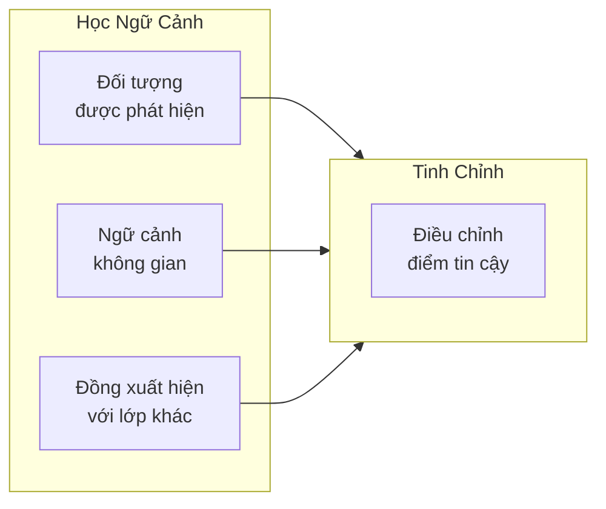
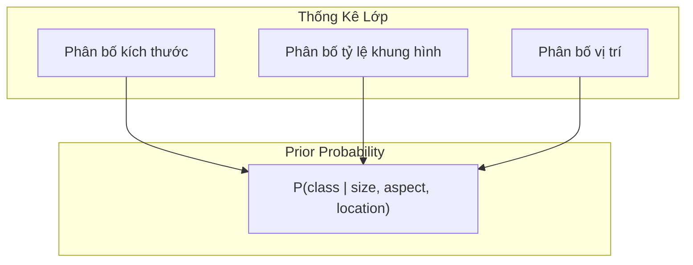

# 6.1.4 Giải Pháp Hạng Ba xView1: Multi-Scale Pattern Recognition

## Lời Dẫn

Trong khi hai giải pháp hàng đầu tập trung vào thiết kế hàm mất mát và học đặc trưng robust, giải pháp hạng ba của nhóm University of South Florida tiếp cận bài toán từ góc độ pattern recognition cổ điển. Với hơn 25 năm kinh nghiệm trong lĩnh vực nhận dạng mẫu, Prof. Sudeep Sarkar và nhóm nghiên cứu đã áp dụng các nguyên lý phân tích đa tỷ lệ kết hợp với deep learning để xử lý hiệu quả sự biến thiên khổng lồ về kích thước đối tượng trong xView1.

| Thuộc tính | Giá trị |
|-----------|---------|
| **Xếp hạng** | 3/2,300+ bài nộp |
| **Tác giả** | Prof. Sudeep Sarkar và nhóm |
| **Đơn vị** | University of South Florida |
| **Điểm mAP** | ~25 (ước tính) |
| **Đóng góp chính** | Hierarchical Multi-Scale Analysis |

---

## 1. Bối Cảnh Nghiên Cứu

### 1.1 Nền Tảng Pattern Recognition

Nhóm nghiên cứu USF có truyền thống mạnh về pattern recognition với các công trình nổi bật trong:
- **Nhận dạng dáng đi (Gait Recognition)**: Hệ thống nhận dạng người qua dáng đi
- **Phân tích hình dạng (Shape Analysis)**: Đối sánh và truy vấn hình dạng 3D
- **Tổ chức tri giác (Perceptual Organization)**: Thuật toán cho nhận thức thị giác

Kinh nghiệm này đặc biệt phù hợp với xView1, nơi đối tượng có hình dạng và kích thước biến thiên lớn.

### 1.2 Thách Thức Đa Tỷ Lệ

---

## 2. Kiến Trúc Phân Tích Đa Cấp

### 2.1 Hierarchical Feature Pyramid

Nhóm USF mở rộng Feature Pyramid Network với cấu trúc phân cấp đa lớp:

### 2.2 Context-Aware Detection

Một đóng góp quan trọng là sử dụng ngữ cảnh không gian để cải thiện phân loại:

| Loại ngữ cảnh | Ví dụ | Ứng dụng |
|---------------|-------|----------|
| **Không gian** | Xe ô tô trên đường | Xác nhận phân loại |
| **Đồng xuất hiện** | Máy bay gần đường băng | Tăng confidence |
| **Mật độ** | Cluster xe ở bãi đỗ | Phát hiện bãi đỗ |
| **Kích thước tương đối** | So sánh với đối tượng lân cận | Loại bỏ false positive |

---

## 3. Chiến Lược Huấn Luyện

### 3.1 Curriculum Learning

Nhóm áp dụng chiến lược học theo chương trình, bắt đầu từ các nhiệm vụ dễ:

| Giai đoạn | Epochs | Nội dung |
|-----------|--------|----------|
| 1 | 1-5 | Chỉ đối tượng lớn (>100 pixels) |
| 2 | 6-12 | Thêm đối tượng trung bình (30-100) |
| 3 | 13-20 | Thêm đối tượng nhỏ (<30 pixels) |
| 4 | 21-30 | Tất cả đối tượng, fine-tuning |

### 3.2 Statistical Class Modeling

Nhóm mô hình hóa phân bố của từng lớp để cải thiện prior:

---

## 4. Kết Quả và Phân Tích

### 4.1 Hiệu Suất Theo Tỷ Lệ

| Nhóm kích thước | AP | Ghi chú |
|-----------------|-----|---------|
| Nhỏ (<32 px) | 0.15 | Thách thức chính |
| Trung bình (32-96 px) | 0.35 | Cải thiện đáng kể |
| Lớn (>96 px) | 0.55 | Hiệu quả cao |

### 4.2 Đóng Góp Của Từng Thành Phần

| Cấu hình | mAP | Δ mAP |
|----------|-----|-------|
| Baseline FPN | 0.18 | - |
| + Hierarchical Detection | 0.21 | +0.03 |
| + Context Modeling | 0.23 | +0.02 |
| + Curriculum Learning | 0.24 | +0.01 |
| + Statistical Priors | 0.25 | +0.01 |

---

## 5. Ý Nghĩa và Bài Học

### 5.1 Kết Hợp Cổ Điển và Hiện Đại

Giải pháp của USF minh họa giá trị của việc kết hợp nguyên lý pattern recognition cổ điển với deep learning:
- **Phân tích đa tỷ lệ**: Nguyên lý cổ điển, triển khai hiện đại
- **Ngữ cảnh không gian**: Tri thức domain được mã hóa
- **Mô hình thống kê**: Prior probability cải thiện posterior

### 5.2 Bài Học Cho Nghiên Cứu

1. **Kiến thức domain vẫn quan trọng**: Deep learning không thay thế hoàn toàn tri thức chuyên gia
2. **Curriculum learning hiệu quả**: Học từ dễ đến khó cải thiện hội tụ
3. **Ngữ cảnh cải thiện phân loại**: Không chỉ nhìn đối tượng riêng lẻ
4. **Prior hợp lý giúp ích**: Mô hình thống kê bổ sung cho deep learning

---

## Tài Liệu Tham Khảo

1. Sarkar, S., et al. Various publications on pattern recognition and shape analysis. IEEE PAMI.

2. Lin, T. Y., et al. (2017). Feature Pyramid Networks for Object Detection. CVPR.

3. Bengio, Y., et al. (2009). Curriculum Learning. ICML.

---

*Mục tiếp theo sẽ trình bày giải pháp hạng tư của cuộc thi, với góc nhìn từ ngành công nghiệp về triển khai production-ready.*
