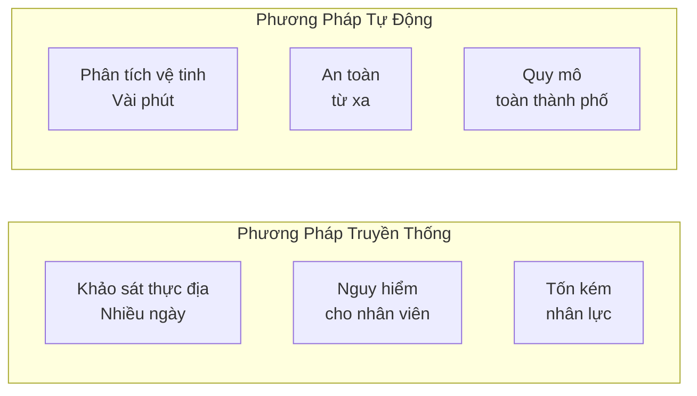
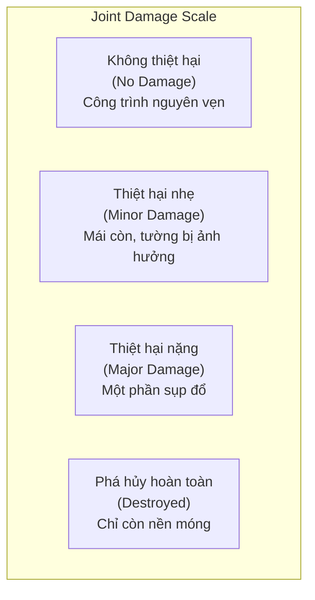
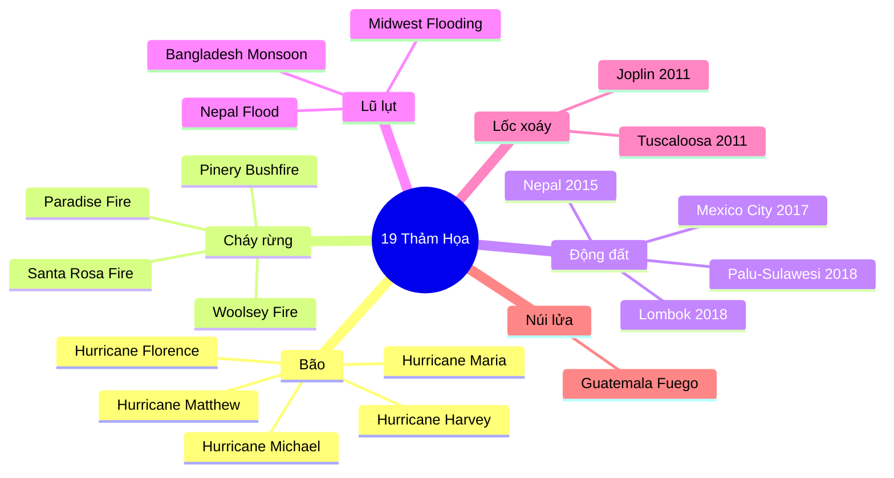
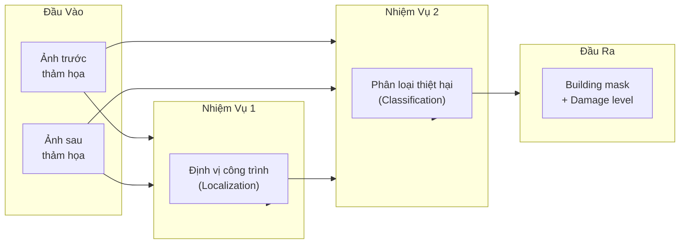
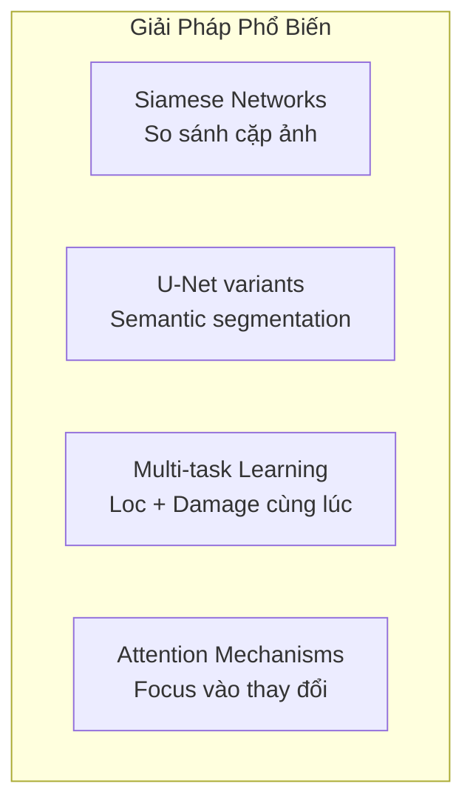

# 6.2.1 Bộ Dữ Liệu xBD: Đánh Giá Thiệt Hại Công Trình Sau Thảm Họa

## Lời Dẫn

Nếu xView1 đặt nền móng cho phát hiện đối tượng trong ảnh viễn thám, thì xView2 hướng đến một ứng dụng mang tính nhân đạo sâu sắc hơn: đánh giá nhanh thiệt hại công trình sau thảm họa. Khi động đất, bão, hay cháy rừng xảy ra, mỗi phút trì hoãn trong việc xác định khu vực bị ảnh hưởng nặng nhất có thể đồng nghĩa với mất mát thêm nhiều sinh mạng. Bộ dữ liệu xBD (xView Building Damage) được thiết kế để giải quyết bài toán này thông qua học máy.

| Thuộc tính | Giá trị |
|-----------|---------|
| **Năm phát hành** | 2019 |
| **Tổ chức** | DIU + CMU SEI |
| **Số công trình** | 850,736 polygon |
| **Số thảm họa** | 19 sự kiện, 6 loại |
| **Quốc gia** | 15+ |
| **Đặc điểm** | Cặp ảnh trước/sau thảm họa |
| **Thang thiệt hại** | 4 cấp độ (Joint Damage Scale) |
| **Bài báo** | CVPR 2019 Workshop |

---

## 1. Bối Cảnh và Động Lực

### 1.1 Vấn Đề Thực Tiễn

Khi thảm họa xảy ra, việc đánh giá thiệt hại theo phương pháp truyền thống gặp nhiều hạn chế:



Một trận động đất có thể phá hủy hàng chục nghìn công trình, và việc kiểm tra từng tòa nhà theo phương pháp truyền thống có thể mất nhiều ngày. xBD cung cấp nền tảng để huấn luyện mô hình có thể phân tích toàn bộ một thành phố trong vòng vài phút.

### 1.2 Kế Thừa Từ xView1

Kinh nghiệm từ xView1 Challenge ảnh hưởng trực tiếp đến thiết kế xBD:

| Bài học từ xView1 | Áp dụng vào xBD |
|-------------------|-----------------|
| Mất cân bằng lớp | Thiết kế 4 cấp thiệt hại cân bằng hơn |
| Cần chuẩn hóa | Joint Damage Scale với các chuyên gia |
| Domain gap | Đa dạng loại thảm họa và kiến trúc |
| Annotation quality | Quy trình QC chặt chẽ |

---

## 2. Joint Damage Scale

### 2.1 Thang Đo Bốn Cấp Độ

xBD giới thiệu Joint Damage Scale - thang đo chuẩn hóa được phát triển với các chuyên gia từ NASA, FEMA, CAL FIRE:



### 2.2 Đặc Điểm Quan Sát

| Cấp độ | Đặc điểm từ ảnh vệ tinh |
|--------|------------------------|
| **No Damage** | Mái nhà nguyên vẹn, không thay đổi so với ảnh trước |
| **Minor** | Mái còn, có dấu hiệu hư hại nhẹ (màu sắc thay đổi) |
| **Major** | Một phần mái sụp, cấu trúc bị phá vỡ |
| **Destroyed** | Chỉ còn nền móng, mất hoàn toàn cấu trúc |

---

## 3. Đặc Điểm Kỹ Thuật

### 3.1 Thống Kê Tổng Quan

| Chỉ số | Train | Test | Holdout | Tổng |
|--------|-------|------|---------|------|
| **Polygon** | 632,228 | 109,724 | 108,784 | 850,736 |
| **Ảnh** | 18,336 | 1,866 | 1,866 | 22,068 |
| **Cặp pre/post** | 9,168 | 933 | 933 | 11,034 |

### 3.2 Nguồn Ảnh

| Đặc điểm | Thông số |
|----------|----------|
| **Vệ tinh** | WorldView-1/2/3, GeoEye-1 |
| **GSD** | 0.3 - 0.8 mét |
| **Kích thước** | 1024 × 1024 pixels |
| **Định dạng** | PNG RGB |
| **Nguồn** | Maxar Open Data Program |

### 3.3 Các Sự Kiện Thảm Họa



---

## 4. Bài Toán Đa Nhiệm

### 4.1 Hai Giai Đoạn

xView2 Challenge yêu cầu giải quyết bài toán đa nhiệm:



### 4.2 Metric Đánh Giá

Cuộc thi sử dụng metric kết hợp:

$$\text{xView2 Score} = 0.3 \times F1_{loc} + 0.7 \times F1_{dmg}$$

- **Localization F1**: Đánh giá khả năng phát hiện công trình
- **Damage F1**: Đánh giá khả năng phân loại thiệt hại (weighted)

---

## 5. Thách Thức Kỹ Thuật

### 5.1 Các Thách Thức Chính

| Thách thức | Mô tả |
|------------|-------|
| **Change Detection** | So sánh cặp ảnh pre/post với góc chụp khác nhau |
| **Class Imbalance** | ~80% công trình không thiệt hại |
| **Fine-grained** | Phân biệt Minor vs Major damage |
| **Multi-disaster** | Generalize qua nhiều loại thảm họa |
| **Resolution variation** | GSD từ 0.3 đến 0.8 mét |

### 5.2 Ảnh Hưởng Đến Thiết Kế Mô Hình



---

## 6. Phân Bố Thiệt Hại

### 6.1 Mất Cân Bằng Lớp

| Cấp độ | Số lượng | Tỷ lệ |
|--------|----------|-------|
| No Damage | ~680,000 | 80% |
| Minor Damage | ~85,000 | 10% |
| Major Damage | ~51,000 | 6% |
| Destroyed | ~34,000 | 4% |

Tỷ lệ mất cân bằng nhẹ hơn xView1 (80:10:6:4 so với 3000:1), nhưng vẫn đòi hỏi các kỹ thuật xử lý như Focal Loss hoặc class weighting.

### 6.2 Biến Thiên Theo Loại Thảm Họa

| Loại thảm họa | Đặc điểm thiệt hại |
|---------------|-------------------|
| **Cháy rừng** | Binary: nguyên vẹn hoặc cháy rụi |
| **Động đất** | Gradient: từ nhẹ đến sụp đổ |
| **Bão** | Mái hư hại, ngập lụt |
| **Lốc xoáy** | Phá hủy theo dải |

---

## 7. So Sánh Với Dataset Khác

| Dataset | Số công trình | Số thảm họa | Cặp pre/post | Thang đo |
|---------|--------------|-------------|--------------|----------|
| **xBD** | 850,736 | 19 | Có | 4 cấp |
| Harvey Homes | 5,000 | 1 | Không | Binary |
| Building Change | 7,500 | 3 | Có | Binary |
| ASONAM | 20,000 | 1 | Có | 5 cấp |

xBD vượt trội về quy mô, đa dạng, và chuẩn hóa.

---

## 8. Ứng Dụng Thực Tiễn

### 8.1 Case Study: California Wildfires 2020

California Air National Guard đã sử dụng mô hình huấn luyện trên xBD:
- **Thời gian phân tích**: 10-20 phút (so với 1-2 ngày thủ công)
- **Phạm vi**: Toàn bộ khu vực cháy
- **Ứng dụng**: Ưu tiên khu vực cứu hộ

### 8.2 Kết Quả Cuộc Thi

| Hạng | Đội | xView2 Score |
|------|-----|--------------|
| 1 | MakeML | 0.821 |
| 2 | XD_XD | 0.812 |
| 3 | Simula | 0.805 |
| 4 | JIJI | 0.798 |
| 5 | selim_sef | 0.792 |

---

## 9. Tài Nguyên

### 9.1 Truy Cập

- **Website**: [xview2.org](https://xview2.org/)
- **GitHub**: [DIUx-xView/xView2_baseline](https://github.com/DIUx-xView/xView2_baseline)
- **Dung lượng**: ~11 GB

### 9.2 Bài Báo

```
@inproceedings{gupta2019xbd,
  title={Creating xBD: A Dataset for Assessing Building Damage from Satellite Imagery},
  author={Gupta, Ritwik and Hosfelt, Richard and Sajeev, Sandra and others},
  booktitle={CVPR Workshop},
  year={2019}
}
```

---

## Tài Liệu Tham Khảo

1. Gupta, R., et al. (2019). Creating xBD: A Dataset for Assessing Building Damage from Satellite Imagery. CVPR Workshop.

2. Maxar Open Data Program. Maxar Technologies.

3. Joint Damage Scale. DIU and Partner Organizations.

---

*Mục tiếp theo sẽ trình bày giải pháp hạng nhất của cuộc thi xView2, với kiến trúc Siamese U-Net cho bài toán đánh giá thiệt hại.*
