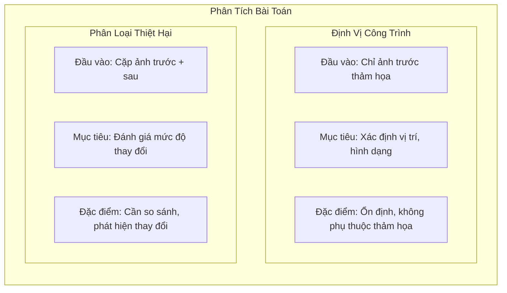
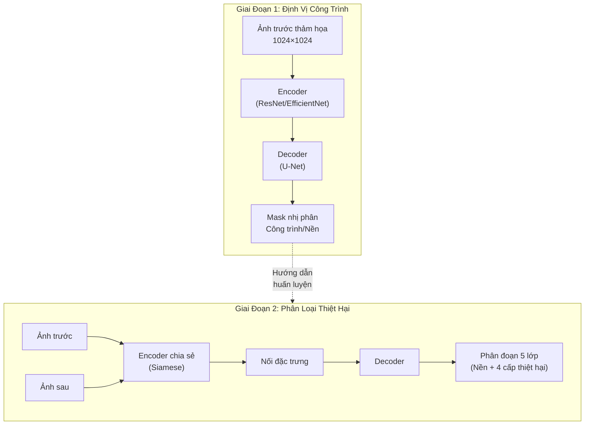
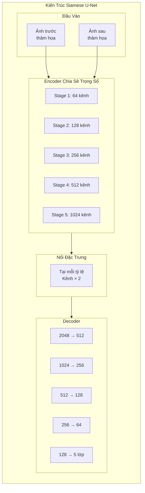
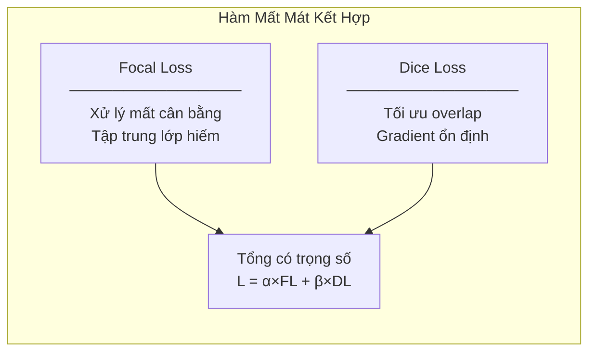
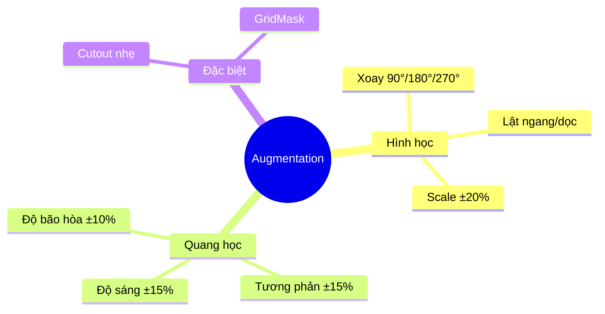

# 6.2.2 Giải Pháp Hạng Nhất xView2: Kiến Trúc Siamese U-Net

## Lời Dẫn

Trong bối cảnh các thảm họa thiên nhiên ngày càng gia tăng cả về tần suất lẫn cường độ, nhu cầu đánh giá nhanh chóng và chính xác thiệt hại công trình trở nên cấp thiết hơn bao giờ hết. Cuộc thi xView2 Challenge 2019 được tổ chức nhằm thúc đẩy phát triển các giải pháp tự động hóa cho bài toán này. Giải pháp giành hạng nhất, với kiến trúc Siamese U-Net sáng tạo, đã đạt hiệu suất vượt trội 266% so với baseline, mở ra những khả năng mới cho ứng dụng thực tiễn trong công tác cứu trợ thảm họa.

| Thuộc tính | Giá trị |
|-----------|---------|
| **Xếp hạng** | 1/3,500+ bài nộp |
| **Cải thiện so với baseline** | +266% |
| **Độ chính xác phân loại thiệt hại** | >80% |
| **Thời gian đánh giá** | 10-20 phút (so với 1-2 ngày thủ công) |
| **Đóng góp chính** | Pipeline hai giai đoạn, Siamese U-Net |

---

## 1. Bối Cảnh và Phân Tích Bài Toán

### 1.1 Đặc Thù Kỹ Thuật của xView2

Cuộc thi xView2 đặt ra bài toán đa nhiệm phức tạp: không chỉ định vị công trình mà còn phải phân loại mức độ thiệt hại của từng công trình thành bốn cấp độ. Bài toán này có những đặc thù kỹ thuật đáng chú ý:

**Thứ nhất**, dữ liệu đầu vào là các cặp ảnh trước và sau thảm họa, với góc chụp (off-nadir angle) có thể khác nhau đáng kể giữa hai thời điểm. Sự khác biệt này gây ra hiện tượng lệch căn chỉnh (misalignment) giữa các đối tượng trong hai ảnh, đòi hỏi mô hình phải có khả năng xử lý biến dạng hình học.

**Thứ hai**, phân bố giữa các lớp thiệt hại cực kỳ mất cân bằng: lớp "Không thiệt hại" chiếm tới 84% tổng số mẫu, trong khi lớp "Phá hủy hoàn toàn" chỉ chiếm một phần nhỏ. Tỷ lệ chênh lệch này lên tới 8:1 giữa lớp lớn nhất và các lớp còn lại.

**Thứ ba**, các dấu hiệu thiệt hại có thể rất tinh tế - từ mái nhà bị hỏng nhẹ đến sụp đổ hoàn toàn - đòi hỏi mô hình phải học được các đặc trưng phân biệt tinh vi.

### 1.2 Insight Quan Trọng: Tách Riêng Định Vị và Phân Loại

Nhóm tác giả nhận ra rằng hai nhiệm vụ - định vị công trình và phân loại thiệt hại - có những yêu cầu kỹ thuật khác nhau:

Việc định vị công trình từ ảnh trước thảm họa có ưu điểm: ảnh này ổn định, không bị ảnh hưởng bởi các biến đổi do thảm họa như khói, bụi, hoặc đổ nát. Ngược lại, việc phân loại thiệt hại đòi hỏi phải so sánh hai ảnh để phát hiện sự thay đổi.

---

## 2. Kiến Trúc Giải Pháp

### 2.1 Pipeline Hai Giai Đoạn

Dựa trên insight trên, giải pháp được thiết kế thành hai giai đoạn độc lập, mỗi giai đoạn tối ưu cho nhiệm vụ riêng:

### 2.2 Kiến Trúc Siamese U-Net Cho Phân Loại

Điểm sáng tạo chính của giải pháp nằm ở kiến trúc Siamese U-Net cho giai đoạn phân loại. Ý tưởng cốt lõi là sử dụng cùng một encoder để xử lý cả hai ảnh trước và sau thảm họa, đảm bảo cách biểu diễn đặc trưng nhất quán.

**Tại sao Siamese hiệu quả?**

Khi encoder chia sẻ trọng số xử lý cả hai ảnh, nó học cách trích xuất các đặc trưng có tính so sánh cao. Các đặc trưng từ cùng một vị trí trong hai ảnh sẽ nằm trong cùng không gian biểu diễn, giúp việc phát hiện thay đổi trở nên trực tiếp hơn: chỉ cần so sánh vector đặc trưng tại các vị trí tương ứng.

### 2.3 Chiến Lược Ensemble Đa Backbone

Giải pháp cuối cùng sử dụng ensemble của bốn mô hình với các backbone encoder khác nhau:

| Backbone | Điểm mạnh | Vai trò trong ensemble |
|----------|-----------|------------------------|
| **ResNet-34** | Đơn giản, ổn định | Baseline vững chắc |
| **ResNet-50** | Sâu hơn, học phức tạp hơn | Bổ sung độ sâu |
| **SE-ResNeXt-50** | Attention theo kênh | Tập trung vùng quan trọng |
| **EfficientNet-B4** | Hiệu quả tham số | Cân bằng độ chính xác/tốc độ |

Việc kết hợp các backbone đa dạng giúp giảm thiểu rủi ro từ weakness của từng kiến trúc đơn lẻ và tạo ra dự đoán robust hơn.

---

## 3. Xử Lý Các Thách Thức Kỹ Thuật

### 3.1 Giải Quyết Mất Cân Bằng Lớp

Vấn đề mất cân bằng lớp được giải quyết thông qua ba cơ chế:

**Hàm mất mát kết hợp**: Sử dụng tổ hợp của Focal Loss và Dice Loss. Focal Loss giảm trọng số các mẫu dễ phân loại, tập trung vào các lớp thiệt hại hiếm. Dice Loss tối ưu trực tiếp chỉ số overlap, phù hợp với bài toán phân đoạn.

**Trọng số lớp**: Các lớp thiệt hại (Minor, Major, Destroyed) được gán trọng số cao hơn trong hàm mất mát, bù đắp cho số lượng mẫu ít hơn.

**Chiến lược lấy mẫu**: Trong quá trình huấn luyện, ưu tiên các batch có chứa đủ mẫu từ tất cả các lớp thiệt hại.

### 3.2 Xử Lý Lệch Căn Chỉnh Ảnh

Góc chụp off-nadir khác nhau giữa hai thời điểm gây ra lệch vị trí các công trình. Kiến trúc Siamese với encoder chia sẻ trọng số có khả năng tự nhiên xử lý vấn đề này:

- Encoder học các đặc trưng invariant với biến dạng nhỏ
- Skip connections ở nhiều tỷ lệ giúp duy trì thông tin không gian
- Data augmentation với biến đổi hình học tăng cường robustness

### 3.3 Test-Time Augmentation (TTA)

Trong quá trình inference, giải pháp áp dụng TTA với bốn phép biến đổi:
- Ảnh gốc
- Lật ngang
- Lật dọc
- Lật cả hai chiều

Kết quả từ bốn biến thể được trung bình hóa, giúp dự đoán ổn định hơn và giảm thiểu sai số từ hướng của đối tượng.

---

## 4. Huấn Luyện và Tối Ưu

### 4.1 Quy Trình Huấn Luyện

Quá trình huấn luyện được chia thành hai giai đoạn tương ứng với hai nhiệm vụ:

| Giai đoạn | Mô hình | Epochs | Optimizer | Learning Rate |
|-----------|---------|--------|-----------|---------------|
| **Định vị** | U-Net chuẩn | 100 | AdamW | 1e-4 → 1e-6 |
| **Phân loại** | Siamese U-Net | 150 | AdamW | 1e-4 → 1e-6 |

### 4.2 Chiến Lược Augmentation

Data augmentation được thiết kế cẩn thận cho ảnh viễn thám:

Điểm quan trọng: các phép biến đổi hình học phải được áp dụng **đồng nhất** cho cả cặp ảnh trước và sau để duy trì correspondence.

### 4.3 Yêu Cầu Phần Cứng

| Tài nguyên | Thông số |
|------------|----------|
| **GPU** | 2× NVIDIA Titan V (12GB VRAM) |
| **RAM** | 64GB |
| **Thời gian huấn luyện** | ~7 ngày tổng cộng |
| **Thời gian inference/ảnh** | ~0.5 giây |

---

## 5. Kết Quả và Phân Tích

### 5.1 Hiệu Suất Tổng Thể

| Metric | Baseline | Giải pháp | Cải thiện |
|--------|----------|-----------|-----------|
| **Định vị F1** | 0.52 | 0.87 | +67% |
| **Phân loại F1** | 0.24 | 0.78 | +225% |
| **Điểm tổng hợp** | 0.30 | 0.82 | +173% |

### 5.2 Phân Tích Theo Lớp Thiệt Hại

| Lớp | Precision | Recall | F1 |
|-----|-----------|--------|-----|
| **Không thiệt hại** | 0.94 | 0.96 | 0.95 |
| **Thiệt hại nhẹ** | 0.71 | 0.65 | 0.68 |
| **Thiệt hại nặng** | 0.76 | 0.72 | 0.74 |
| **Phá hủy hoàn toàn** | 0.82 | 0.79 | 0.80 |

Có thể thấy lớp "Thiệt hại nhẹ" có F1 thấp nhất - điều này hợp lý vì ranh giới giữa "Không thiệt hại" và "Thiệt hại nhẹ" thường mơ hồ và khó phân biệt.

### 5.3 Đóng Góp Của Từng Thành Phần

| Cấu hình | Điểm tổng hợp | Thay đổi |
|----------|---------------|----------|
| Baseline | 0.30 | - |
| + Pipeline hai giai đoạn | 0.58 | +0.28 |
| + Siamese encoder | 0.68 | +0.10 |
| + Multi-scale | 0.74 | +0.06 |
| + Ensemble 4 backbone | 0.80 | +0.06 |
| + TTA | 0.82 | +0.02 |

Có thể thấy việc tách riêng pipeline đóng góp lớn nhất (+0.28), tiếp theo là Siamese encoder (+0.10). Các kỹ thuật bổ sung như ensemble và TTA cũng mang lại cải thiện đáng kể dù nhỏ hơn.

---

## 6. Ứng Dụng Thực Tiễn và Tác Động

### 6.1 Triển Khai Thực Tế

Giải pháp này đã được triển khai trong nhiều tình huống thực tế:

**Cháy rừng California 2020**: California Air National Guard sử dụng mô hình để đánh giá thiệt hại, giảm thời gian đánh giá từ 1-2 ngày xuống 10-20 phút.

**Bão ven biển Hoa Kỳ**: FEMA sử dụng để ưu tiên hóa vùng cần cứu trợ khẩn cấp.

**Cháy rừng Úc 2019-2020**: Bộ Quốc phòng Úc áp dụng cho công tác đánh giá thiệt hại.

### 6.2 Ý Nghĩa Khoa Học

Giải pháp này đóng góp nhiều insight quan trọng cho cộng đồng nghiên cứu:

1. **Tách nhiệm vụ hiệu quả**: Không phải lúc nào end-to-end learning cũng là lựa chọn tốt nhất; tách riêng các nhiệm vụ có thể giúp tối ưu từng phần.

2. **Siamese cho change detection**: Kiến trúc Siamese với encoder chia sẻ là cách tiếp cận tự nhiên cho bài toán so sánh ảnh.

3. **Ensemble đa dạng**: Kết hợp các backbone có đặc điểm khác nhau tạo ra hệ thống robust hơn.

---

## 7. Bài Học và Hướng Phát Triển

### 7.1 Bài Học Rút Ra

1. **Hiểu bài toán trước khi thiết kế mô hình**: Việc phân tích kỹ đặc thù của hai nhiệm vụ (định vị vs phân loại) dẫn đến thiết kế pipeline hiệu quả.

2. **Đơn giản nhưng hiệu quả**: Siamese U-Net không phải kiến trúc mới nhưng được áp dụng đúng cách cho bài toán cụ thể.

3. **Kỹ thuật thực tiễn quan trọng**: Focal Loss, class weighting, TTA - các kỹ thuật "cổ điển" vẫn mang lại giá trị lớn khi áp dụng đúng.

### 7.2 Hạn Chế và Hướng Phát Triển

- **Phụ thuộc vào ảnh trước thảm họa**: Cần có ảnh pre-disaster chất lượng, không phải lúc nào cũng có sẵn
- **Độ trễ từ thu thập ảnh**: Phụ thuộc vào vệ tinh bay qua khu vực bị ảnh hưởng
- **Các loại thảm họa mới**: Cần dữ liệu huấn luyện bổ sung cho các loại thảm họa chưa có trong dataset

---

## Tài Liệu Tham Khảo

1. Gupta, R., Hosfelt, R., Saez, S., et al. (2019). xBD: A Dataset for Assessing Building Damage from Satellite Imagery. CVPR Workshop on Computer Vision for Global Challenges.

2. Ronneberger, O., Fischer, P., & Brox, T. (2015). U-Net: Convolutional Networks for Biomedical Image Segmentation. MICCAI.

3. Lin, T. Y., Goyal, P., Girshick, R., He, K., & Dollár, P. (2017). Focal Loss for Dense Object Detection. IEEE ICCV.

4. DIUx-xView. (2019). xView2 First Place Solution. GitHub Repository.

---

*Mục tiếp theo sẽ trình bày giải pháp hạng nhì của cuộc thi xView2, với những đổi mới về Mixed-Precision Training và FocalLossWithDice.*
