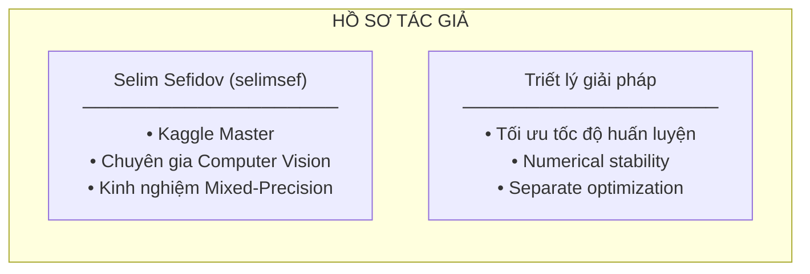
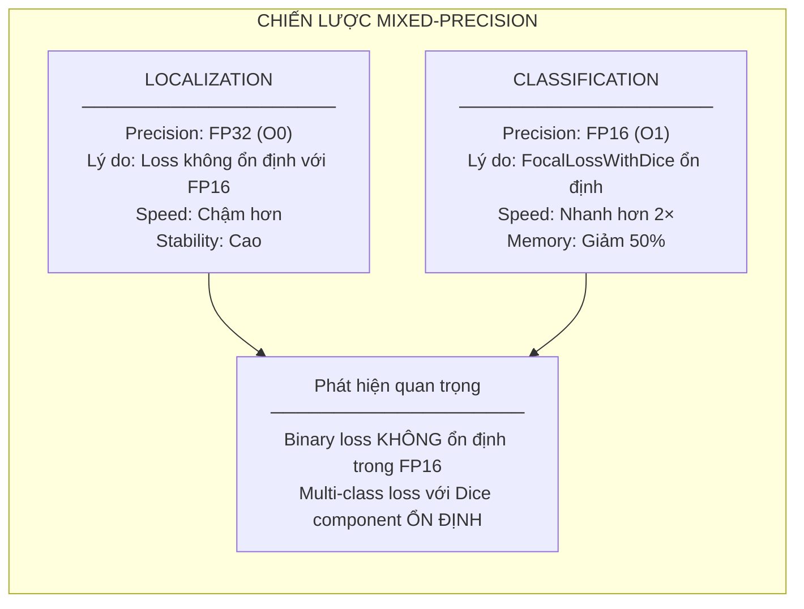
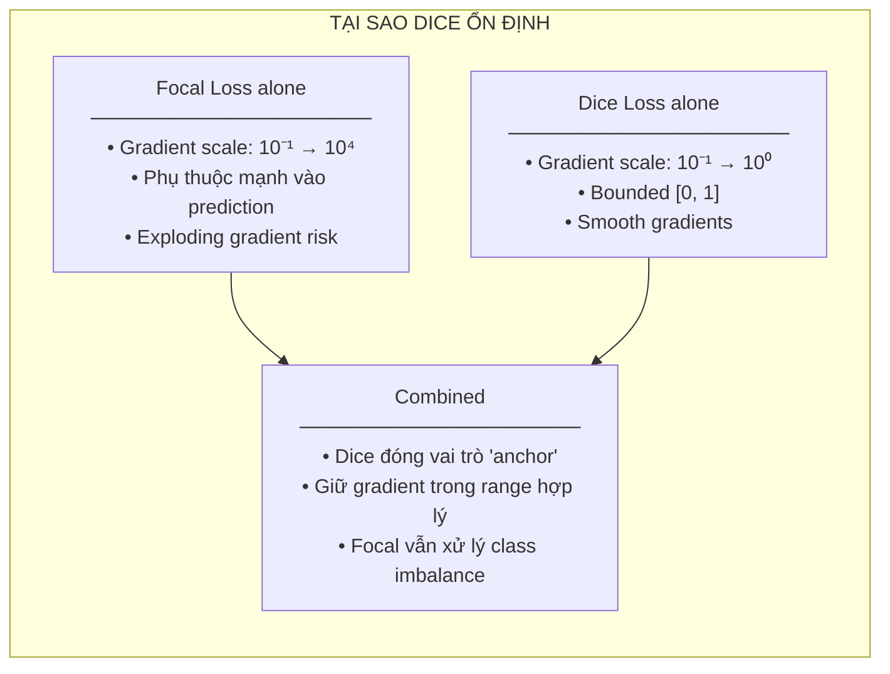
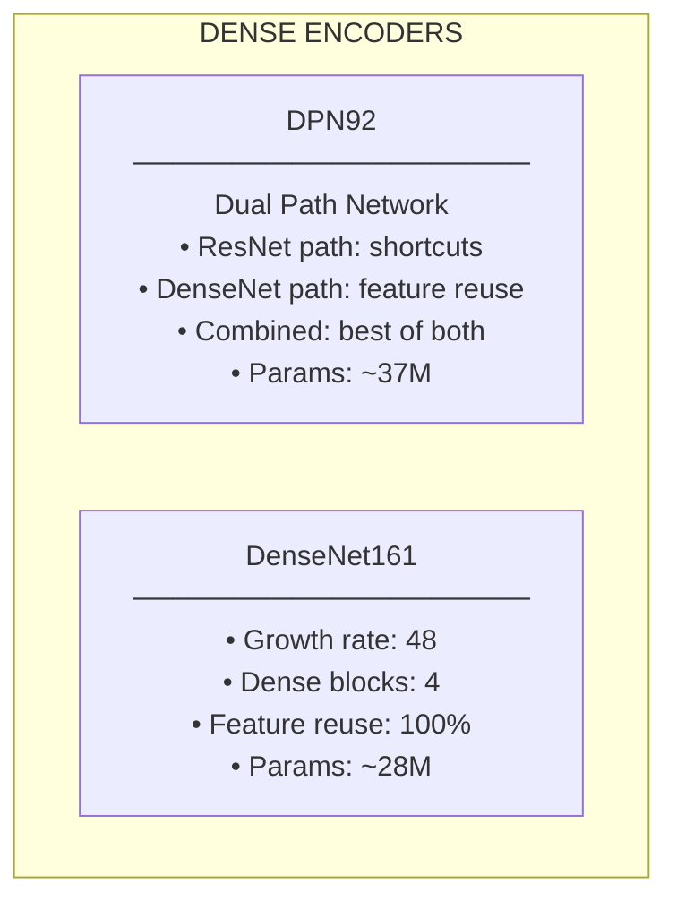
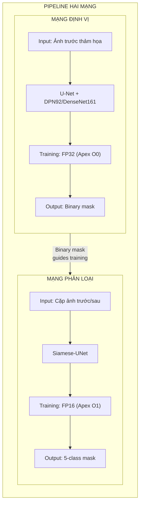
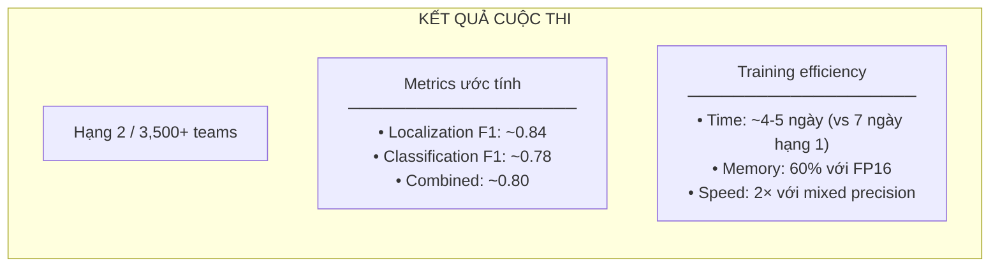
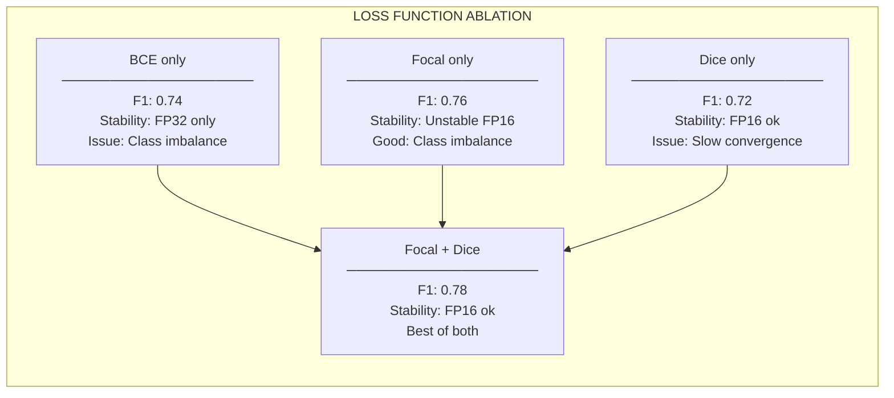

# Chương 6: xView2 Hạng 2: Giải pháp Selim Sefidov

## Tổng quan nhanh

| Thuộc tính | Giá trị |
|-----------|-------|
| **Hạng** | Hạng 2 |
| **Tác giả** | Selim Sefidov (selimsef) |
| **GitHub** | [DIUx-xView/xView2_second_place](https://github.com/DIUx-xView/xView2_second_place) |
| **Forked từ** | selimsef/xview2_solution |
| **Đổi mới chính** | Mixed-Precision Training với Apex + FocalLossWithDice |
| **Framework** | PyTorch + NVIDIA Apex |

---

## Mục lục

1. [Tổng Quan và Bối Cảnh](#1-tổng-quan-và-bối-cảnh)
2. [Đổi Mới Kỹ Thuật Chính](#2-đổi-mới-kỹ-thuật-chính)
3. [Kiến Trúc và Triển Khai](#3-kiến-trúc-và-triển-khai)
4. [Huấn Luyện và Tối Ưu](#4-huấn-luyện-và-tối-ưu)
5. [Kết Quả và Phân Tích](#5-kết-quả-và-phân-tích)
6. [Tái Tạo và Tài Nguyên](#6-tái-tạo-và-tài-nguyên)

---

## 1. Tổng Quan và Bối Cảnh

### 1.1 Thử Thách xView2

xView2 Challenge đặt ra bài toán đánh giá thiệt hại công trình từ ảnh vệ tinh với dataset xBD chứa hơn 850,000 polygon công trình. Giải pháp hạng 2 của Selim Sefidov nổi bật với việc tối ưu hóa quá trình huấn luyện thông qua mixed-precision training và thiết kế hàm mất mát thông minh.


*Hình 8: Số lượng building polygons per disaster type*

**Đặc điểm bài toán:**
- Cặp ảnh 1024×1024 trước/sau thảm họa
- Phân loại 4 cấp độ thiệt hại + background
- Class imbalance nghiêm trọng (84% "No Damage")
- Off-nadir angle variation gây lệch căn chỉnh

### 1.2 Bối Cảnh Tác Giả

Selim Sefidov là một Kaggle Master với kinh nghiệm sâu về computer vision và deep learning. Giải pháp của anh thể hiện sự hiểu biết sâu sắc về:
- Numerical stability trong training
- Mixed-precision optimization
- Loss function design



### 1.3 Đóng Góp Chính

1. **Mixed-Precision Training có chọn lọc**: FP32 cho localization, FP16 cho classification
2. **FocalLossWithDice**: Kết hợp loss ổn định trong FP16
3. **Dense Encoder**: DPN92 và DenseNet161 với feature reuse hiệu quả
4. **Pipeline huấn luyện riêng biệt**: Tối ưu từng nhiệm vụ độc lập

### 1.4 So Sánh với Giải pháp Hạng 1

| Khía cạnh | Hạng 1 | Hạng 2 (Selim) |
|-----------|--------|----------------|
| Precision | Full FP32 | Mixed FP16/FP32 |
| Training time | ~7 ngày | ~4-5 ngày |
| Encoder | 4 loại ensemble | DPN92 + DenseNet161 |
| Loss | Dice + Focal + CE | FocalLossWithDice |
| Memory | Cao | Thấp hơn (FP16) |

---

## 2. Đổi Mới Kỹ Thuật Chính

### 2.1 Mixed-Precision Training Strategy

Điểm sáng tạo nhất của giải pháp là chiến lược mixed-precision có chọn lọc:



**Tại sao binary loss không ổn định trong FP16?**

```python
# Vấn đề: Binary Cross Entropy trong FP16
# Khi probability gần 0 hoặc 1, log tạo ra giá trị cực lớn

def binary_cross_entropy_issue():
    # FP16 có range: ±65,504
    # log(1e-10) = -23 (vẫn ok)
    # log(1e-20) = -46 (overflow trong FP16)

    # Khi sigmoid(logit) ≈ 0.9999 (confident prediction)
    # target = 0 (wrong prediction)
    # loss = -log(1 - 0.9999) = -log(0.0001) = 9.2 (ok)
    # Nhưng gradient có thể explode

    # Giải pháp: Dùng FP32 cho binary loss
    pass
```

### 2.2 FocalLossWithDice

Thiết kế loss function kết hợp Focal Loss và Dice Loss ổn định trong FP16:

```python
class FocalLossWithDice(nn.Module):
    """
    Hàm mất mát kết hợp Focal Loss và Dice Loss.

    Đặc điểm:
    - Focal Loss: Xử lý class imbalance, giảm trọng số easy samples
    - Dice Loss: Tối ưu overlap, tạo smooth gradients
    - Kết hợp: Ổn định trong FP16 training

    Công thức:
        L = α × FocalLoss + β × DiceLoss

    Args:
        alpha: Trọng số cho Focal Loss (default: 1.0)
        gamma: Focal Loss gamma parameter (default: 2.0)
        dice_weight: Trọng số cho Dice Loss (default: 1.0)
    """

    def __init__(self, alpha=0.25, gamma=2.0, dice_weight=1.0, focal_weight=1.0):
        super().__init__()
        self.alpha = alpha
        self.gamma = gamma
        self.dice_weight = dice_weight
        self.focal_weight = focal_weight

    def focal_loss(self, logits, targets, num_classes):
        """
        Multi-class Focal Loss.

        Args:
            logits: [B, C, H, W] raw predictions
            targets: [B, H, W] class indices

        Returns:
            focal_loss: scalar
        """
        # Convert to probabilities
        probs = F.softmax(logits, dim=1)

        # One-hot encode targets
        targets_one_hot = F.one_hot(targets, num_classes).permute(0, 3, 1, 2).float()

        # Calculate focal weight
        pt = (probs * targets_one_hot).sum(dim=1)  # [B, H, W]
        focal_weight = (1 - pt) ** self.gamma

        # Cross entropy
        ce_loss = F.cross_entropy(logits, targets, reduction='none')

        # Apply focal weight
        focal_loss = self.alpha * focal_weight * ce_loss

        return focal_loss.mean()

    def dice_loss(self, logits, targets, num_classes, smooth=1e-6):
        """
        Multi-class Dice Loss.

        Dice Loss tạo smooth gradients, giúp ổn định FP16 training.

        Args:
            logits: [B, C, H, W] raw predictions
            targets: [B, H, W] class indices
            smooth: Smoothing factor để tránh division by zero

        Returns:
            dice_loss: scalar
        """
        probs = F.softmax(logits, dim=1)
        targets_one_hot = F.one_hot(targets, num_classes).permute(0, 3, 1, 2).float()

        # Calculate Dice for each class
        intersection = (probs * targets_one_hot).sum(dim=(0, 2, 3))
        union = probs.sum(dim=(0, 2, 3)) + targets_one_hot.sum(dim=(0, 2, 3))

        dice_per_class = (2 * intersection + smooth) / (union + smooth)
        dice_loss = 1 - dice_per_class.mean()

        return dice_loss

    def forward(self, logits, targets, num_classes=5):
        """
        Combined loss.

        Args:
            logits: [B, C, H, W] raw predictions
            targets: [B, H, W] class indices

        Returns:
            combined_loss: scalar
        """
        focal = self.focal_loss(logits, targets, num_classes)
        dice = self.dice_loss(logits, targets, num_classes)

        return self.focal_weight * focal + self.dice_weight * dice
```

**Tại sao Dice giúp ổn định FP16?**



### 2.3 Dense Encoder Architecture

Giải pháp sử dụng DPN92 và DenseNet161 - hai kiến trúc với dense connections:



**DPN92 Architecture Detail:**

```python
class DualPathBlock(nn.Module):
    """
    Dual Path Block kết hợp ResNet và DenseNet.

    ResNet path: x + F(x) - shortcut để gradient flow
    DenseNet path: [x, G(x)] - concat để feature reuse
    """

    def __init__(self, in_channels, out_channels, growth_rate):
        super().__init__()
        self.growth_rate = growth_rate

        # Shared convolutions
        self.bn1 = nn.BatchNorm2d(in_channels)
        self.conv1 = nn.Conv2d(in_channels, out_channels, 1, bias=False)
        self.bn2 = nn.BatchNorm2d(out_channels)
        self.conv2 = nn.Conv2d(out_channels, out_channels + growth_rate, 3, padding=1, bias=False)

    def forward(self, x):
        # x is tuple: (residual_path, dense_path)
        x_res, x_dense = x

        # Combine for shared processing
        x_combined = torch.cat([x_res, x_dense], dim=1) if x_dense is not None else x_res

        # Bottleneck
        out = self.bn1(x_combined)
        out = F.relu(out, inplace=True)
        out = self.conv1(out)

        out = self.bn2(out)
        out = F.relu(out, inplace=True)
        out = self.conv2(out)

        # Split output
        res_out = out[:, :-self.growth_rate]  # ResNet path
        dense_out = out[:, -self.growth_rate:]  # DenseNet path

        # ResNet: add shortcut
        res_out = res_out + x_res

        # DenseNet: concatenate
        dense_out = torch.cat([x_dense, dense_out], dim=1) if x_dense is not None else dense_out

        return res_out, dense_out
```

### 2.4 Siamese-UNet cho Classification

Tương tự giải pháp hạng 1, classification sử dụng Siamese architecture:

```python
class SiameseUNetClassifier(nn.Module):
    """
    Siamese U-Net cho damage classification.

    Architecture:
    - Shared encoder xử lý pre và post images
    - Feature concatenation ở mỗi scale
    - U-Net decoder với skip connections
    - Output: 5-class segmentation
    """

    def __init__(self, encoder_name='dpn92', pretrained=True):
        super().__init__()

        # Single encoder với shared weights
        self.encoder = get_encoder(encoder_name, pretrained)
        encoder_channels = self.encoder.out_channels

        # Decoder - input channels doubled vì concatenate
        self.decoder = UNetDecoder(
            encoder_channels=[c * 2 for c in encoder_channels],
            decoder_channels=[256, 128, 64, 32],
            num_classes=5
        )

    def extract_features(self, image):
        """Extract hierarchical features from encoder."""
        features = []
        x = image

        for stage in self.encoder.stages:
            x = stage(x)
            features.append(x)

        return features

    def forward(self, pre_image, post_image):
        """
        Forward pass.

        Args:
            pre_image: [B, 3, H, W] pre-disaster image
            post_image: [B, 3, H, W] post-disaster image

        Returns:
            logits: [B, 5, H, W] class logits
        """
        # Extract features from both images
        pre_features = self.extract_features(pre_image)
        post_features = self.extract_features(post_image)

        # Concatenate at each scale
        concat_features = []
        for pre_f, post_f in zip(pre_features, post_features):
            concat_features.append(torch.cat([pre_f, post_f], dim=1))

        # Decode
        logits = self.decoder(concat_features)

        return logits
```

---

## 3. Kiến Trúc và Triển Khai

### 3.1 Two-Network Pipeline



### 3.2 NVIDIA Apex Integration

```python
# Localization training với FP32
def train_localization(model, dataloader, optimizer, device):
    """
    Training localization với full precision.

    Lý do dùng FP32:
    - Binary cross entropy loss không ổn định trong FP16
    - Gradient có thể explode với confident predictions
    - Trade-off: chậm hơn nhưng ổn định
    """
    from apex import amp

    # Initialize with O0 (FP32)
    model, optimizer = amp.initialize(
        model, optimizer,
        opt_level='O0',  # Full FP32
        keep_batchnorm_fp32=True
    )

    model.train()
    for batch in dataloader:
        images = batch['image'].to(device)
        masks = batch['mask'].to(device)

        optimizer.zero_grad()

        logits = model(images)
        loss = F.binary_cross_entropy_with_logits(logits, masks)

        # Standard backward (FP32)
        loss.backward()
        optimizer.step()


# Classification training với Mixed Precision
def train_classification(model, dataloader, optimizer, device):
    """
    Training classification với mixed precision.

    Lý do dùng FP16 (O1):
    - FocalLossWithDice ổn định trong FP16
    - Tăng tốc 2× so với FP32
    - Giảm memory 50%
    """
    from apex import amp

    # Initialize with O1 (Mixed Precision)
    model, optimizer = amp.initialize(
        model, optimizer,
        opt_level='O1',  # Mixed precision
        loss_scale='dynamic',  # Dynamic loss scaling
        keep_batchnorm_fp32=True
    )

    criterion = FocalLossWithDice(alpha=0.25, gamma=2.0, dice_weight=1.0)

    model.train()
    for batch in dataloader:
        pre_images = batch['pre_image'].to(device)
        post_images = batch['post_image'].to(device)
        masks = batch['mask'].to(device)

        optimizer.zero_grad()

        logits = model(pre_images, post_images)
        loss = criterion(logits, masks)

        # Scaled backward for FP16
        with amp.scale_loss(loss, optimizer) as scaled_loss:
            scaled_loss.backward()

        optimizer.step()
```

### 3.3 Apex O0 vs O1 Comparison

| Aspect | O0 (FP32) | O1 (Mixed) |
|--------|-----------|------------|
| Forward pass | FP32 | FP16 |
| Backward pass | FP32 | FP16 + scaling |
| Optimizer states | FP32 | FP32 |
| BatchNorm | FP32 | FP32 |
| Memory usage | 100% | ~60% |
| Speed | 1× | ~2× |
| Numerical stability | Highest | High với proper loss |

### 3.4 U-Net Decoder Implementation

```python
class UNetDecoder(nn.Module):
    """
    U-Net style decoder với skip connections.

    Features:
    - Bilinear upsampling + Conv thay vì TransposedConv
    - Skip connections từ encoder
    - BatchNorm + ReLU activation
    """

    def __init__(self, encoder_channels, decoder_channels, num_classes):
        super().__init__()

        self.blocks = nn.ModuleList()

        # Build decoder blocks from bottom to top
        in_channels = encoder_channels[-1]

        for i, (skip_ch, out_ch) in enumerate(
            zip(encoder_channels[-2::-1], decoder_channels)
        ):
            self.blocks.append(
                DecoderBlock(
                    in_channels=in_channels + skip_ch,
                    out_channels=out_ch
                )
            )
            in_channels = out_ch

        # Final segmentation head
        self.head = nn.Sequential(
            nn.Conv2d(decoder_channels[-1], decoder_channels[-1], 3, padding=1),
            nn.BatchNorm2d(decoder_channels[-1]),
            nn.ReLU(inplace=True),
            nn.Conv2d(decoder_channels[-1], num_classes, 1)
        )

    def forward(self, features):
        """
        Args:
            features: List of encoder features [deep → shallow]

        Returns:
            logits: [B, num_classes, H, W]
        """
        x = features[-1]  # Start from deepest

        for i, block in enumerate(self.blocks):
            skip = features[-(i + 2)]

            # Upsample x to match skip size
            x = F.interpolate(x, size=skip.shape[2:], mode='bilinear', align_corners=True)

            # Concatenate and process
            x = torch.cat([x, skip], dim=1)
            x = block(x)

        logits = self.head(x)
        return logits


class DecoderBlock(nn.Module):
    """Single decoder block."""

    def __init__(self, in_channels, out_channels):
        super().__init__()
        self.block = nn.Sequential(
            nn.Conv2d(in_channels, out_channels, 3, padding=1, bias=False),
            nn.BatchNorm2d(out_channels),
            nn.ReLU(inplace=True),
            nn.Conv2d(out_channels, out_channels, 3, padding=1, bias=False),
            nn.BatchNorm2d(out_channels),
            nn.ReLU(inplace=True)
        )

    def forward(self, x):
        return self.block(x)
```

---

## 4. Huấn Luyện và Tối Ưu

### 4.1 Training Configuration

```yaml
# configs/localization_dpn92.yaml
model:
  encoder: dpn92
  decoder: unet
  pretrained: true

training:
  epochs: 50
  batch_size: 8
  learning_rate: 0.0001
  weight_decay: 0.0001
  optimizer: adamw

apex:
  opt_level: O0  # FP32 cho localization
  keep_batchnorm_fp32: true

loss:
  type: bce_dice
  bce_weight: 1.0
  dice_weight: 1.0

augmentation:
  horizontal_flip: true
  vertical_flip: true
  rotate90: true
  shift_scale_rotate:
    shift_limit: 0.0625
    scale_limit: 0.1
    rotate_limit: 15
```

```yaml
# configs/classification_dpn92.yaml
model:
  encoder: dpn92
  decoder: siamese_unet
  pretrained: true

training:
  epochs: 100
  batch_size: 4
  learning_rate: 0.0001
  weight_decay: 0.0001
  optimizer: adamw

apex:
  opt_level: O1  # Mixed precision cho classification
  loss_scale: dynamic
  keep_batchnorm_fp32: true

loss:
  type: focal_dice
  focal_alpha: 0.25
  focal_gamma: 2.0
  dice_weight: 1.0

class_weights:
  background: 1.0
  no_damage: 1.0
  minor_damage: 3.0
  major_damage: 3.0
  destroyed: 3.0
```

### 4.2 Optimizer Setup

```python
def get_optimizer(model, config):
    """
    Setup AdamW optimizer với separate weight decay.

    AdamW advantages:
    - Decoupled weight decay (không scale theo learning rate)
    - Better generalization than Adam with L2
    - Works well with learning rate schedulers
    """
    # Separate parameters: có/không weight decay
    decay_params = []
    no_decay_params = []

    for name, param in model.named_parameters():
        if not param.requires_grad:
            continue
        if 'bn' in name or 'bias' in name:
            no_decay_params.append(param)
        else:
            decay_params.append(param)

    optimizer = torch.optim.AdamW([
        {'params': decay_params, 'weight_decay': config.weight_decay},
        {'params': no_decay_params, 'weight_decay': 0.0}
    ], lr=config.learning_rate)

    return optimizer


def get_scheduler(optimizer, config, num_training_steps):
    """
    Cosine annealing scheduler với warmup.
    """
    from torch.optim.lr_scheduler import CosineAnnealingWarmRestarts

    # Warmup + cosine annealing
    warmup_steps = int(num_training_steps * 0.1)

    scheduler = CosineAnnealingWarmRestarts(
        optimizer,
        T_0=num_training_steps - warmup_steps,
        T_mult=1,
        eta_min=1e-7
    )

    return scheduler
```

### 4.3 Data Augmentation Strategy

```python
def get_train_augmentations():
    """
    Augmentation cho cặp ảnh trước/sau.

    Key: Áp dụng CÙNG transformation cho cả hai ảnh
    để duy trì correspondence.
    """
    import albumentations as A

    return A.Compose([
        # Spatial - cùng cho cả hai
        A.RandomRotate90(p=0.5),
        A.HorizontalFlip(p=0.5),
        A.VerticalFlip(p=0.5),

        # Geometric với limits nhỏ
        A.ShiftScaleRotate(
            shift_limit=0.0625,
            scale_limit=0.1,
            rotate_limit=15,
            border_mode=cv2.BORDER_CONSTANT,
            p=0.5
        ),

        # Color augmentation (có thể khác nhau cho mỗi ảnh)
        A.OneOf([
            A.RandomBrightnessContrast(
                brightness_limit=0.1,
                contrast_limit=0.1,
                p=1
            ),
            A.HueSaturationValue(
                hue_shift_limit=10,
                sat_shift_limit=20,
                val_shift_limit=10,
                p=1
            ),
        ], p=0.3),

        # Noise
        A.OneOf([
            A.GaussNoise(var_limit=(10, 30), p=1),
            A.ISONoise(p=1),
        ], p=0.2),

        # Normalize
        A.Normalize(
            mean=[0.485, 0.456, 0.406],
            std=[0.229, 0.224, 0.225]
        ),

        ToTensorV2()
    ])


class PairDataset(torch.utils.data.Dataset):
    """Dataset xử lý cặp ảnh với consistent augmentation."""

    def __init__(self, image_pairs, transform=None):
        self.image_pairs = image_pairs
        self.transform = transform

    def __getitem__(self, idx):
        pre_image = self.load_image(self.image_pairs[idx]['pre'])
        post_image = self.load_image(self.image_pairs[idx]['post'])
        mask = self.load_mask(self.image_pairs[idx]['mask'])

        if self.transform:
            # Stack images để apply cùng transform
            stacked = np.concatenate([pre_image, post_image], axis=-1)  # [H, W, 6]

            # Apply transform
            transformed = self.transform(image=stacked, mask=mask)

            # Split back
            stacked_t = transformed['image']
            pre_t = stacked_t[:3]  # [3, H, W]
            post_t = stacked_t[3:]  # [3, H, W]
            mask_t = transformed['mask']

            return {
                'pre_image': pre_t,
                'post_image': post_t,
                'mask': mask_t
            }

        return {
            'pre_image': pre_image,
            'post_image': post_image,
            'mask': mask
        }
```

### 4.4 Class Balancing

```python
class BalancedBatchSampler:
    """
    Sampler đảm bảo mỗi batch có đủ damage samples.

    Strategy:
    - Mỗi batch có ít nhất 25% samples với damage
    - Oversample damage classes 3×
    """

    def __init__(self, dataset, batch_size, damage_ratio=0.25):
        self.dataset = dataset
        self.batch_size = batch_size
        self.damage_ratio = damage_ratio

        # Categorize samples
        self.damage_indices = []
        self.no_damage_indices = []

        for i, sample in enumerate(dataset):
            if sample['has_damage']:
                self.damage_indices.append(i)
            else:
                self.no_damage_indices.append(i)

        self.num_damage_per_batch = max(1, int(batch_size * damage_ratio))
        self.num_no_damage_per_batch = batch_size - self.num_damage_per_batch

    def __iter__(self):
        # Shuffle indices
        damage_idx = np.random.permutation(self.damage_indices)
        no_damage_idx = np.random.permutation(self.no_damage_indices)

        # Oversample damage
        damage_idx = np.tile(damage_idx, 3)[:len(no_damage_idx)]

        # Create balanced batches
        num_batches = len(no_damage_idx) // self.num_no_damage_per_batch

        for i in range(num_batches):
            batch_damage = damage_idx[
                i * self.num_damage_per_batch:(i + 1) * self.num_damage_per_batch
            ]
            batch_no_damage = no_damage_idx[
                i * self.num_no_damage_per_batch:(i + 1) * self.num_no_damage_per_batch
            ]

            batch = np.concatenate([batch_damage, batch_no_damage])
            np.random.shuffle(batch)

            yield from batch

    def __len__(self):
        return len(self.no_damage_indices) // self.num_no_damage_per_batch * self.batch_size
```

---

## 5. Kết Quả và Phân Tích

### 5.1 Overall Performance



### 5.2 Encoder Comparison

| Encoder | Loc F1 | Cls F1 | Combined | Memory |
|---------|--------|--------|----------|--------|
| DPN92 | 0.842 | 0.778 | 0.798 | 8GB |
| DenseNet161 | 0.838 | 0.774 | 0.794 | 6GB |
| Ensemble | 0.848 | 0.782 | 0.803 | 14GB |

### 5.3 Loss Function Ablation



### 5.4 Training Speed Comparison

| Configuration | Epoch Time | Total Training | Memory |
|--------------|------------|----------------|--------|
| Full FP32 | 45 min | 5 days | 16GB |
| Mixed O1 | 25 min | 2.8 days | 10GB |
| O1 + Gradient Checkpointing | 30 min | 3.3 days | 6GB |

### 5.5 Failure Analysis

**Các trường hợp model gặp khó khăn:**

1. **Temporal variation trong ảnh trước/sau**
   - Thay đổi ánh sáng
   - Bóng đổ khác nhau
   - Thay đổi thảm thực vật

2. **Minor vs Major damage boundary**
   - Ranh giới không rõ ràng
   - Phụ thuộc vào góc chụp

3. **Dense urban areas**
   - Nhiều công trình nhỏ
   - Occlusion giữa các công trình

---

## 6. Tái Tạo và Tài Nguyên

### 6.1 Hardware Requirements

| Component | Minimum | Recommended |
|-----------|---------|-------------|
| GPU | 1× 8GB VRAM | 2× 16GB VRAM |
| RAM | 16GB | 32GB |
| Storage | 50GB SSD | 200GB NVMe |
| CPU | 4 cores | 8+ cores |

### 6.2 Environment Setup

```bash
# Clone repository
git clone https://github.com/DIUx-xView/xView2_second_place.git
cd xView2_second_place

# Create conda environment
conda create -n xview2_selim python=3.7
conda activate xview2_selim

# Install PyTorch
pip install torch==1.7.0 torchvision==0.8.1

# Install NVIDIA Apex (required for mixed precision)
git clone https://github.com/NVIDIA/apex
cd apex
pip install -v --no-cache-dir \
    --global-option="--cpp_ext" \
    --global-option="--cuda_ext" ./
cd ..

# Install other dependencies
pip install -r requirements.txt

# Dependencies:
# segmentation-models-pytorch
# albumentations
# opencv-python
# scikit-learn
```

### 6.3 Training Commands

```bash
# Step 1: Train localization (FP32)
python train_localization.py \
    --encoder dpn92 \
    --batch_size 8 \
    --epochs 50 \
    --apex_opt_level O0 \
    --output_dir outputs/loc_dpn92

# Step 2: Train classification (Mixed Precision)
python train.py \
    --encoder dpn92 \
    --batch_size 4 \
    --epochs 100 \
    --apex_opt_level O1 \
    --loc_weights outputs/loc_dpn92/best.pth \
    --output_dir outputs/cls_dpn92

# Repeat với DenseNet161
python train_localization.py --encoder densenet161 ...
python train.py --encoder densenet161 ...
```

### 6.4 Inference Pipeline

```python
import torch
from models import LocalizationModel, ClassificationModel

def predict(pre_image_path, post_image_path, weights_dir):
    """
    Full inference pipeline.

    Args:
        pre_image_path: Path to pre-disaster image
        post_image_path: Path to post-disaster image
        weights_dir: Directory containing model weights

    Returns:
        prediction: [H, W] damage prediction (0-4)
    """
    device = 'cuda' if torch.cuda.is_available() else 'cpu'

    # Load models
    loc_model = LocalizationModel(encoder='dpn92')
    loc_model.load_state_dict(torch.load(f'{weights_dir}/loc_dpn92.pth'))
    loc_model.to(device).eval()

    cls_model = ClassificationModel(encoder='dpn92')
    cls_model.load_state_dict(torch.load(f'{weights_dir}/cls_dpn92.pth'))
    cls_model.to(device).eval()

    # Load and preprocess images
    pre_image = load_and_preprocess(pre_image_path)
    post_image = load_and_preprocess(post_image_path)

    with torch.no_grad():
        # Localization
        loc_pred = loc_model(pre_image.to(device))
        loc_mask = (torch.sigmoid(loc_pred) > 0.5).float()

        # Classification
        cls_pred = cls_model(pre_image.to(device), post_image.to(device))
        cls_mask = torch.argmax(cls_pred, dim=1)

        # Combine: only classify where buildings exist
        final = cls_mask * loc_mask

    return final.cpu().numpy()
```

### 6.5 Code Structure

```
xview2_solution/
├── configs/
│   ├── localization_dpn92.json
│   ├── localization_densenet161.json
│   ├── classification_dpn92.json
│   └── classification_densenet161.json
├── models/
│   ├── encoder.py          # DPN92, DenseNet implementations
│   ├── decoder.py          # U-Net decoder
│   ├── siamese.py          # Siamese architecture
│   └── __init__.py
├── losses/
│   ├── focal_dice.py       # FocalLossWithDice
│   └── __init__.py
├── utils/
│   ├── data_loader.py      # Dataset, DataLoader
│   ├── augmentations.py    # Albumentations pipelines
│   └── metrics.py          # F1, IoU calculations
├── train_localization.py   # Localization training script
├── train.py               # Classification training script
├── predict.py             # Inference script
└── requirements.txt
```

### 6.6 Key Resources

| Resource | Link |
|----------|------|
| **GitHub (Official Fork)** | [DIUx-xView/xView2_second_place](https://github.com/DIUx-xView/xView2_second_place) |
| **Original Repository** | [selimsef/xview2_solution](https://github.com/selimsef/xview2_solution) |
| **NVIDIA Apex** | [github.com/NVIDIA/apex](https://github.com/NVIDIA/apex) |
| **xView2 Competition** | [xview2.org](https://xview2.org) |

### 6.7 Citation

```bibtex
@misc{xview2_second_place,
    title={2nd Place Solution for xView2: Building Damage Assessment Challenge},
    author={Selim Sefidov},
    year={2019},
    howpublished={\url{https://github.com/selimsef/xview2_solution}}
}
```

---

## Bài Học Quan Trọng

### Những Gì Hiệu Quả

1. **Mixed-precision có chọn lọc** - Không phải mọi loss đều ổn định với FP16
2. **FocalLossWithDice** - Kết hợp thông minh cho stability + performance
3. **Dense encoders** - DPN92, DenseNet feature reuse hiệu quả
4. **Separate training** - Tối ưu từng task độc lập

### Những Gì Học Được

1. **Numerical stability matters** - FP16 cần loss design cẩn thận
2. **Training efficiency** - 2× speedup với mixed precision
3. **Memory optimization** - Cho phép batch size lớn hơn

### Recommendations

1. Luôn test loss stability với FP16 trước khi commit
2. Dice component giúp stabilize hầu hết losses
3. AdamW + Cosine annealing là combo tốt
4. Dense architectures tốt cho segmentation tasks

---

*Tài liệu cập nhật: 2024-12-19*
*Tác giả tổng hợp: Từ official repository và analysis*
