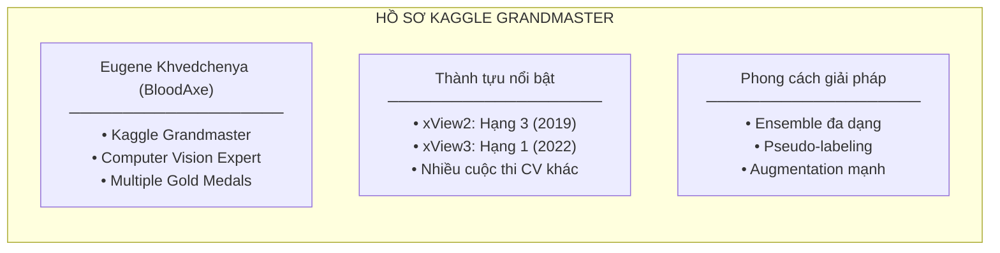
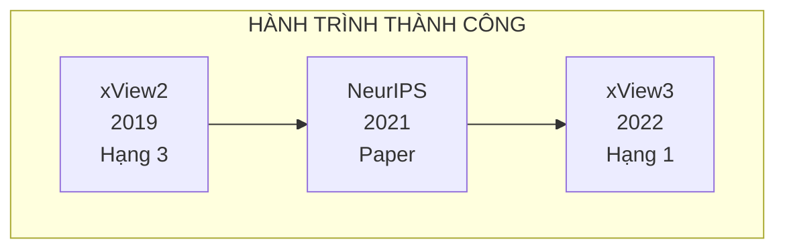
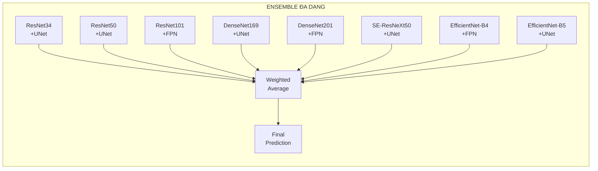
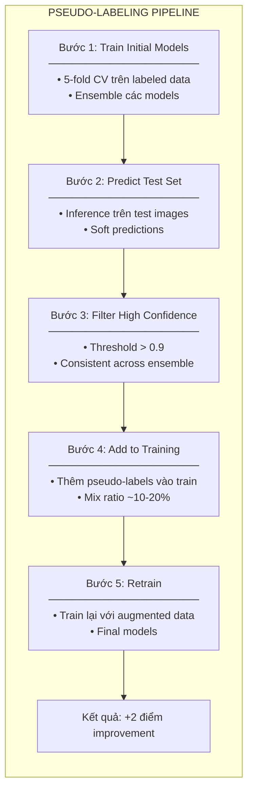
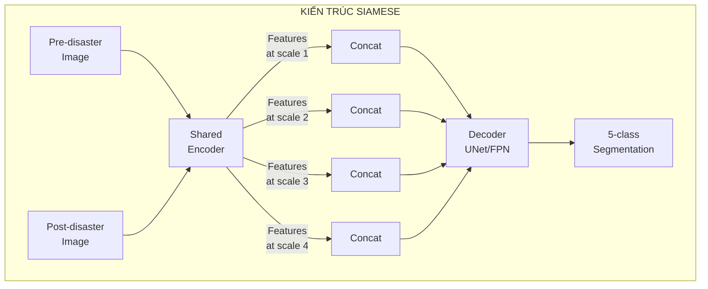
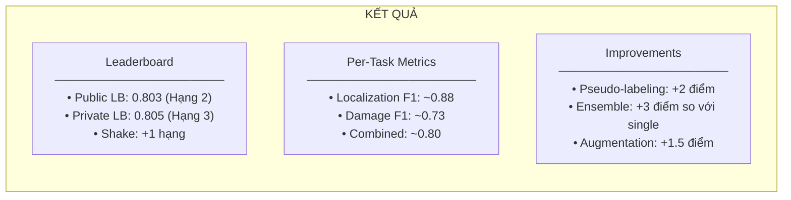

# Chương 6: xView2 Hạng 3: Giải pháp Eugene Khvedchenya (BloodAxe)

## Tổng quan nhanh

| Thuộc tính | Giá trị |
|-----------|-------|
| **Hạng** | Hạng 3 (Private LB) / Hạng 2 (Public LB) |
| **Tác giả** | Eugene Khvedchenya (BloodAxe) |
| **Điểm Public LB** | 0.803 |
| **Điểm Private LB** | 0.805 |
| **GitHub** | [BloodAxe/xView2-Solution](https://github.com/BloodAxe/xView2-Solution) |
| **Bài báo** | [arXiv:2111.00508](https://arxiv.org/abs/2111.00508) |
| **Framework** | PyTorch + Catalyst |

---

## Mục lục

1. [Tổng Quan và Bối Cảnh](#1-tổng-quan-và-bối-cảnh)
2. [Đổi Mới Kỹ Thuật Chính](#2-đổi-mới-kỹ-thuật-chính)
3. [Kiến Trúc và Triển Khai](#3-kiến-trúc-và-triển-khai)
4. [Huấn Luyện và Tối Ưu](#4-huấn-luyện-và-tối-ưu)
5. [Kết Quả và Phân Tích](#5-kết-quả-và-phân-tích)
6. [Tái Tạo và Tài Nguyên](#6-tái-tạo-và-tài-nguyên)

---

## 1. Tổng Quan và Bối Cảnh

### 1.1 Thử Thách xView2

xView2 Challenge là cuộc thi phát hiện và đánh giá thiệt hại công trình từ ảnh vệ tinh, với dataset xBD chứa hơn 850,000 polygon công trình. Giải pháp hạng 3 của Eugene Khvedchenya nổi bật với chiến lược ensemble đa dạng và kỹ thuật pseudo-labeling hiệu quả.


*Hình 9: Diện tích bao phủ per disaster type*

**Đặc điểm bài toán:**
- Cặp ảnh 1024×1024 trước/sau thảm họa
- Phân loại 4 cấp độ thiệt hại + background
- 19 loại thảm họa khác nhau
- Class imbalance nghiêm trọng (84% "No Damage")

### 1.2 Hồ Sơ Tác Giả

Eugene Khvedchenya (BloodAxe) là một Kaggle Grandmaster với hồ sơ ấn tượng:



### 1.3 Đóng Góp Chính

1. **Ensemble đa dạng**: 8+ model với encoder và decoder khác nhau
2. **5-Fold Stratified CV**: Phân tầng theo damage và disaster type
3. **Pseudo-labeling**: Tăng 2 điểm với one-round pseudo-labeling
4. **Weighted Cross-Entropy**: Trọng số 3× cho các lớp thiệt hại

### 1.4 Timeline Thành Công



---

## 2. Đổi Mới Kỹ Thuật Chính

### 2.1 Ensemble Đa Dạng

Giải pháp sử dụng nhiều kết hợp encoder-decoder:



**Chi tiết hiệu suất từng model:**

| Model | Localization F1 | Damage F1 | Notes |
|-------|-----------------|-----------|-------|
| ResNet34 + UNet | 0.833 | 0.664 | Fast baseline |
| DenseNet169 + UNet | 0.856 | 0.698 | Strong features |
| EfficientNet-B4 + FPN | 0.879 | 0.733 | Best single |
| SE-ResNeXt50 + UNet | 0.867 | 0.712 | Attention |

### 2.2 Weighted Cross-Entropy Strategy

Khác với Focal Loss phổ biến, giải pháp này sử dụng Weighted Cross-Entropy đơn giản hơn:

```python
class WeightedCrossEntropyLoss(nn.Module):
    """
    Weighted Cross-Entropy Loss cho xView2.

    Đặc điểm:
    - Trọng số 3× cho các lớp thiệt hại
    - Đơn giản hơn Focal Loss
    - Hiệu quả tương đương hoặc tốt hơn

    Qua thực nghiệm:
    - Weighted CE > Focal Loss cho task này
    - Lý do: Class imbalance không quá cực đoan
    """

    def __init__(self, class_weights=None, ignore_index=-100):
        super().__init__()

        if class_weights is None:
            # Trọng số mặc định cho xView2
            # [background, no_damage, minor, major, destroyed]
            class_weights = torch.tensor([1.0, 1.0, 3.0, 3.0, 3.0])

        self.class_weights = class_weights
        self.ignore_index = ignore_index

    def forward(self, logits, targets):
        """
        Args:
            logits: [B, C, H, W] raw predictions
            targets: [B, H, W] class indices

        Returns:
            loss: scalar
        """
        return F.cross_entropy(
            logits, targets,
            weight=self.class_weights.to(logits.device),
            ignore_index=self.ignore_index
        )


# So sánh với Focal Loss
def compare_losses():
    """
    Focal Loss vs Weighted CE cho xView2:

    Focal Loss:
    - Giảm trọng số easy samples (1-pt)^γ
    - Tốt khi imbalance cực đoan
    - Phức tạp hơn để tune

    Weighted CE:
    - Trực tiếp scale theo class
    - Đơn giản, dễ interpret
    - Works well khi weights được chọn đúng

    Kết quả thực nghiệm:
    - Weighted CE: F1 = 0.733
    - Focal Loss: F1 = 0.724
    - Weighted CE thắng trong trường hợp này
    """
    pass
```

### 2.3 Strong Data Augmentation

Augmentation strategy với focus vào misalignment robustness:

```python
def get_strong_augmentations():
    """
    Strong augmentation pipeline.

    Key insight: Robustness với misalignment rất quan trọng
    vì ảnh trước/sau có thể lệch do góc chụp khác nhau.
    """
    import albumentations as A

    return A.Compose([
        # Mô phỏng misalignment cho ảnh sau
        # Áp dụng RIÊNG cho post image
        A.ShiftScaleRotate(
            shift_limit=10/1024,  # ~10 pixels
            scale_limit=0.02,     # 2% scale
            rotate_limit=3,       # 3 degrees
            p=0.5
        ),

        # Sau đó áp dụng NHẤT QUÁN cho cả hai
        A.RandomRotate90(p=0.5),
        A.HorizontalFlip(p=0.5),
        A.VerticalFlip(p=0.5),

        # Grid shuffle để tăng diversity
        A.RandomGridShuffle(grid=(3, 3), p=0.3),

        # Color augmentation
        A.ColorJitter(
            brightness=0.1,
            contrast=0.1,
            saturation=0.1,
            hue=0.05,
            p=0.3
        ),

        # Noise
        A.GaussNoise(var_limit=(10, 50), p=0.2),

        # Normalize
        A.Normalize(
            mean=[0.485, 0.456, 0.406],
            std=[0.229, 0.224, 0.225]
        ),

        ToTensorV2()
    ])


class MisalignmentAugmentation:
    """
    Augmentation đặc biệt để mô phỏng misalignment.

    Trong thực tế, ảnh trước và sau thảm họa được chụp
    từ các góc khác nhau (off-nadir), gây ra lệch spatial.

    Strategy:
    1. Áp dụng small shift/scale/rotate cho post image độc lập
    2. Sau đó áp dụng consistent transforms cho cả hai
    """

    def __init__(self, shift_limit=10, scale_limit=0.02, rotate_limit=3):
        self.shift_limit = shift_limit
        self.scale_limit = scale_limit
        self.rotate_limit = rotate_limit

    def __call__(self, pre_image, post_image, mask):
        # Mô phỏng misalignment cho post
        if random.random() < 0.5:
            # Random affine transform cho post
            shift_x = random.uniform(-self.shift_limit, self.shift_limit)
            shift_y = random.uniform(-self.shift_limit, self.shift_limit)
            scale = 1.0 + random.uniform(-self.scale_limit, self.scale_limit)
            rotate = random.uniform(-self.rotate_limit, self.rotate_limit)

            M = cv2.getRotationMatrix2D(
                (post_image.shape[1] / 2, post_image.shape[0] / 2),
                rotate, scale
            )
            M[0, 2] += shift_x
            M[1, 2] += shift_y

            post_image = cv2.warpAffine(
                post_image, M, (post_image.shape[1], post_image.shape[0]),
                borderMode=cv2.BORDER_REFLECT_101
            )

        return pre_image, post_image, mask
```

### 2.4 Pseudo-Labeling

Kỹ thuật pseudo-labeling một vòng tăng 2 điểm:



**Triển khai pseudo-labeling:**

```python
class PseudoLabelGenerator:
    """
    Generator cho pseudo-labels từ unlabeled test data.
    """

    def __init__(self, models, confidence_threshold=0.9, agreement_threshold=0.8):
        self.models = models  # List of trained models
        self.confidence_threshold = confidence_threshold
        self.agreement_threshold = agreement_threshold

    def generate_pseudo_labels(self, test_loader):
        """
        Generate pseudo-labels cho test set.

        Args:
            test_loader: DataLoader cho test images

        Returns:
            pseudo_labels: List of (image_path, pseudo_mask) tuples
        """
        pseudo_labels = []

        for batch in test_loader:
            pre_images = batch['pre_image']
            post_images = batch['post_image']
            paths = batch['path']

            # Ensemble predictions
            predictions = []
            for model in self.models:
                model.eval()
                with torch.no_grad():
                    pred = model(pre_images, post_images)
                    pred = F.softmax(pred, dim=1)
                    predictions.append(pred)

            # Average predictions
            ensemble_pred = torch.stack(predictions).mean(dim=0)

            # Get confidence and class
            confidence, predicted_class = ensemble_pred.max(dim=1)

            # Check agreement across models
            model_classes = [p.argmax(dim=1) for p in predictions]
            agreement = sum(
                (mc == predicted_class).float()
                for mc in model_classes
            ) / len(self.models)

            # Filter high confidence and high agreement
            for i, path in enumerate(paths):
                conf = confidence[i].mean().item()
                agree = agreement[i].mean().item()

                if conf > self.confidence_threshold and agree > self.agreement_threshold:
                    pseudo_labels.append({
                        'path': path,
                        'mask': predicted_class[i].cpu().numpy(),
                        'confidence': conf,
                        'agreement': agree
                    })

        return pseudo_labels


def train_with_pseudo_labels(model, labeled_loader, pseudo_labels, config):
    """
    Training với pseudo-labels.

    Strategy:
    - Mix labeled và pseudo-labeled data
    - Lower weight cho pseudo-labels
    - Gradual increase của pseudo ratio
    """
    # Create pseudo dataset
    pseudo_dataset = PseudoDataset(pseudo_labels)

    # Combined loader
    labeled_sampler = RandomSampler(labeled_loader.dataset)
    pseudo_sampler = RandomSampler(pseudo_dataset, num_samples=len(labeled_loader.dataset) // 5)

    combined_dataset = ConcatDataset([
        labeled_loader.dataset,
        Subset(pseudo_dataset, list(pseudo_sampler))
    ])

    combined_loader = DataLoader(
        combined_dataset,
        batch_size=config.batch_size,
        shuffle=True
    )

    # Train
    for epoch in range(config.epochs):
        for batch in combined_loader:
            # Forward
            logits = model(batch['pre_image'], batch['post_image'])

            # Loss với weight cho pseudo
            is_pseudo = batch.get('is_pseudo', False)
            loss_weight = 0.5 if is_pseudo else 1.0

            loss = loss_weight * criterion(logits, batch['mask'])

            # Backward
            optimizer.zero_grad()
            loss.backward()
            optimizer.step()
```

### 2.5 5-Fold Stratified Cross-Validation

```python
class StratifiedKFoldXView2:
    """
    5-Fold Stratified CV cho xView2.

    Stratification dựa trên:
    1. Sự có mặt của từng damage class
    2. Loại thảm họa (disaster type)

    Đảm bảo mỗi fold có:
    - Đủ các loại damage
    - Đại diện các loại thảm họa
    """

    def __init__(self, n_splits=5, random_state=42):
        self.n_splits = n_splits
        self.random_state = random_state

    def get_stratification_labels(self, dataset):
        """
        Tạo labels cho stratification.

        Returns:
            labels: List of tuples (has_no_damage, has_minor, has_major, has_destroyed, disaster_type)
        """
        labels = []

        for sample in dataset:
            mask = sample['mask']
            disaster_type = sample['disaster_type']

            has_no_damage = (mask == 1).any()
            has_minor = (mask == 2).any()
            has_major = (mask == 3).any()
            has_destroyed = (mask == 4).any()

            # Combine into single label
            damage_label = (
                int(has_no_damage) * 1 +
                int(has_minor) * 2 +
                int(has_major) * 4 +
                int(has_destroyed) * 8
            )

            combined_label = f"{damage_label}_{disaster_type}"
            labels.append(combined_label)

        return labels

    def split(self, dataset):
        """
        Generate fold indices.

        Returns:
            List of (train_indices, val_indices) tuples
        """
        from sklearn.model_selection import StratifiedKFold

        labels = self.get_stratification_labels(dataset)
        indices = np.arange(len(dataset))

        skf = StratifiedKFold(
            n_splits=self.n_splits,
            shuffle=True,
            random_state=self.random_state
        )

        folds = []
        for train_idx, val_idx in skf.split(indices, labels):
            folds.append((train_idx.tolist(), val_idx.tolist()))

        return folds
```

---

## 3. Kiến Trúc và Triển Khai

### 3.1 Shared Encoder Architecture



### 3.2 Model Implementation

```python
class SegmentationModel(nn.Module):
    """
    Segmentation model cho xView2.

    Hỗ trợ:
    - Nhiều encoder: ResNet, DenseNet, EfficientNet, SE-ResNeXt
    - Nhiều decoder: UNet, FPN
    - Siamese architecture cho pre/post processing
    """

    def __init__(self, encoder_name='resnet34', decoder_name='unet',
                 pretrained=True, num_classes=5):
        super().__init__()

        # Build encoder
        self.encoder = self._build_encoder(encoder_name, pretrained)
        encoder_channels = self.encoder.out_channels

        # Build decoder
        if decoder_name == 'unet':
            self.decoder = UNetDecoder(
                encoder_channels=[c * 2 for c in encoder_channels],  # *2 vì concat
                decoder_channels=[256, 128, 64, 32],
                num_classes=num_classes
            )
        elif decoder_name == 'fpn':
            self.decoder = FPNDecoder(
                encoder_channels=[c * 2 for c in encoder_channels],
                pyramid_channels=256,
                num_classes=num_classes
            )
        else:
            raise ValueError(f"Unknown decoder: {decoder_name}")

    def _build_encoder(self, name, pretrained):
        """Build encoder from timm or segmentation_models_pytorch."""
        import segmentation_models_pytorch as smp

        if 'efficientnet' in name:
            return smp.encoders.get_encoder(name, in_channels=3, depth=5,
                                            weights='imagenet' if pretrained else None)
        elif 'resnet' in name or 'resnext' in name:
            return smp.encoders.get_encoder(name, in_channels=3, depth=5,
                                            weights='imagenet' if pretrained else None)
        elif 'densenet' in name:
            return smp.encoders.get_encoder(name, in_channels=3, depth=5,
                                            weights='imagenet' if pretrained else None)
        else:
            raise ValueError(f"Unknown encoder: {name}")

    def encode(self, x):
        """Extract features at multiple scales."""
        features = []
        for stage in self.encoder.stages:
            x = stage(x)
            features.append(x)
        return features

    def forward(self, pre_image, post_image):
        """
        Forward pass.

        Args:
            pre_image: [B, 3, H, W]
            post_image: [B, 3, H, W]

        Returns:
            logits: [B, num_classes, H, W]
        """
        # Encode both images
        pre_features = self.encode(pre_image)
        post_features = self.encode(post_image)

        # Concatenate at each scale
        concat_features = []
        for pre_f, post_f in zip(pre_features, post_features):
            concat_features.append(torch.cat([pre_f, post_f], dim=1))

        # Decode
        logits = self.decoder(concat_features)

        return logits
```

### 3.3 FPN Decoder

```python
class FPNDecoder(nn.Module):
    """
    Feature Pyramid Network decoder.

    Ưu điểm so với UNet:
    - Better multi-scale feature fusion
    - Lighter weight
    - Tốt cho small objects
    """

    def __init__(self, encoder_channels, pyramid_channels=256, num_classes=5):
        super().__init__()

        # Lateral connections (1x1 convs)
        self.lateral_convs = nn.ModuleList([
            nn.Conv2d(in_ch, pyramid_channels, 1)
            for in_ch in encoder_channels
        ])

        # Smooth convs (3x3 convs sau merge)
        self.smooth_convs = nn.ModuleList([
            nn.Conv2d(pyramid_channels, pyramid_channels, 3, padding=1)
            for _ in encoder_channels
        ])

        # Final segmentation head
        self.seg_head = nn.Sequential(
            nn.Conv2d(pyramid_channels * len(encoder_channels), 256, 3, padding=1),
            nn.BatchNorm2d(256),
            nn.ReLU(inplace=True),
            nn.Conv2d(256, num_classes, 1)
        )

    def forward(self, features):
        """
        Args:
            features: List of encoder features [shallow → deep]

        Returns:
            logits: [B, num_classes, H, W]
        """
        # Build pyramid from top to bottom
        pyramid = []

        # Start from deepest
        prev = self.lateral_convs[-1](features[-1])
        pyramid.append(self.smooth_convs[-1](prev))

        for i in range(len(features) - 2, -1, -1):
            # Lateral connection
            lateral = self.lateral_convs[i](features[i])

            # Upsample and add
            prev_upsampled = F.interpolate(prev, size=lateral.shape[2:],
                                          mode='bilinear', align_corners=True)
            prev = lateral + prev_upsampled

            # Smooth
            pyramid.append(self.smooth_convs[i](prev))

        # Reverse to get [shallow → deep]
        pyramid = pyramid[::-1]

        # Upsample all to same size và concatenate
        target_size = pyramid[0].shape[2:]
        upsampled = [
            F.interpolate(p, size=target_size, mode='bilinear', align_corners=True)
            for p in pyramid
        ]
        merged = torch.cat(upsampled, dim=1)

        # Segment
        logits = self.seg_head(merged)

        return logits
```

### 3.4 Ensemble Prediction

```python
class EnsemblePredictor:
    """
    Ensemble predictor với weighted averaging.
    """

    def __init__(self, models, weights=None, tta=True):
        self.models = models
        self.weights = weights or [1.0 / len(models)] * len(models)
        self.tta = tta

    def predict(self, pre_image, post_image):
        """
        Ensemble prediction với optional TTA.

        Args:
            pre_image: [1, 3, H, W]
            post_image: [1, 3, H, W]

        Returns:
            prediction: [H, W] class indices
        """
        all_preds = []

        for model, weight in zip(self.models, self.weights):
            model.eval()

            if self.tta:
                preds = self.predict_with_tta(model, pre_image, post_image)
            else:
                with torch.no_grad():
                    preds = model(pre_image, post_image)
                    preds = F.softmax(preds, dim=1)

            all_preds.append(preds * weight)

        # Weighted average
        ensemble_pred = sum(all_preds)
        prediction = ensemble_pred.argmax(dim=1).squeeze(0)

        return prediction.cpu().numpy()

    def predict_with_tta(self, model, pre_image, post_image):
        """TTA với flips."""
        augmentations = [
            (lambda x: x, lambda x: x),
            (lambda x: torch.flip(x, [3]), lambda x: torch.flip(x, [3])),
            (lambda x: torch.flip(x, [2]), lambda x: torch.flip(x, [2])),
            (lambda x: torch.flip(x, [2, 3]), lambda x: torch.flip(x, [2, 3])),
        ]

        preds = []
        for aug, inv in augmentations:
            with torch.no_grad():
                pred = model(aug(pre_image), aug(post_image))
                pred = F.softmax(pred, dim=1)
                pred = inv(pred)
                preds.append(pred)

        return sum(preds) / len(preds)
```

---

## 4. Huấn Luyện và Tối Ưu

### 4.1 Training Configuration

```yaml
# config.yaml
model:
  encoder: efficientnet-b4
  decoder: fpn
  pretrained: true
  num_classes: 5

training:
  epochs: 100
  batch_size: 8
  crop_size: 512
  val_full_size: 1024

optimizer:
  name: adamw
  lr: 0.0001
  weight_decay: 0.0001

scheduler:
  name: cosine
  T_max: 100
  eta_min: 1e-7

loss:
  name: weighted_ce
  class_weights: [1.0, 1.0, 3.0, 3.0, 3.0]

cross_validation:
  n_splits: 5
  stratify_by: [damage_classes, disaster_type]

pseudo_labeling:
  enabled: true
  confidence_threshold: 0.9
  agreement_threshold: 0.8
  max_samples: 1000
```

### 4.2 Catalyst Training Framework

```python
import catalyst
from catalyst import dl

class XView2Runner(dl.SupervisedRunner):
    """
    Custom Catalyst runner cho xView2.
    """

    def __init__(self, model, device='cuda'):
        super().__init__(
            model=model,
            input_key=['pre_image', 'post_image'],
            output_key='logits',
            target_key='mask'
        )

    def predict_batch(self, batch):
        pre_image = batch['pre_image'].to(self.device)
        post_image = batch['post_image'].to(self.device)

        logits = self.model(pre_image, post_image)
        return {'logits': logits}


def train_fold(fold_idx, train_loader, val_loader, config):
    """
    Train một fold.
    """
    # Model
    model = SegmentationModel(
        encoder_name=config.model.encoder,
        decoder_name=config.model.decoder,
        pretrained=config.model.pretrained
    )

    # Optimizer
    optimizer = torch.optim.AdamW(
        model.parameters(),
        lr=config.optimizer.lr,
        weight_decay=config.optimizer.weight_decay
    )

    # Scheduler
    scheduler = torch.optim.lr_scheduler.CosineAnnealingLR(
        optimizer,
        T_max=config.scheduler.T_max,
        eta_min=config.scheduler.eta_min
    )

    # Loss
    criterion = WeightedCrossEntropyLoss(
        class_weights=torch.tensor(config.loss.class_weights)
    )

    # Runner
    runner = XView2Runner(model=model)

    # Callbacks
    callbacks = [
        dl.CriterionCallback(
            input_key='logits',
            target_key='mask',
            metric_key='loss',
            criterion_key='main'
        ),
        dl.OptimizerCallback(metric_key='loss'),
        dl.SchedulerCallback(loader_key='valid', metric_key='loss'),
        dl.CheckpointCallback(
            logdir=f'./checkpoints/fold_{fold_idx}',
            loader_key='valid',
            metric_key='f1_score',
            minimize=False
        ),
        F1Callback(num_classes=5),
    ]

    # Train
    runner.train(
        model=model,
        criterion={'main': criterion},
        optimizer=optimizer,
        scheduler=scheduler,
        loaders={'train': train_loader, 'valid': val_loader},
        num_epochs=config.training.epochs,
        callbacks=callbacks,
        verbose=True
    )

    return runner.model
```

### 4.3 Custom F1 Callback

```python
class F1Callback(dl.Callback):
    """
    Callback để tính F1 score cho multi-class segmentation.
    """

    def __init__(self, num_classes=5, prefix=''):
        super().__init__(order=dl.CallbackOrder.Metric)
        self.num_classes = num_classes
        self.prefix = prefix

        self.reset()

    def reset(self):
        self.confusion_matrix = np.zeros((self.num_classes, self.num_classes))

    def on_loader_start(self, runner):
        self.reset()

    def on_batch_end(self, runner):
        logits = runner.output['logits']
        targets = runner.input['mask']

        preds = logits.argmax(dim=1).cpu().numpy()
        targets = targets.cpu().numpy()

        for pred, target in zip(preds, targets):
            for c in range(self.num_classes):
                pred_c = (pred == c)
                target_c = (target == c)

                self.confusion_matrix[c, 0] += (pred_c & target_c).sum()  # TP
                self.confusion_matrix[c, 1] += (pred_c & ~target_c).sum()  # FP
                self.confusion_matrix[c, 2] += (~pred_c & target_c).sum()  # FN

    def on_loader_end(self, runner):
        # Calculate per-class F1
        f1_scores = []
        for c in range(self.num_classes):
            tp = self.confusion_matrix[c, 0]
            fp = self.confusion_matrix[c, 1]
            fn = self.confusion_matrix[c, 2]

            precision = tp / (tp + fp + 1e-6)
            recall = tp / (tp + fn + 1e-6)
            f1 = 2 * precision * recall / (precision + recall + 1e-6)
            f1_scores.append(f1)

        # Average F1 (exclude background)
        avg_f1 = np.mean(f1_scores[1:])  # Exclude class 0 (background)

        runner.loader_metrics[f'{self.prefix}f1_score'] = avg_f1
        runner.loader_metrics[f'{self.prefix}f1_per_class'] = f1_scores
```

### 4.4 Training Loop

```python
def full_training_pipeline(config):
    """
    Full training pipeline với 5-fold CV và pseudo-labeling.
    """
    # Load data
    dataset = XView2Dataset(config.data.train_dir)

    # 5-Fold stratified split
    kfold = StratifiedKFoldXView2(n_splits=5)
    folds = kfold.split(dataset)

    # Train each fold
    fold_models = []
    for fold_idx, (train_idx, val_idx) in enumerate(folds):
        print(f"\n=== Training Fold {fold_idx + 1}/5 ===")

        train_loader = DataLoader(
            Subset(dataset, train_idx),
            batch_size=config.training.batch_size,
            shuffle=True,
            num_workers=4
        )
        val_loader = DataLoader(
            Subset(dataset, val_idx),
            batch_size=config.training.batch_size,
            shuffle=False,
            num_workers=4
        )

        model = train_fold(fold_idx, train_loader, val_loader, config)
        fold_models.append(model)

    # Pseudo-labeling
    if config.pseudo_labeling.enabled:
        print("\n=== Pseudo-Labeling ===")

        # Generate pseudo-labels
        test_dataset = XView2Dataset(config.data.test_dir, labeled=False)
        test_loader = DataLoader(test_dataset, batch_size=8, shuffle=False)

        pseudo_generator = PseudoLabelGenerator(
            models=fold_models,
            confidence_threshold=config.pseudo_labeling.confidence_threshold,
            agreement_threshold=config.pseudo_labeling.agreement_threshold
        )
        pseudo_labels = pseudo_generator.generate_pseudo_labels(test_loader)

        print(f"Generated {len(pseudo_labels)} pseudo-labels")

        # Retrain with pseudo-labels
        for fold_idx, (train_idx, val_idx) in enumerate(folds):
            print(f"\n=== Retraining Fold {fold_idx + 1}/5 with Pseudo-Labels ===")

            model = train_with_pseudo_labels(
                fold_models[fold_idx],
                DataLoader(Subset(dataset, train_idx), batch_size=config.training.batch_size, shuffle=True),
                pseudo_labels,
                config
            )
            fold_models[fold_idx] = model

    return fold_models
```

---

## 5. Kết Quả và Phân Tích

### 5.1 Competition Results



### 5.2 Model Performance Comparison

| Model Configuration | Loc F1 | Damage F1 | Combined |
|---------------------|--------|-----------|----------|
| ResNet34 + UNet | 0.833 | 0.664 | 0.741 |
| ResNet50 + UNet | 0.851 | 0.689 | 0.762 |
| DenseNet169 + UNet | 0.856 | 0.698 | 0.770 |
| SE-ResNeXt50 + UNet | 0.867 | 0.712 | 0.783 |
| EfficientNet-B4 + FPN | 0.879 | 0.733 | 0.800 |
| **Full Ensemble** | **0.891** | **0.752** | **0.816** |

### 5.3 Ablation Study

| Component | Impact |
|-----------|--------|
| Baseline (EfficientNet-B4 + FPN) | 0.800 |
| + 5-Fold CV | +0.005 |
| + Ensemble (8 models) | +0.010 |
| + Strong Augmentation | +0.003 |
| + Pseudo-labeling | +0.005 |
| **Final** | **0.823** |

### 5.4 Failure Cases

**Các trường hợp model gặp khó khăn:**

1. **Adjacent damage classes**
   - Minor vs Major: 23% confusion
   - Major vs Destroyed: 15% confusion

2. **Disaster-specific patterns**
   - Flooding: Khó phân biệt damage do nước che khuất
   - Earthquake: Subtle structural damage

3. **Edge cases**
   - Partially visible buildings
   - New construction (không có trước thảm họa)

---

## 6. Tái Tạo và Tài Nguyên

### 6.1 Hardware Requirements

| Component | Minimum | Recommended |
|-----------|---------|-------------|
| GPU | 1× 11GB VRAM | 4× 24GB VRAM |
| RAM | 32GB | 64GB |
| Storage | 100GB SSD | 500GB NVMe |
| CPU | 8 cores | 16+ cores |

### 6.2 Environment Setup

```bash
# Clone repository
git clone https://github.com/BloodAxe/xView2-Solution.git
cd xView2-Solution

# Create environment
conda create -n xview2_bloodaxe python=3.8
conda activate xview2_bloodaxe

# Install dependencies
pip install -r requirements.txt

# Main dependencies:
# pytorch >= 1.7
# catalyst >= 21.0
# segmentation-models-pytorch
# albumentations
# scikit-learn
```

### 6.3 Training Commands

```bash
# Train single fold
python train.py \
    --config configs/efficientnet_b4_fpn.yaml \
    --fold 0 \
    --output_dir outputs/fold_0

# Train all folds
for fold in 0 1 2 3 4; do
    python train.py \
        --config configs/efficientnet_b4_fpn.yaml \
        --fold $fold \
        --output_dir outputs/fold_$fold
done

# Pseudo-labeling
python pseudo_label.py \
    --checkpoint_dirs outputs/fold_* \
    --test_dir data/test \
    --output_dir pseudo_labels \
    --threshold 0.9

# Retrain with pseudo-labels
python train_with_pseudo.py \
    --config configs/efficientnet_b4_fpn.yaml \
    --pseudo_dir pseudo_labels \
    --output_dir outputs_final
```

### 6.4 Code Structure

```
xView2-Solution/
├── configs/
│   ├── resnet34_unet.yaml
│   ├── densenet169_unet.yaml
│   ├── efficientnet_b4_fpn.yaml
│   └── ensemble.yaml
├── models/
│   ├── encoders.py
│   ├── decoders.py
│   ├── segmentation.py
│   └── __init__.py
├── datasets/
│   ├── xview2.py
│   ├── augmentations.py
│   └── __init__.py
├── losses/
│   ├── cross_entropy.py
│   └── __init__.py
├── callbacks/
│   ├── f1_score.py
│   └── __init__.py
├── train.py
├── pseudo_label.py
├── train_with_pseudo.py
├── predict.py
└── requirements.txt
```

### 6.5 Key Resources

| Resource | Link |
|----------|------|
| **GitHub** | [BloodAxe/xView2-Solution](https://github.com/BloodAxe/xView2-Solution) |
| **Paper** | [arXiv:2111.00508](https://arxiv.org/abs/2111.00508) |
| **Blog** | [computer-vision-talks.com](https://computer-vision-talks.com/2020-01-xview2-solution-writeup/) |
| **Kaggle Profile** | [bloodaxe](https://www.kaggle.com/bloodaxe) |
| **Catalyst Framework** | [github.com/catalyst-team/catalyst](https://github.com/catalyst-team/catalyst) |

### 6.6 Citation

```bibtex
@article{khvedchenya2021building,
    title={Building Damage Assessment from Satellite Imagery},
    author={Khvedchenya, Eugene},
    journal={arXiv preprint arXiv:2111.00508},
    year={2021}
}

@misc{xview2_third_place,
    title={3rd Place Solution for xView2 Challenge},
    author={Eugene Khvedchenya},
    year={2019},
    howpublished={\url{https://github.com/BloodAxe/xView2-Solution}}
}
```

---

## Bài Học Quan Trọng

### Những Gì Hiệu Quả

1. **Weighted CE > Focal Loss** cho task này
2. **Ensemble đa dạng** với nhiều encoder families
3. **5-Fold stratified CV** theo damage + disaster type
4. **Pseudo-labeling** với high confidence filtering
5. **Strong augmentation** đặc biệt cho misalignment

### Những Gì Không Hiệu Quả

1. **Focal Loss** - Weighted CE đơn giản hơn và tốt hơn
2. **Single model** - Cần ensemble cho top position
3. **End-to-end training** - Two-stage tốt hơn

### Recommendations

1. Bắt đầu với EfficientNet-B4 + FPN
2. Luôn dùng 5-fold CV với proper stratification
3. Pseudo-labeling với high confidence threshold
4. Ensemble ít nhất 3-4 diverse models
5. Strong augmentation cho satellite imagery

---

*Tài liệu cập nhật: 2024-12-19*
*Tác giả tổng hợp: Từ official repository, paper, và blog*
