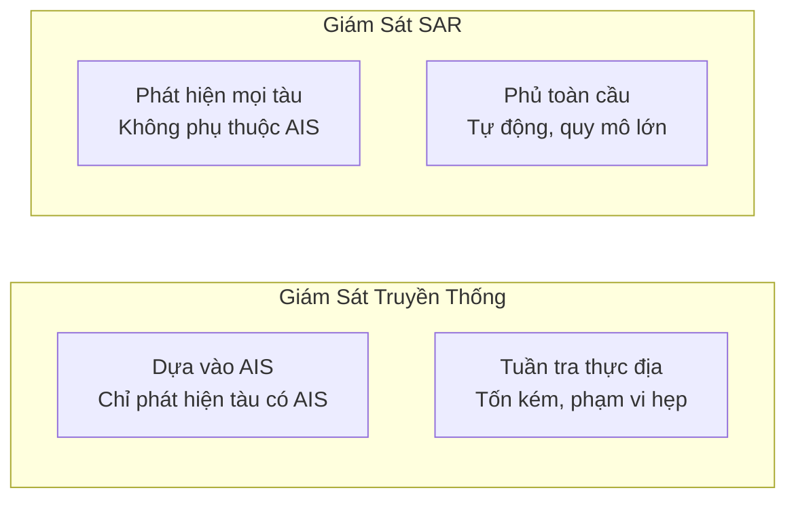
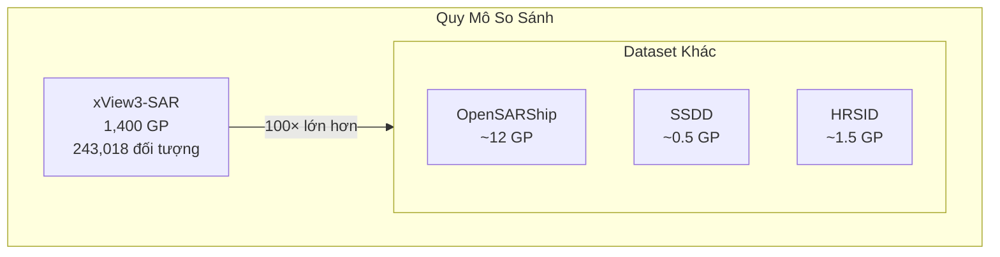
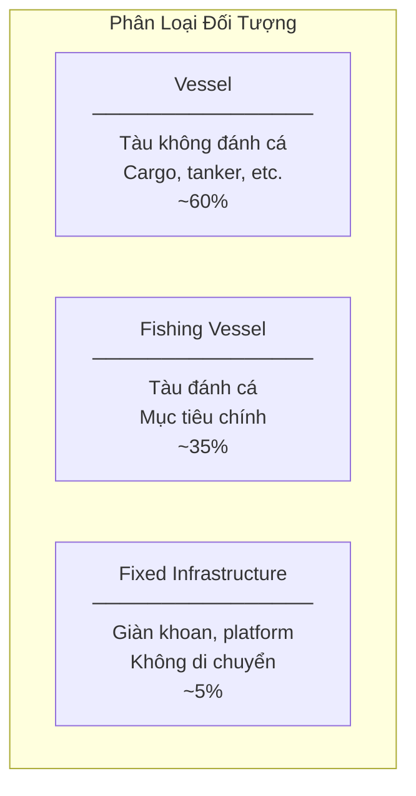
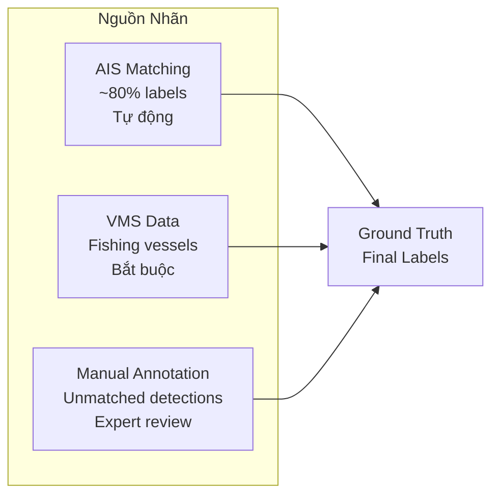
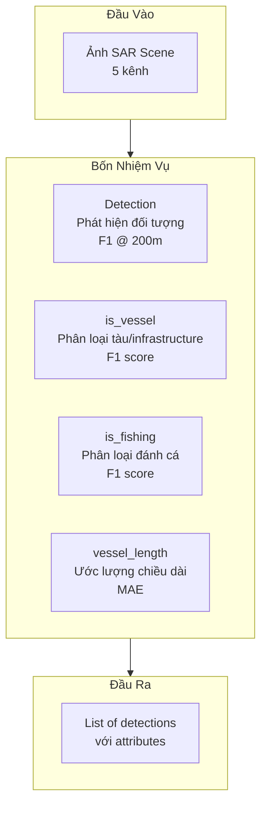
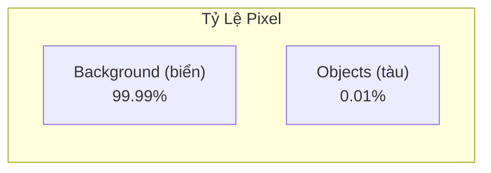
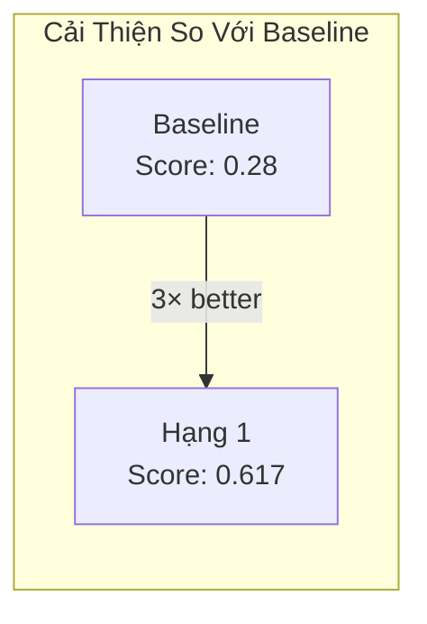
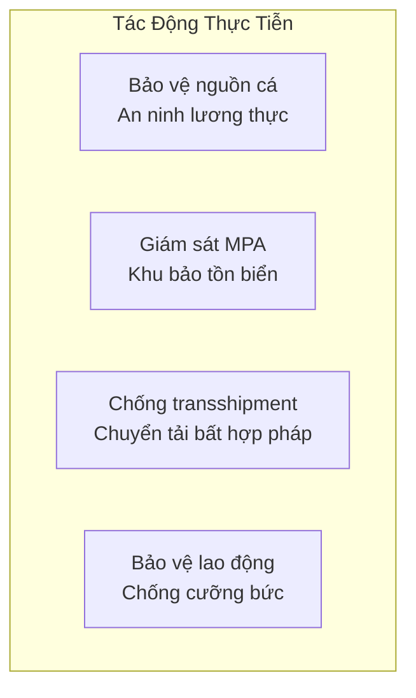

# 6.3.1 Bộ Dữ Liệu xView3-SAR: Phát Hiện Tàu Thuyền Và Đánh Cá Bất Hợp Pháp

## Lời Dẫn

Nếu xView1 mở đầu với ảnh quang học và xView2 mở rộng sang bài toán thay đổi theo thời gian, thì xView3 đánh dấu bước chuyển mình quan trọng khi chuyển hoàn toàn sang ảnh radar khẩu độ tổng hợp (SAR). Đây không chỉ là sự thay đổi về loại dữ liệu, mà còn mang theo mục tiêu nhân đạo sâu sắc: chống đánh bắt cá bất hợp pháp, không báo cáo và không quản lý (IUU - Illegal, Unreported, Unregulated fishing). Ước tính IUU gây thiệt hại 10-23 tỷ USD mỗi năm, đe dọa an ninh lương thực của hàng triệu người phụ thuộc vào nghề cá.

| Thuộc tính | Giá trị |
|-----------|---------|
| **Năm phát hành** | 2021-2022 |
| **Tổ chức** | DIU + Global Fishing Watch |
| **Tổng scene** | 991 cảnh SAR |
| **Kích thước scene** | 29,400 × 24,400 pixels (trung bình) |
| **Tổng gigapixels** | 1,400 GP |
| **Đối tượng** | 243,018 instances |
| **Bài báo** | NeurIPS 2022 Datasets Track |

---

## 1. Bối Cảnh và Động Lực

### 1.1 Vấn Nạn Đánh Cá IUU

Thách thức lớn nhất trong chống IUU là phát hiện "tàu tối" (dark vessels) - những tàu cố tình tắt hệ thống AIS (Automatic Identification System). AIS là hệ thống định vị bắt buộc phát vị trí và nhận dạng tàu, nhưng các tàu bất hợp pháp thường tắt để tránh giám sát.



### 1.2 Ưu Điểm của Ảnh SAR

SAR (Synthetic Aperture Radar) cung cấp khả năng giám sát độc nhất:

| Khía cạnh | Ảnh Quang Học | Ảnh SAR |
|-----------|---------------|---------|
| **Hoạt động** | Chỉ ban ngày | 24/7 |
| **Điều kiện thời tiết** | Cần trời quang | Xuyên mây, sương mù |
| **Phụ thuộc** | Ánh sáng mặt trời | Phát sóng radar chủ động |
| **Đặc điểm ảnh** | RGB, trực quan | Grayscale, backscatter |

Sentinel-1 của ESA cung cấp dữ liệu SAR miễn phí với chu kỳ 6 ngày, cho phép giám sát toàn cầu liên tục.

---

## 2. Thông Số Kỹ Thuật

### 2.1 Quy Mô Dataset

xView3-SAR là dataset SAR ship detection lớn nhất từng được công bố, vượt xa các benchmark trước đó:



### 2.2 Nguồn Vệ Tinh Sentinel-1

| Thông số | Giá trị |
|----------|---------|
| **Thiết bị** | C-band SAR |
| **Tần số** | 5.405 GHz |
| **Bước sóng** | ~5.6 cm |
| **Polarization** | VV + VH |
| **Chế độ** | Interferometric Wide (IW) |
| **GSD** | 10 mét |
| **Swath width** | 250 km |

### 2.3 Các Kênh Đầu Vào

xView3 cung cấp năm kênh thông tin:

| Kênh | Mô tả | Vai trò |
|------|-------|---------|
| **VV** | Vertical-Vertical polarization | Hiển thị wake patterns, oil slicks |
| **VH** | Vertical-Horizontal polarization | Contrast tàu-biển tốt hơn |
| **Bathymetry** | Độ sâu nước | Phân biệt shallow artifacts |
| **Wind Speed** | Tốc độ gió | Normalize SAR intensity |
| **Wind Direction** | Hướng gió | Bổ sung ngữ cảnh |

---

## 3. Hệ Thống Phân Loại

### 3.1 Ba Lớp Đối Tượng



### 3.2 Thuộc Tính Nhãn

Mỗi đối tượng được gán nhãn với các thuộc tính:

| Thuộc tính | Kiểu | Mô tả |
|------------|------|-------|
| `detect_lon/lat` | Float | Tọa độ WGS84 |
| `is_vessel` | Boolean | Tàu hay infrastructure |
| `is_fishing` | Boolean/None | Đang đánh cá không |
| `vessel_length_m` | Float | Chiều dài ước tính |
| `confidence` | HIGH/MEDIUM/LOW | Độ tin cậy annotation |

### 3.3 Nguồn Ground Truth



---

## 4. Bài Toán Đa Nhiệm

### 4.1 Bốn Nhiệm Vụ

xView3 Challenge yêu cầu giải quyết bốn sub-tasks:



### 4.2 Metric Đánh Giá

Điểm tổng hợp được tính theo công thức:

$$\text{Score} = 0.5 \times F1_{det} + 0.2 \times F1_{vessel} + 0.2 \times F1_{fishing} + 0.1 \times (1 - \text{Length Error})$$

Detection F1 chiếm trọng số cao nhất (50%), phản ánh tầm quan trọng của việc phát hiện chính xác vị trí tàu.

---

## 5. Thách Thức Kỹ Thuật

### 5.1 Các Thách Thức Chính

| Thách thức | Mô tả | Độ khó |
|------------|-------|--------|
| **Kích thước ảnh** | ~720 triệu pixels/scene | Rất cao |
| **Class imbalance** | 99.99% background | Cực đoan |
| **Point labels** | Chỉ có tọa độ, không có bbox | Khác biệt |
| **Noisy labels** | Dark vessels không có GT | Vốn có |
| **SAR-specific** | Speckle noise, sea state | Đặc thù |

### 5.2 Mất Cân Bằng Cực Đoan



Trong một scene 720 triệu pixels, chỉ có vài trăm đến vài nghìn pixels thuộc về tàu. Điều này đòi hỏi các kỹ thuật đặc biệt như Focal Loss và hard negative mining.

### 5.3 Noisy và Incomplete Labels

Đặc điểm quan trọng: labels được tạo từ AIS, nhưng chính các "tàu tối" không có AIS lại là mục tiêu cần phát hiện. Điều này tạo ra nghịch lý trong training - mô hình học từ tàu "sáng" nhưng cần phát hiện tàu "tối".

---

## 6. Kết Quả Cuộc Thi

### 6.1 Bảng Xếp Hạng Top 5

| Hạng | Đội | Detection F1 | Overall Score |
|------|-----|--------------|---------------|
| 1 | BloodAxe (CircleNet) | 0.78 | 0.617 |
| 2 | Selim Sefidov | 0.75 | 0.604 |
| 3 | Tumenn | 0.72 | 0.598 |
| 4 | AI2 Skylight | 0.70 | 0.591 |
| 5 | Kohei (smly) | 0.68 | 0.585 |

### 6.2 So Sánh Với Baseline



Giải pháp hạng nhất đạt điểm gấp ba lần baseline, cho thấy tiềm năng cải thiện đáng kể từ các kỹ thuật deep learning tiên tiến.

---

## 7. Ứng Dụng Thực Tiễn

### 7.1 Tích Hợp Với Global Fishing Watch

Các giải pháp chiến thắng đã được Global Fishing Watch tích hợp vào hệ thống giám sát thực tế:

- **Phạm vi**: Quét toàn bộ đại dương được Sentinel-1 cover
- **Tần suất**: Hàng ngày
- **Ứng dụng**: Flag tàu không có AIS tương ứng
- **Kết quả**: Hỗ trợ cơ quan quản lý nghề cá nhiều quốc gia

### 7.2 Tác Động Nhân Đạo



---

## 8. Tài Nguyên

### 8.1 Truy Cập

- **Website**: [iuu.xview.us](https://iuu.xview.us)
- **GitHub**: [DIUx-xView/xview3-reference](https://github.com/DIUx-xView/xview3-reference)
- **Dung lượng**: ~1.4 TB

### 8.2 Citation

```
@inproceedings{paolo2022xview3,
  title={xView3-SAR: Detecting Dark Fishing Activity Using SAR Imagery},
  author={Paolo, Fernando S and Kroodsma, David A and others},
  booktitle={NeurIPS Datasets and Benchmarks Track},
  year={2022}
}
```

---

## Tài Liệu Tham Khảo

1. Paolo, F. S., et al. (2022). xView3-SAR: Detecting Dark Fishing Activity Using Synthetic Aperture Radar Imagery. NeurIPS 2022.

2. Global Fishing Watch. Marine Traffic and Fishing Activity Data.

3. European Space Agency. Sentinel-1 User Guide.

---

*Mục tiếp theo sẽ trình bày giải pháp hạng nhất của cuộc thi xView3, với kiến trúc CircleNet đột phá cho bài toán phát hiện tàu trong ảnh SAR.*
