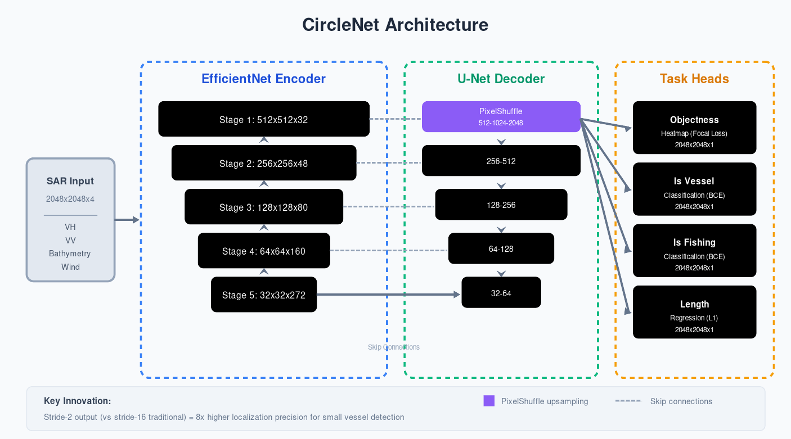
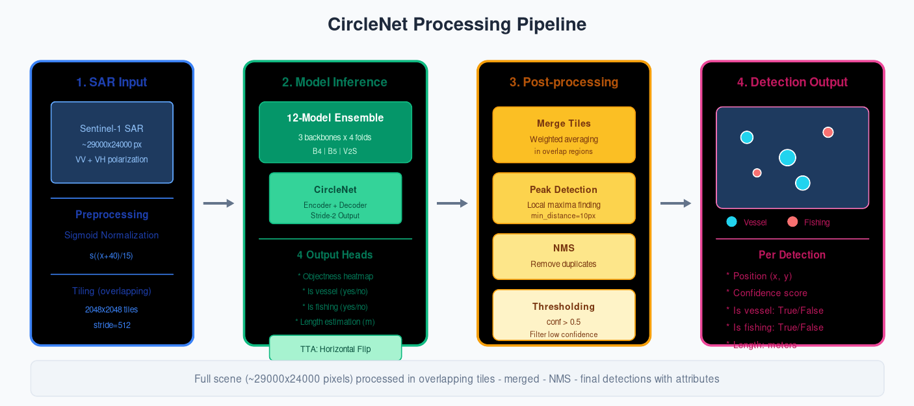

# Giải Nhất xView3: CircleNet (Eugene Khvedchenya)

## Tổng Quan

| Thuộc tính | Giá trị |
|-----------|---------|
| **Xếp hạng** | 1/1,900+ đội |
| **Tác giả** | Eugene Khvedchenya (BloodAxe) - Kaggle Grandmaster |
| **Điểm Holdout** | 0.617 (gấp 3× baseline chính phủ) |
| **Giải thưởng** | $150,000 |
| **GitHub** | [BloodAxe/xView3-The-First-Place-Solution](https://github.com/BloodAxe/xView3-The-First-Place-Solution) |

---

## 1. Ý Tưởng Cốt Lõi

CircleNet là kiến trúc encoder-decoder kết hợp ưu điểm của **CenterNet** (phát hiện điểm) và **U-Net** (skip connections độ phân giải cao). Thay vì dùng bounding box, CircleNet coi mỗi tàu là một **điểm trung tâm** trên heatmap.


*Hình 1: Kiến trúc CircleNet với encoder EfficientNet và decoder PixelShuffle*

**Tại sao hiệu quả cho SAR?**
- Tàu biển nhỏ (10-100 pixels) → phát hiện điểm chính xác hơn bounding box
- Output stride-2 thay vì stride-16 → định vị chính xác hơn 8×
- Decoupled heads → tối ưu riêng cho từng task (detection, classification, length estimation)

---

## 2. Đổi Mới Kỹ Thuật Chính

### 2.1 Stride-2 Output Resolution

Đây là đổi mới quan trọng nhất. Các mô hình thông thường dùng stride-16 (giảm độ phân giải 16×), CircleNet dùng **stride-2** nhờ PixelShuffle upsampling.

| Output Stride | Label Encoding F1 |
|---------------|-------------------|
| Stride-16 | 0.9672 |
| Stride-8 | 0.9934 |
| Stride-4 | 0.9991 |
| **Stride-2** | **0.9999** |

### 2.2 Xử Lý Nhãn Nhiễu

Dữ liệu xView3 có nhãn không đầy đủ (chủ yếu từ AIS correlation). Giải pháp:

1. **Label Smoothing (5%)**: Giảm overconfidence, tăng generalization
2. **Shannon Entropy Regularization**: Với nhãn unknown, đẩy prediction về 0 hoặc 1 thay vì uncertain 0.5

### 2.3 Sigmoid SAR Normalization

SAR imagery có dynamic range rất lớn (-50dB đến +20dB) với nhiều outliers. Thay vì linear scaling:

```
normalized = sigmoid((image + 40) / 15)
```

Cách này nén range mượt mà, robust với outliers.

---

## 3. Kiến Trúc Chi Tiết


*Hình 2: Pipeline xử lý từ ảnh SAR đến detection*

### 3.1 Encoder
- **Backbone**: EfficientNet-B4/B5/V2S (pretrained ImageNet)
- **Input**: 4 kênh (VH, VV polarization + bathymetry + wind)
- **Tile size**: 2048×2048 pixels

### 3.2 Decoder
- U-Net style với skip connections
- PixelShuffle cho upsampling cuối (stride-4 → stride-2)
- GroupNorm thay vì BatchNorm (ổn định hơn với batch size nhỏ)

### 3.3 Task Heads
Bốn heads riêng biệt:
- **Objectness**: Heatmap phát hiện tàu (Focal Loss)
- **Is Vessel**: Phân loại có phải tàu không (BCE)
- **Is Fishing**: Phân loại tàu đánh cá (BCE)
- **Length**: Ước lượng chiều dài tàu (L1 Loss)

---

## 4. Ensemble Strategy


*Hình 3: 12-model ensemble (3 backbone × 4 folds)*

| Backbone | Số Models | CV Score |
|----------|-----------|----------|
| EfficientNet-B4 | 4 folds | 0.51-0.52 |
| EfficientNet-B5 | 4 folds | 0.53-0.55 |
| EfficientNet-V2S | 4 folds | 0.55-0.62 |
| **Ensemble** | **12 total** | **0.617** |

**Test-Time Augmentation**: Horizontal flip averaging (+0.5-1% score)

---

## 5. Kết Quả và Ablation

### 5.1 Đóng Góp Từng Thành Phần

| Component | Δ Score |
|-----------|---------|
| Baseline (stride-16) | - |
| + Stride-2 output | +0.04 |
| + Label smoothing | +0.01 |
| + Entropy regularization | +0.01 |
| + Sigmoid normalization | +0.01 |
| + 12-model ensemble | +0.06 |
| **Tổng** | **+0.13** |

### 5.2 Phân Tích Lỗi

| Loại Lỗi | Tỷ Lệ | Nguyên Nhân |
|----------|-------|-------------|
| False Negatives | 40% | Tàu nhỏ, dark vessels, gần bờ |
| False Positives | 30% | Cơ sở hạ tầng cố định, wave patterns |
| Classification | 20% | Fishing vs non-fishing khó phân biệt |
| Edge Effects | 10% | Tiling artifacts |

---

## 6. Bài Học Rút Ra

1. **Độ phân giải cao quan trọng**: Stride-2 vs stride-16 tạo khác biệt +3.3% label encoding accuracy
2. **Xử lý nhãn nhiễu**: Entropy regularization giúp model tự học từ unlabeled data
3. **Preprocessing đặc thù SAR**: Sigmoid normalization vượt trội linear scaling
4. **Ensemble vẫn là vua**: 12 models > single model (+0.06 score)

---

## 7. Tài Nguyên

### Hardware Requirements
- **GPU**: 4× RTX 3090 (24GB mỗi card)
- **RAM**: 128GB
- **Training time**: ~25 giờ (4 GPUs)

### Links
- **GitHub**: [BloodAxe/xView3-The-First-Place-Solution](https://github.com/BloodAxe/xView3-The-First-Place-Solution)
- **Challenge**: [iuu.xview.us](https://iuu.xview.us)
- **Kaggle Profile**: [bloodaxe](https://www.kaggle.com/bloodaxe)

### Papers Liên Quan
- Zhou et al. (2019). "Objects as Points" - CenterNet
- Tan & Le (2019). "EfficientNet: Rethinking Model Scaling" - ICML
- Ronneberger et al. (2015). "U-Net: Convolutional Networks for Biomedical Image Segmentation" - MICCAI

---

*Cập nhật: 2024-12-19*
