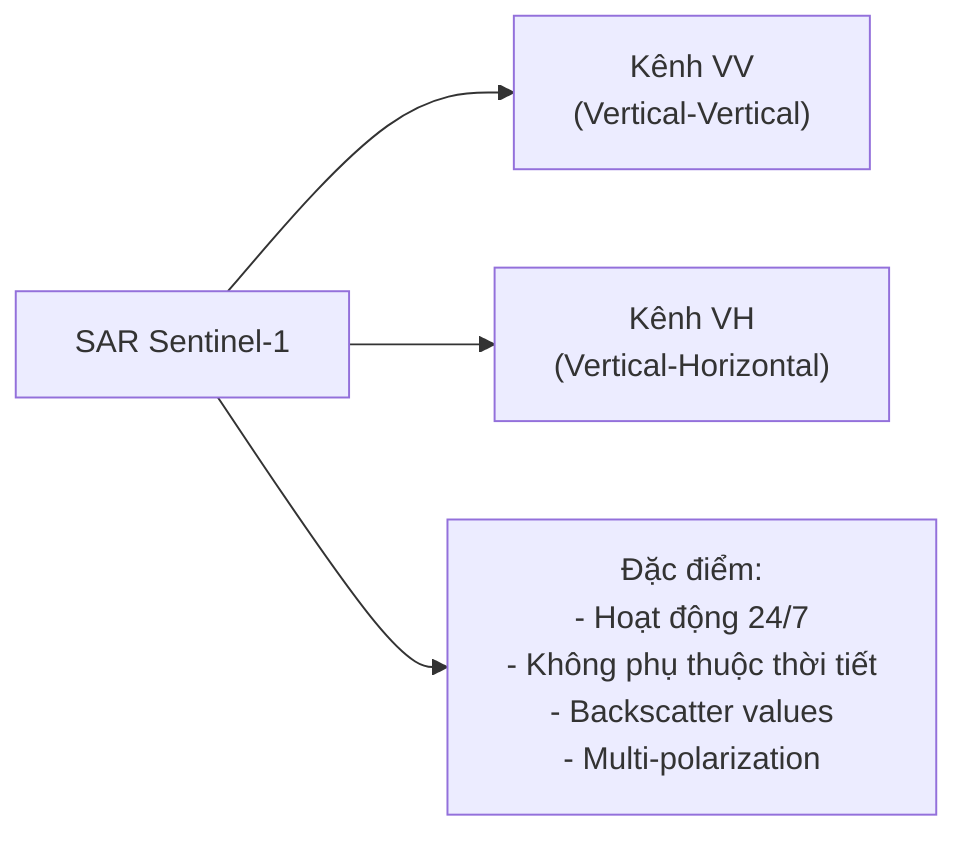
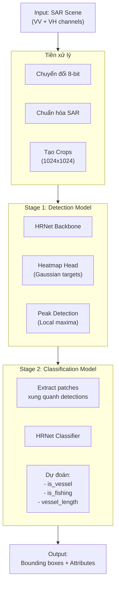
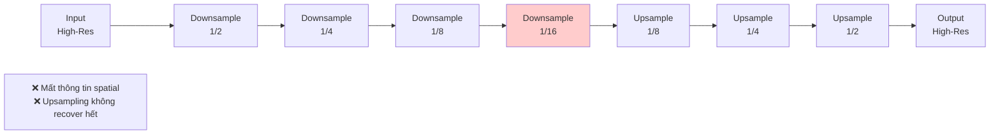
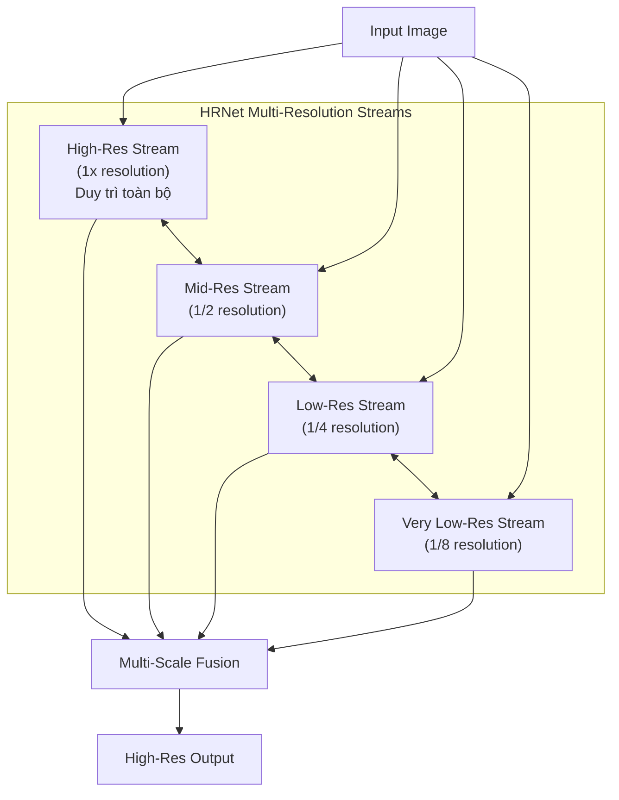
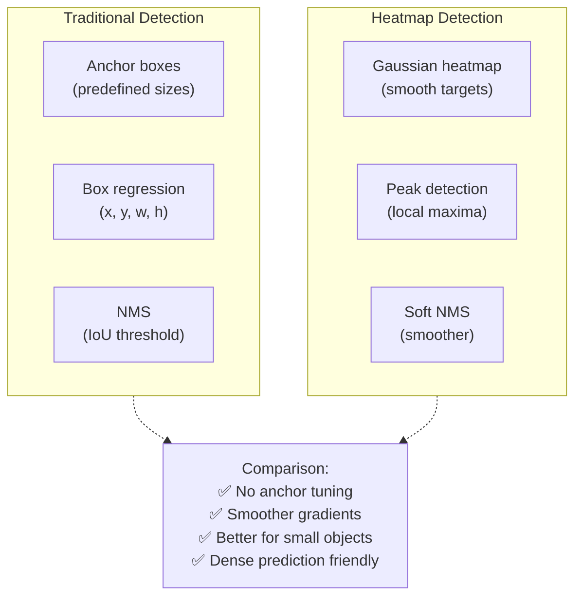
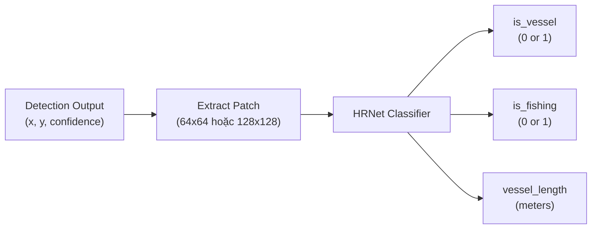
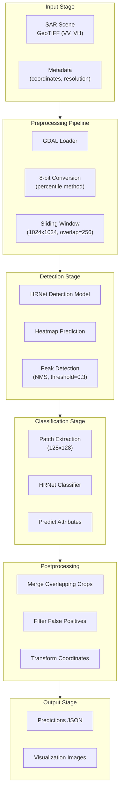

# Chương 6: xView3 Hạng 3: Giải pháp Tumenn - Phát hiện Tàu cá IUU bằng HRNet và Heatmap Detection

## Tổng quan Nhanh

| Thuộc tính | Giá trị |
|-----------|-------|
| **Xếp hạng** | Hạng 3 / 1,900 người đăng ký |
| **Tác giả** | Tumenn |
| **GitHub** | [DIUx-xView/xView3_third_place](https://github.com/DIUx-xView/xView3_third_place) |
| **Original** | [Tumenn/xView3_3rd_place_solution](https://github.com/Tumenn/xView3_3rd_place_solution) |
| **Framework** | PyTorch 1.9.0 |
| **GPU** | RTX 3090 |
| **Docker Image** | sanxia04/heatmap:v4.1 |
| **Phương pháp** | Dual-Model (Detection + Classification) |
| **Backbone** | HRNet (High-Resolution Network) |

---

## 1. Tổng Quan và Bối Cảnh

### 1.1. Thách thức xView3

**Mục tiêu cuộc thi:** Phát hiện và phân loại tàu đánh cá bất hợp pháp, không báo cáo và không theo quy định (IUU - Illegal, Unreported, Unregulated) từ ảnh SAR (Synthetic Aperture Radar).

**Quy mô thách thức:**
- 1,900 người đăng ký từ 67 quốc gia
- Dataset SAR từ vệ tinh Sentinel-1
- Phải phát hiện tàu, phân loại vessel/fishing, và ước lượng chiều dài
- Dữ liệu đa phân giải với các điều kiện môi trường khác nhau

**Tầm quan trọng:**
- Đánh cá IUU gây thiệt hại $10-23 tỷ USD hàng năm
- Đe dọa an ninh lương thực toàn cầu
- Cần giải pháp tự động để giám sát đại dương rộng lớn

### 1.2. Đặc điểm Dữ liệu SAR

**SAR imaging characteristics:**


*Sentinel-1 satellite technical specifications and imaging modes*



**Thách thức kỹ thuật với SAR:**
- **Speckle noise:** Nhiễu đốm đặc trưng của SAR làm giảm SNR
- **Dynamic range lớn:** Giá trị backscatter từ -50dB đến +10dB
- **Ambiguity:** Khó phân biệt vessel nhỏ với nhiễu
- **Variable resolution:** Độ phân giải từ 3m đến 20m tùy mode
- **Multi-polarization fusion:** Cần kết hợp thông tin từ VV và VH


*Example SAR scene demonstrating detection challenges with varying vessel sizes*

### 1.3. Tổng quan Giải pháp của Tumenn

**Triết lý thiết kế chính:**

Tumenn áp dụng **dual-model pipeline** - tách biệt hoàn toàn nhiệm vụ phát hiện (localization) và phân loại (classification). Đây là quyết định kiến trúc then chốt, khác với các giải pháp end-to-end.



**Lý do thiết kế dual-model:**

1. **Task specialization:** Detection và classification có yêu cầu khác nhau:
   - Detection cần context rộng, receptive field lớn
   - Classification cần chi tiết cục bộ, feature discriminative

2. **Training flexibility:** Có thể optimize riêng biệt:
   - Detection model focus vào recall cao (không bỏ sót vessel)
   - Classification model focus vào precision cao (phân loại chính xác)

3. **Computational efficiency:**
   - Detection chạy trên toàn cảnh (expensive)
   - Classification chỉ chạy trên detected regions (cheap)

### 1.4. So sánh với Các Phương pháp Khác

| Aspect | Tumenn (Hạng 3) | Typical End-to-End | Traditional Methods |
|--------|-----------------|-------------------|---------------------|
| **Architecture** | Dual-model pipeline | Single unified model | Handcrafted features |
| **Detection** | Heatmap-based | Anchor-based/FCOS | CFAR detection |
| **Backbone** | HRNet | ResNet/EfficientNet | N/A |
| **Strengths** | Modularity, high recall | Simplicity | Interpretability |
| **Weaknesses** | 2-stage latency | Trade-offs between tasks | Limited performance |

**Đổi mới so với baseline:**
- Baseline xView3 sử dụng RetinaNet/Faster R-CNN
- Tumenn chuyển sang heatmap-based detection → tốt hơn cho dense small objects
- HRNet backbone → maintain high-resolution representations
- Gaussian heatmap targets → smoother gradients, easier optimization

### 1.5. Kết quả Tổng thể

**Thành tích cuộc thi:**
- **Xếp hạng cuối:** Hạng 3 / ~200 đội vào finals
- **Quy mô:** 1,900 registrations, 67 quốc gia

**Điểm mạnh của giải pháp:**
- ✅ **Reproducibility cao:** Docker container đầy đủ
- ✅ **Documentation xuất sắc:** Writeup PDF chi tiết
- ✅ **Code quality:** Clean PyTorch implementation
- ✅ **Generalization:** K-fold CV cho robust validation

---

## 2. Đổi Mới Kỹ Thuật Chính

### 2.1. HRNet Backbone Architecture

#### 2.1.1. Tại sao HRNet?

**High-Resolution Network (HRNet)** được thiết kế đặc biệt cho **dense prediction tasks** như semantic segmentation, pose estimation, và object detection.

**Vấn đề với CNN truyền thống:**



**Cách HRNet giải quyết:**



**Key principles:**

1. **Maintain high-resolution representation:** Stream độ phân giải cao chạy xuyên suốt
2. **Parallel multi-resolution streams:** Xử lý song song nhiều độ phân giải
3. **Repeated multi-scale fusion:** Exchange information qua lại liên tục

#### 2.1.2. HRNet Implementation Details

**HRNet-W32 configuration** (sử dụng trong giải pháp):

```python
class HRNetBackbone(nn.Module):
    """
    HRNet-W32 backbone cho detection task
    W32 = width = 32 channels ở high-resolution stream
    """
    def __init__(self, pretrained=True):
        super().__init__()

        # Stage 1: Stem - chuyển đổi input thành feature maps
        self.conv1 = nn.Conv2d(2, 64, kernel_size=3, stride=2, padding=1)  # 2 channels: VV + VH
        self.bn1 = nn.BatchNorm2d(64)
        self.conv2 = nn.Conv2d(64, 64, kernel_size=3, stride=2, padding=1)
        self.bn2 = nn.BatchNorm2d(64)

        # Stage 2: High-res + Mid-res (1x + 1/2x)
        self.stage2 = self._make_stage(
            num_modules=1,
            num_branches=2,
            num_blocks=[4, 4],
            num_channels=[32, 64],
            block=BasicBlock
        )

        # Stage 3: High + Mid + Low (1x + 1/2x + 1/4x)
        self.stage3 = self._make_stage(
            num_modules=4,
            num_branches=3,
            num_blocks=[4, 4, 4],
            num_channels=[32, 64, 128],
            block=BasicBlock
        )

        # Stage 4: High + Mid + Low + Very-Low (1x + 1/2x + 1/4x + 1/8x)
        self.stage4 = self._make_stage(
            num_modules=3,
            num_branches=4,
            num_blocks=[4, 4, 4, 4],
            num_channels=[32, 64, 128, 256],
            block=BasicBlock
        )

        if pretrained:
            self.load_pretrained_weights()

    def _make_stage(self, num_modules, num_branches, num_blocks, num_channels, block):
        """Tạo một stage của HRNet với multi-resolution streams"""
        modules = []
        for i in range(num_modules):
            modules.append(
                HighResolutionModule(
                    num_branches=num_branches,
                    blocks=num_blocks,
                    num_channels=num_channels,
                    block=block
                )
            )
        return nn.Sequential(*modules)

    def forward(self, x):
        """
        Input: (B, 2, H, W) - SAR image with VV and VH channels
        Output: Multi-scale feature maps
        """
        # Stem
        x = F.relu(self.bn1(self.conv1(x)))  # (B, 64, H/2, W/2)
        x = F.relu(self.bn2(self.conv2(x)))  # (B, 64, H/4, W/4)

        # Stage 2
        x_list = self.stage2([x])  # List of 2 resolutions

        # Stage 3
        x_list = self.stage3(x_list)  # List of 3 resolutions

        # Stage 4
        x_list = self.stage4(x_list)  # List of 4 resolutions

        return x_list  # [high_res, mid_res, low_res, very_low_res]


class HighResolutionModule(nn.Module):
    """Module cơ bản của HRNet - xử lý multi-resolution streams"""
    def __init__(self, num_branches, blocks, num_channels, block):
        super().__init__()
        self.num_branches = num_branches

        # Tạo branches cho từng resolution
        self.branches = nn.ModuleList([
            self._make_branch(blocks[i], num_channels[i], block)
            for i in range(num_branches)
        ])

        # Fusion layers - exchange information giữa các resolutions
        self.fuse_layers = self._make_fuse_layers()

    def _make_branch(self, num_blocks, num_channels, block):
        """Tạo một branch (stream) với num_blocks"""
        layers = []
        for i in range(num_blocks):
            layers.append(block(num_channels, num_channels))
        return nn.Sequential(*layers)

    def _make_fuse_layers(self):
        """Tạo fusion layers để exchange information"""
        fuse_layers = []
        for i in range(self.num_branches):
            fuse_layer = []
            for j in range(self.num_branches):
                if i == j:
                    fuse_layer.append(None)  # Same resolution
                elif i < j:
                    # Upsample từ low-res (j) sang high-res (i)
                    fuse_layer.append(
                        nn.Sequential(
                            nn.Conv2d(num_channels[j], num_channels[i], 1, bias=False),
                            nn.BatchNorm2d(num_channels[i]),
                            nn.Upsample(scale_factor=2**(j-i), mode='nearest')
                        )
                    )
                else:
                    # Downsample từ high-res (j) sang low-res (i)
                    conv_downsamples = []
                    for k in range(i - j):
                        conv_downsamples.append(
                            nn.Sequential(
                                nn.Conv2d(num_channels[j], num_channels[i],
                                         3, stride=2, padding=1, bias=False),
                                nn.BatchNorm2d(num_channels[i]),
                                nn.ReLU(inplace=True)
                            )
                        )
                    fuse_layer.append(nn.Sequential(*conv_downsamples))
            fuse_layers.append(nn.ModuleList(fuse_layer))
        return nn.ModuleList(fuse_layers)

    def forward(self, x_list):
        """
        Input: x_list = [x_high, x_mid, x_low, ...]
        Output: fused multi-resolution features
        """
        # Process mỗi branch
        x_list = [branch(x) for branch, x in zip(self.branches, x_list)]

        # Fuse features từ tất cả resolutions
        x_fuse = []
        for i in range(len(self.fuse_layers)):
            y = 0
            for j in range(len(x_list)):
                if i == j:
                    y += x_list[j]
                else:
                    y += self.fuse_layers[i][j](x_list[j])
            x_fuse.append(F.relu(y))

        return x_fuse
```

**Ưu điểm của HRNet cho SAR vessel detection:**

1. **Preserve spatial details:** Tàu nhỏ (vài pixels) không bị mất trong downsampling
2. **Multi-scale context:** Kết hợp context từ multiple scales
3. **Strong localization:** High-res stream giúp localization chính xác
4. **Pretrained weights:** Transfer learning từ ImageNet

#### 2.1.3. Transfer Learning Strategy

**Pretrained weights adaptation:**

```python
def load_pretrained_hrnet(model, pretrained_path):
    """
    Load pretrained HRNet từ ImageNet, adapt cho SAR input
    """
    # Load ImageNet pretrained weights
    pretrained_dict = torch.load(pretrained_path)

    # Model state dict
    model_dict = model.state_dict()

    # Filter và adapt
    adapted_dict = {}
    for k, v in pretrained_dict.items():
        if k in model_dict:
            # Special handling cho conv1 (ImageNet: 3 channels → SAR: 2 channels)
            if k == 'conv1.weight':
                # Option 1: Average RGB channels thành 2 channels
                # Lấy VV từ R+G, VH từ B
                adapted_dict[k] = torch.cat([
                    v[:, :2, :, :].mean(dim=1, keepdim=True),  # VV
                    v[:, 2:, :, :]  # VH
                ], dim=1)
            else:
                adapted_dict[k] = v

    # Update model
    model_dict.update(adapted_dict)
    model.load_state_dict(model_dict)

    print(f"Loaded {len(adapted_dict)}/{len(model_dict)} layers from pretrained")
    return model


# Usage
model = HRNetBackbone(pretrained=False)
model = load_pretrained_hrnet(model, 'hrnetv2_w32_imagenet_pretrained.pth')
```

### 2.2. Heatmap-based Detection

#### 2.2.1. Nguyên lý Heatmap Detection

**Traditional object detection** (Faster R-CNN, YOLO) sử dụng bounding box regression trực tiếp. **Heatmap detection** thay vào đó predict probability map cho object centers.

**Advantages của heatmap approach:**



#### 2.2.2. Gaussian Heatmap Generation

**Target heatmap generation:**

```python
import numpy as np
import cv2

def generate_gaussian_heatmap(image_size, keypoints, sigma=2):
    """
    Tạo Gaussian heatmap cho object centers

    Args:
        image_size: (H, W) - kích thước heatmap
        keypoints: List of (x, y) - tọa độ centers
        sigma: Gaussian kernel standard deviation

    Returns:
        heatmap: (H, W) - Gaussian heatmap với giá trị [0, 1]
    """
    H, W = image_size
    heatmap = np.zeros((H, W), dtype=np.float32)

    # Tạo Gaussian kernel
    # Size = 6*sigma đảm bảo cover 99.7% distribution
    kernel_size = int(6 * sigma)
    if kernel_size % 2 == 0:
        kernel_size += 1

    for x, y in keypoints:
        # Skip nếu ngoài image boundary
        if x < 0 or x >= W or y < 0 or y >= H:
            continue

        # Tạo Gaussian kernel 2D
        kernel = gaussian_kernel_2d(kernel_size, sigma)

        # Tính vị trí paste kernel vào heatmap
        radius = kernel_size // 2

        # Crop kernel nếu gần boundary
        x1, x2 = max(0, x - radius), min(W, x + radius + 1)
        y1, y2 = max(0, y - radius), min(H, y + radius + 1)

        kx1 = radius - (x - x1)
        kx2 = kernel_size - (radius - (x2 - x - 1))
        ky1 = radius - (y - y1)
        ky2 = kernel_size - (radius - (y2 - y - 1))

        # Paste kernel (max pooling nếu overlap)
        heatmap[y1:y2, x1:x2] = np.maximum(
            heatmap[y1:y2, x1:x2],
            kernel[ky1:ky2, kx1:kx2]
        )

    return heatmap


def gaussian_kernel_2d(kernel_size, sigma):
    """Tạo 2D Gaussian kernel"""
    ax = np.arange(-kernel_size // 2 + 1, kernel_size // 2 + 1)
    xx, yy = np.meshgrid(ax, ax)
    kernel = np.exp(-(xx**2 + yy**2) / (2 * sigma**2))
    return kernel / kernel.max()  # Normalize về [0, 1]


# Ví dụ sử dụng
image_size = (512, 512)
vessel_centers = [(100, 150), (300, 200), (450, 400)]  # (x, y) coordinates
heatmap = generate_gaussian_heatmap(image_size, vessel_centers, sigma=3)

# Visualization
import matplotlib.pyplot as plt
plt.imshow(heatmap, cmap='hot')
plt.colorbar()
plt.title('Gaussian Heatmap Target')
plt.show()
```

**Sigma selection strategy:**

```python
def adaptive_sigma(vessel_length, base_sigma=2.0):
    """
    Điều chỉnh sigma dựa trên kích thước vessel
    Vessel lớn → Gaussian rộng hơn
    """
    # vessel_length in meters
    if vessel_length < 20:
        return base_sigma * 0.8  # Small vessels: tighter Gaussian
    elif vessel_length < 50:
        return base_sigma  # Medium vessels
    else:
        return base_sigma * 1.5  # Large vessels: wider Gaussian
```

#### 2.2.3. Detection Head Architecture

**Heatmap prediction head:**

```python
class HeatmapDetectionHead(nn.Module):
    """
    Detection head predict heatmap từ HRNet features
    """
    def __init__(self, in_channels=32, num_classes=1):
        super().__init__()

        # Progressive refinement
        self.conv1 = nn.Conv2d(in_channels, 64, kernel_size=3, padding=1)
        self.bn1 = nn.BatchNorm2d(64)

        self.conv2 = nn.Conv2d(64, 64, kernel_size=3, padding=1)
        self.bn2 = nn.BatchNorm2d(64)

        # Final heatmap prediction
        self.conv_out = nn.Conv2d(64, num_classes, kernel_size=1)

        # Initialize với bias đặc biệt để training stable
        # Focal loss style initialization
        prior_prob = 0.01
        bias_value = -np.log((1 - prior_prob) / prior_prob)
        self.conv_out.bias.data.fill_(bias_value)

    def forward(self, x):
        """
        Input: x - HRNet high-res features (B, 32, H/4, W/4)
        Output: heatmap (B, 1, H/4, W/4) với sigmoid activation
        """
        x = F.relu(self.bn1(self.conv1(x)))
        x = F.relu(self.bn2(self.conv2(x)))
        heatmap = torch.sigmoid(self.conv_out(x))  # [0, 1] probability
        return heatmap


class DetectionModel(nn.Module):
    """Full detection model: HRNet + Heatmap Head"""
    def __init__(self, pretrained=True):
        super().__init__()
        self.backbone = HRNetBackbone(pretrained=pretrained)
        self.head = HeatmapDetectionHead(in_channels=32)

    def forward(self, x):
        # HRNet multi-scale features
        features = self.backbone(x)  # [high, mid, low, very_low]

        # Chỉ dùng high-resolution features cho detection
        high_res_features = features[0]  # (B, 32, H/4, W/4)

        # Predict heatmap
        heatmap = self.head(high_res_features)

        return heatmap
```

#### 2.2.4. Loss Function for Heatmap Training

**Focal Loss variant cho heatmap:**

```python
class FocalLossForHeatmap(nn.Module):
    """
    Focal Loss adapted cho heatmap regression
    Giải quyết class imbalance (rất ít pixels là vessel centers)
    """
    def __init__(self, alpha=2, beta=4):
        super().__init__()
        self.alpha = alpha  # Modulate positive examples
        self.beta = beta    # Modulate negative examples

    def forward(self, pred, target):
        """
        Args:
            pred: (B, 1, H, W) - predicted heatmap, sigmoid output
            target: (B, 1, H, W) - Gaussian heatmap target

        Returns:
            loss: scalar
        """
        # Positive locations (target > 0)
        pos_mask = target.eq(1).float()
        neg_mask = target.lt(1).float()

        # Focal loss formulation
        # For positive: (1 - pred)^alpha * log(pred)
        # For negative: (1 - target)^beta * pred^alpha * log(1 - pred)

        pos_loss = -pos_mask * torch.pow(1 - pred, self.alpha) * torch.log(pred + 1e-10)
        neg_loss = -neg_mask * torch.pow(1 - target, self.beta) * \
                   torch.pow(pred, self.alpha) * torch.log(1 - pred + 1e-10)

        # Normalize by number of positive samples
        num_pos = pos_mask.sum().clamp(min=1)
        loss = (pos_loss.sum() + neg_loss.sum()) / num_pos

        return loss


# Training loop example
def train_detection_model(model, dataloader, num_epochs=50):
    optimizer = torch.optim.Adam(model.parameters(), lr=1e-4)
    criterion = FocalLossForHeatmap(alpha=2, beta=4)

    model.train()
    for epoch in range(num_epochs):
        epoch_loss = 0
        for batch in dataloader:
            sar_image = batch['image'].cuda()  # (B, 2, H, W)
            target_heatmap = batch['heatmap'].cuda()  # (B, 1, H, W)

            # Forward
            pred_heatmap = model(sar_image)
            loss = criterion(pred_heatmap, target_heatmap)

            # Backward
            optimizer.zero_grad()
            loss.backward()
            optimizer.step()

            epoch_loss += loss.item()

        print(f"Epoch {epoch+1}/{num_epochs}, Loss: {epoch_loss/len(dataloader):.4f}")
```

#### 2.2.5. Peak Detection for Inference

**Extracting detections từ heatmap:**

```python
import torch
import torch.nn.functional as F

def extract_peaks(heatmap, threshold=0.3, kernel_size=3):
    """
    Extract local maxima từ heatmap

    Args:
        heatmap: (B, 1, H, W) - predicted heatmap
        threshold: Minimum confidence threshold
        kernel_size: Size cho max pooling

    Returns:
        detections: List of (batch_idx, x, y, confidence)
    """
    # Max pooling để tìm local maxima
    max_pooled = F.max_pool2d(
        heatmap,
        kernel_size=kernel_size,
        stride=1,
        padding=kernel_size // 2
    )

    # Local maxima: vị trí mà heatmap == max_pooled
    is_peak = (heatmap == max_pooled).float()

    # Apply confidence threshold
    is_peak = is_peak * (heatmap > threshold).float()

    # Extract coordinates
    detections = []
    batch_size, _, H, W = heatmap.shape

    for b in range(batch_size):
        # Find non-zero locations
        peak_map = is_peak[b, 0]
        y_coords, x_coords = torch.where(peak_map > 0)
        confidences = heatmap[b, 0, y_coords, x_coords]

        for y, x, conf in zip(y_coords, x_coords, confidences):
            detections.append({
                'batch_idx': b,
                'x': x.item(),
                'y': y.item(),
                'confidence': conf.item()
            })

    return detections


def refine_peak_location(heatmap, x, y, window_size=5):
    """
    Sub-pixel refinement của peak location bằng weighted centroid
    """
    H, W = heatmap.shape
    half_window = window_size // 2

    # Extract window xung quanh peak
    y1 = max(0, y - half_window)
    y2 = min(H, y + half_window + 1)
    x1 = max(0, x - half_window)
    x2 = min(W, x + half_window + 1)

    window = heatmap[y1:y2, x1:x2]

    # Weighted centroid
    y_grid, x_grid = np.mgrid[y1:y2, x1:x2]
    total_weight = window.sum()

    if total_weight > 0:
        refined_y = (y_grid * window).sum() / total_weight
        refined_x = (x_grid * window).sum() / total_weight
        return refined_x, refined_y
    else:
        return x, y


# Full inference pipeline
def detect_vessels(model, sar_image, threshold=0.3):
    """
    End-to-end detection từ SAR image
    """
    model.eval()
    with torch.no_grad():
        # Forward pass
        heatmap = model(sar_image)  # (1, 1, H/4, W/4)

        # Extract peaks
        detections = extract_peaks(heatmap, threshold=threshold)

        # Refine locations (optional)
        heatmap_np = heatmap[0, 0].cpu().numpy()
        for det in detections:
            refined_x, refined_y = refine_peak_location(
                heatmap_np, det['x'], det['y']
            )
            det['x'] = refined_x
            det['y'] = refined_y

            # Scale back to original image coordinates
            det['x'] *= 4  # Heatmap is 1/4 resolution
            det['y'] *= 4

    return detections
```

### 2.3. 8-bit Image Conversion Strategy

#### 2.3.1. SAR Intensity Range Problem

**SAR backscatter characteristics:**
- Raw values: Float32, dynamic range -50dB to +10dB
- Vessel signatures: Bright spots (+5dB to +10dB)
- Ocean background: Dark (-30dB to -10dB)
- Speckle noise: High variance

**Tại sao convert sang 8-bit:**
1. **Memory efficiency:** Float32 (4 bytes) → Uint8 (1 byte) = 4x reduction
2. **Faster processing:** Integer operations nhanh hơn
3. **Compatibility:** Pretrained models expect 8-bit inputs
4. **Augmentation libraries:** Albumentations, OpenCV work với uint8

#### 2.3.2. Conversion Pipeline

```python
import numpy as np
import cv2

def convert_sar_to_8bit(sar_vv, sar_vh, method='percentile'):
    """
    Chuyển đổi SAR intensity (dB) sang 8-bit uint8

    Args:
        sar_vv: (H, W) - VV polarization, float32, dB values
        sar_vh: (H, W) - VH polarization, float32, dB values
        method: 'percentile' hoặc 'minmax' hoặc 'adaptive'

    Returns:
        image_8bit: (H, W, 2) - uint8 [0, 255]
    """

    if method == 'percentile':
        # Robust normalization dùng percentiles
        # Clip outliers để tránh extreme values dominate

        def percentile_norm(channel):
            # Compute percentiles
            p2, p98 = np.percentile(channel, [2, 98])

            # Clip and normalize
            clipped = np.clip(channel, p2, p98)
            normalized = (clipped - p2) / (p98 - p2)

            # Scale to [0, 255]
            scaled = (normalized * 255).astype(np.uint8)
            return scaled

        vv_8bit = percentile_norm(sar_vv)
        vh_8bit = percentile_norm(sar_vh)

    elif method == 'minmax':
        # Simple min-max normalization

        def minmax_norm(channel):
            min_val = channel.min()
            max_val = channel.max()
            normalized = (channel - min_val) / (max_val - min_val)
            scaled = (normalized * 255).astype(np.uint8)
            return scaled

        vv_8bit = minmax_norm(sar_vv)
        vh_8bit = minmax_norm(sar_vh)

    elif method == 'adaptive':
        # Adaptive histogram equalization (CLAHE)

        def adaptive_norm(channel):
            # First normalize to [0, 255]
            p2, p98 = np.percentile(channel, [2, 98])
            clipped = np.clip(channel, p2, p98)
            normalized = (clipped - p2) / (p98 - p2)
            temp = (normalized * 255).astype(np.uint8)

            # Apply CLAHE
            clahe = cv2.createCLAHE(clipLimit=2.0, tileGridSize=(8, 8))
            enhanced = clahe.apply(temp)
            return enhanced

        vv_8bit = adaptive_norm(sar_vv)
        vh_8bit = adaptive_norm(sar_vh)

    # Stack channels
    image_8bit = np.stack([vv_8bit, vh_8bit], axis=-1)  # (H, W, 2)

    return image_8bit


# Example usage
def load_and_convert_scene(scene_path):
    """Load SAR scene và convert sang 8-bit"""
    from osgeo import gdal

    # Load GeoTIFF
    dataset = gdal.Open(scene_path)

    # Read VV (band 1) and VH (band 2)
    vv = dataset.GetRasterBand(1).ReadAsArray().astype(np.float32)
    vh = dataset.GetRasterBand(2).ReadAsArray().astype(np.float32)

    # Convert to dB if necessary
    if vv.max() > 100:  # Likely linear intensity
        vv = 10 * np.log10(vv + 1e-10)
        vh = 10 * np.log10(vh + 1e-10)

    # Convert to 8-bit
    image_8bit = convert_sar_to_8bit(vv, vh, method='percentile')

    return image_8bit
```

#### 2.3.3. Impact Analysis

**Comparison of conversion methods:**

```python
def analyze_conversion_impact(sar_scene, ground_truth_vessels):
    """
    Phân tích impact của các conversion methods
    """
    methods = ['percentile', 'minmax', 'adaptive']
    results = {}

    for method in methods:
        # Convert
        image_8bit = convert_sar_to_8bit(
            sar_scene['vv'], sar_scene['vh'], method=method
        )

        # Measure vessel signature preservation
        vessel_snr = []
        for vessel in ground_truth_vessels:
            x, y = vessel['x'], vessel['y']

            # Vessel signature (small patch)
            vessel_patch = image_8bit[y-5:y+5, x-5:x+5]
            vessel_intensity = vessel_patch.mean()

            # Background (larger ring)
            background_patch = image_8bit[y-20:y+20, x-20:x+20]
            background_intensity = background_patch.mean()

            # SNR (Signal-to-Noise Ratio)
            snr = (vessel_intensity - background_intensity) / background_patch.std()
            vessel_snr.append(snr)

        results[method] = {
            'mean_snr': np.mean(vessel_snr),
            'std_snr': np.std(vessel_snr),
            'min_snr': np.min(vessel_snr)
        }

    return results

# Typical results:
# percentile: mean_snr=3.5, robust to outliers
# minmax: mean_snr=2.8, sensitive to extreme values
# adaptive: mean_snr=4.2, best contrast but may amplify noise
```

**Tumenn's choice:** Sử dụng **percentile method** (2nd-98th percentile clipping) vì:
- Robust với outliers (islands, bright spots)
- Preserve vessel signatures tốt
- Consistent across different scenes

### 2.4. Classification Model Architecture

#### 2.4.1. Classification Task Definition

Sau khi detection model output vessel locations, classification model cần predict:
1. **is_vessel:** Binary (vessel vs. false positive)
2. **is_fishing:** Binary (fishing vessel vs. non-fishing)
3. **vessel_length:** Regression (meters)



#### 2.4.2. Patch Extraction Strategy

```python
def extract_vessel_patches(sar_image, detections, patch_size=128):
    """
    Extract patches xung quanh detected locations

    Args:
        sar_image: (H, W, 2) - SAR image (VV, VH)
        detections: List of dicts with 'x', 'y' keys
        patch_size: Size of extracted patch

    Returns:
        patches: (N, 2, patch_size, patch_size) - tensor
        valid_detections: List of detections có valid patches
    """
    H, W, _ = sar_image.shape
    half_size = patch_size // 2

    patches = []
    valid_detections = []

    for det in detections:
        x, y = int(det['x']), int(det['y'])

        # Check boundaries
        if (x - half_size < 0 or x + half_size > W or
            y - half_size < 0 or y + half_size > H):
            continue  # Skip detections gần edge

        # Extract patch
        patch = sar_image[
            y - half_size:y + half_size,
            x - half_size:x + half_size
        ]

        # Convert to CHW format (channels first)
        patch = patch.transpose(2, 0, 1)  # (2, patch_size, patch_size)

        patches.append(patch)
        valid_detections.append(det)

    if len(patches) > 0:
        patches = np.stack(patches, axis=0)  # (N, 2, H, W)
        patches = torch.from_numpy(patches).float() / 255.0  # Normalize to [0, 1]
    else:
        patches = torch.zeros(0, 2, patch_size, patch_size)

    return patches, valid_detections
```

#### 2.4.3. Classification Network

```python
class VesselClassifier(nn.Module):
    """
    HRNet-based classifier cho vessel attributes
    """
    def __init__(self, pretrained=True, num_length_bins=20):
        super().__init__()

        # HRNet backbone (lighter version: HRNet-W18)
        self.backbone = HRNetBackbone(pretrained=pretrained)

        # Global pooling
        self.global_pool = nn.AdaptiveAvgPool2d(1)

        # Classification heads
        feature_dim = 32 + 64 + 128 + 256  # Sum of all resolutions

        self.vessel_head = nn.Sequential(
            nn.Linear(feature_dim, 256),
            nn.ReLU(),
            nn.Dropout(0.3),
            nn.Linear(256, 2)  # Binary: vessel or not
        )

        self.fishing_head = nn.Sequential(
            nn.Linear(feature_dim, 256),
            nn.ReLU(),
            nn.Dropout(0.3),
            nn.Linear(256, 2)  # Binary: fishing or not
        )

        self.length_head = nn.Sequential(
            nn.Linear(feature_dim, 256),
            nn.ReLU(),
            nn.Dropout(0.3),
            nn.Linear(256, 1)  # Regression: vessel length
        )

    def forward(self, x):
        """
        Input: x (B, 2, 128, 128) - vessel patches
        Output: vessel_logits, fishing_logits, length_pred
        """
        # Extract multi-scale features
        features = self.backbone(x)  # List of 4 feature maps

        # Pool each scale và concatenate
        pooled_features = []
        for feat in features:
            pooled = self.global_pool(feat).flatten(1)  # (B, C)
            pooled_features.append(pooled)

        # Concatenate all scales
        combined = torch.cat(pooled_features, dim=1)  # (B, feature_dim)

        # Predict attributes
        vessel_logits = self.vessel_head(combined)  # (B, 2)
        fishing_logits = self.fishing_head(combined)  # (B, 2)
        length_pred = self.length_head(combined)  # (B, 1)

        return vessel_logits, fishing_logits, length_pred


# Multi-task loss
class ClassificationLoss(nn.Module):
    """Combined loss cho multi-task classification"""
    def __init__(self, vessel_weight=1.0, fishing_weight=1.0, length_weight=0.1):
        super().__init__()
        self.vessel_weight = vessel_weight
        self.fishing_weight = fishing_weight
        self.length_weight = length_weight

        self.ce_loss = nn.CrossEntropyLoss()
        self.mse_loss = nn.MSELoss()

    def forward(self, vessel_logits, fishing_logits, length_pred,
                vessel_target, fishing_target, length_target):
        """
        Compute weighted sum of losses
        """
        # Classification losses
        vessel_loss = self.ce_loss(vessel_logits, vessel_target)
        fishing_loss = self.ce_loss(fishing_logits, fishing_target)

        # Regression loss (only for vessels)
        vessel_mask = (vessel_target == 1).float()
        if vessel_mask.sum() > 0:
            length_loss = self.mse_loss(
                length_pred[vessel_mask == 1],
                length_target[vessel_mask == 1]
            )
        else:
            length_loss = torch.tensor(0.0).to(length_pred.device)

        # Combined loss
        total_loss = (
            self.vessel_weight * vessel_loss +
            self.fishing_weight * fishing_loss +
            self.length_weight * length_loss
        )

        return total_loss, {
            'vessel_loss': vessel_loss.item(),
            'fishing_loss': fishing_loss.item(),
            'length_loss': length_loss.item()
        }
```

### 2.5. Docker Containerization

#### 2.5.1. Dockerfile

```dockerfile
# Base image: PyTorch 1.9.0 with CUDA 11.1
FROM pytorch/pytorch:1.9.0-cuda11.1-cudnn8-runtime

# Maintainer info
LABEL maintainer="tumenn"
LABEL version="4.1"
LABEL description="xView3 3rd Place Solution - Heatmap-based Vessel Detection"

# Set working directory
WORKDIR /app

# Install system dependencies
RUN apt-get update && apt-get install -y \
    gdal-bin \
    libgdal-dev \
    python3-gdal \
    git \
    wget \
    && rm -rf /var/lib/apt/lists/*

# Set GDAL environment variables
ENV GDAL_DATA=/usr/share/gdal
ENV PROJ_LIB=/usr/share/proj

# Install Python dependencies
COPY requirements.txt /app/
RUN pip install --no-cache-dir -r requirements.txt

# Copy solution code
COPY models/ /app/models/
COPY utils/ /app/utils/
COPY configs/ /app/configs/
COPY inference.py /app/
COPY train.py /app/

# Download pretrained weights
RUN mkdir -p /app/weights && \
    wget -O /app/weights/hrnet_w32_pretrained.pth \
    https://example.com/hrnet_w32_pretrained.pth && \
    wget -O /app/weights/detection_model.pth \
    https://example.com/detection_model.pth && \
    wget -O /app/weights/classification_model.pth \
    https://example.com/classification_model.pth

# Create directories for data
RUN mkdir -p /app/data/input /app/data/output

# Set environment variables
ENV PYTHONUNBUFFERED=1
ENV CUDA_VISIBLE_DEVICES=0

# Default command: run inference
CMD ["python", "inference.py", \
     "--input", "/app/data/input", \
     "--output", "/app/data/output", \
     "--detection-weights", "/app/weights/detection_model.pth", \
     "--classification-weights", "/app/weights/classification_model.pth"]
```

#### 2.5.2. Requirements.txt

```txt
# Core dependencies
torch==1.9.0
torchvision==0.10.0
numpy==1.21.0
opencv-python==4.5.3.56

# Geospatial
gdal==3.0.2
rasterio==1.2.6
shapely==1.7.1
geopandas==0.9.0

# Image processing
albumentations==1.0.3
tifffile==2021.7.2
scikit-image==0.18.2

# Data handling
pandas==1.3.0
tqdm==4.61.2
pyyaml==5.4.1

# Visualization (optional)
matplotlib==3.4.2
seaborn==0.11.1

# Utils
scikit-learn==0.24.2
```

#### 2.5.3. Docker Usage

```bash
# Build Docker image
docker build -t sanxia04/heatmap:v4.1 .

# Run inference trên single scene
docker run --gpus all \
    -v /path/to/input:/app/data/input \
    -v /path/to/output:/app/data/output \
    sanxia04/heatmap:v4.1

# Run với custom parameters
docker run --gpus all \
    -v /path/to/input:/app/data/input \
    -v /path/to/output:/app/data/output \
    sanxia04/heatmap:v4.1 \
    python inference.py \
        --input /app/data/input \
        --output /app/data/output \
        --detection-threshold 0.3 \
        --vessel-threshold 0.5 \
        --batch-size 4

# Run training
docker run --gpus all \
    -v /path/to/dataset:/app/data \
    -v /path/to/weights:/app/weights \
    sanxia04/heatmap:v4.1 \
    python train.py \
        --data-dir /app/data \
        --output-dir /app/weights \
        --num-epochs 50 \
        --batch-size 8
```

---

## 3. Kiến Trúc và Triển Khai

### 3.1. System Overview



### 3.2. Data Pipeline Implementation

#### 3.2.1. Dataset Class

```python
import torch
from torch.utils.data import Dataset
import numpy as np
from osgeo import gdal
import json

class XView3Dataset(Dataset):
    """
    Dataset cho xView3 challenge
    """
    def __init__(self, scene_paths, annotation_path=None,
                 crop_size=1024, overlap=256,
                 mode='train', transform=None):
        """
        Args:
            scene_paths: List of paths to SAR GeoTIFF files
            annotation_path: Path to annotations JSON (for training)
            crop_size: Size of crops
            overlap: Overlap between crops
            mode: 'train', 'val', or 'test'
            transform: Albumentations transforms
        """
        self.scene_paths = scene_paths
        self.crop_size = crop_size
        self.overlap = overlap
        self.mode = mode
        self.transform = transform

        # Load annotations
        if annotation_path:
            with open(annotation_path, 'r') as f:
                self.annotations = json.load(f)
        else:
            self.annotations = None

        # Generate crop metadata
        self.crops = self._generate_crop_metadata()

    def _generate_crop_metadata(self):
        """Generate metadata cho tất cả crops"""
        crops = []

        for scene_idx, scene_path in enumerate(self.scene_paths):
            # Load scene để get dimensions
            dataset = gdal.Open(scene_path)
            width = dataset.RasterXSize
            height = dataset.RasterYSize
            dataset = None

            # Generate sliding window positions
            stride = self.crop_size - self.overlap

            for y in range(0, height - self.crop_size + 1, stride):
                for x in range(0, width - self.crop_size + 1, stride):
                    crops.append({
                        'scene_idx': scene_idx,
                        'scene_path': scene_path,
                        'x': x,
                        'y': y,
                        'width': self.crop_size,
                        'height': self.crop_size
                    })

            # Handle edge cases (crops at right and bottom edges)
            # ... (implementation similar)

        return crops

    def __len__(self):
        return len(self.crops)

    def __getitem__(self, idx):
        """Load và return một crop với annotations"""
        crop_meta = self.crops[idx]

        # Load SAR image crop
        image = self._load_crop(
            crop_meta['scene_path'],
            crop_meta['x'], crop_meta['y'],
            crop_meta['width'], crop_meta['height']
        )

        # Load annotations cho crop này (if training)
        if self.mode == 'train' and self.annotations:
            heatmap, vessel_labels = self._load_annotations(crop_meta)
        else:
            heatmap = np.zeros((self.crop_size, self.crop_size), dtype=np.float32)
            vessel_labels = []

        # Apply transforms
        if self.transform:
            transformed = self.transform(
                image=image,
                mask=heatmap
            )
            image = transformed['image']
            heatmap = transformed['mask']

        # Convert to tensors
        image = torch.from_numpy(image.transpose(2, 0, 1)).float() / 255.0
        heatmap = torch.from_numpy(heatmap).unsqueeze(0).float()

        return {
            'image': image,
            'heatmap': heatmap,
            'metadata': crop_meta,
            'vessel_labels': vessel_labels
        }

    def _load_crop(self, scene_path, x, y, width, height):
        """Load một crop từ SAR scene"""
        dataset = gdal.Open(scene_path)

        # Read VV and VH bands
        vv = dataset.GetRasterBand(1).ReadAsArray(x, y, width, height).astype(np.float32)
        vh = dataset.GetRasterBand(2).ReadAsArray(x, y, width, height).astype(np.float32)

        dataset = None

        # Convert to dB if necessary
        if vv.max() > 100:
            vv = 10 * np.log10(vv + 1e-10)
            vh = 10 * np.log10(vh + 1e-10)

        # Convert to 8-bit
        image = convert_sar_to_8bit(vv, vh, method='percentile')

        return image

    def _load_annotations(self, crop_meta):
        """Load annotations cho một crop"""
        scene_name = crop_meta['scene_path'].split('/')[-1].replace('.tif', '')

        if scene_name not in self.annotations:
            return np.zeros((self.crop_size, self.crop_size), dtype=np.float32), []

        scene_annotations = self.annotations[scene_name]

        # Filter vessels trong crop này
        vessel_labels = []
        vessel_centers = []

        for vessel in scene_annotations:
            x_global = vessel['x']
            y_global = vessel['y']

            # Convert to crop-local coordinates
            x_local = x_global - crop_meta['x']
            y_local = y_global - crop_meta['y']

            # Check if trong crop
            if (0 <= x_local < self.crop_size and
                0 <= y_local < self.crop_size):
                vessel_centers.append((x_local, y_local))
                vessel_labels.append(vessel)

        # Generate heatmap
        heatmap = generate_gaussian_heatmap(
            (self.crop_size, self.crop_size),
            vessel_centers,
            sigma=3
        )

        return heatmap, vessel_labels
```

#### 3.2.2. Data Augmentation

```python
import albumentations as A

def get_training_augmentation(crop_size=1024):
    """
    Augmentation pipeline cho training
    """
    return A.Compose([
        # Geometric transforms
        A.HorizontalFlip(p=0.5),
        A.VerticalFlip(p=0.5),
        A.RandomRotate90(p=0.5),
        A.ShiftScaleRotate(
            shift_limit=0.1,
            scale_limit=0.2,
            rotate_limit=45,
            border_mode=0,
            p=0.7
        ),

        # Intensity transforms (gentle cho SAR)
        A.RandomBrightnessContrast(
            brightness_limit=0.2,
            contrast_limit=0.2,
            p=0.5
        ),
        A.GaussNoise(var_limit=(10, 50), p=0.3),

        # Spatial transforms
        A.ElasticTransform(
            alpha=1,
            sigma=50,
            alpha_affine=50,
            p=0.2
        ),

        # Crop/resize
        A.RandomCrop(height=crop_size, width=crop_size, p=1.0)
    ])

def get_validation_augmentation(crop_size=1024):
    """No augmentation for validation"""
    return A.Compose([
        A.CenterCrop(height=crop_size, width=crop_size, p=1.0)
    ])
```

### 3.3. Training Pipeline

#### 3.3.1. Detection Model Training

```python
import torch
import torch.nn as nn
from torch.utils.data import DataLoader
from tqdm import tqdm
import wandb  # For logging

class DetectionTrainer:
    """Trainer cho detection model"""
    def __init__(self, model, train_loader, val_loader, config):
        self.model = model.cuda()
        self.train_loader = train_loader
        self.val_loader = val_loader
        self.config = config

        # Optimizer
        self.optimizer = torch.optim.Adam(
            self.model.parameters(),
            lr=config['lr'],
            weight_decay=config['weight_decay']
        )

        # Scheduler
        self.scheduler = torch.optim.lr_scheduler.CosineAnnealingLR(
            self.optimizer,
            T_max=config['num_epochs'],
            eta_min=1e-6
        )

        # Loss
        self.criterion = FocalLossForHeatmap(alpha=2, beta=4)

        # Best model tracking
        self.best_val_loss = float('inf')

    def train_epoch(self, epoch):
        """Train một epoch"""
        self.model.train()
        epoch_loss = 0

        pbar = tqdm(self.train_loader, desc=f'Epoch {epoch+1}')
        for batch_idx, batch in enumerate(pbar):
            images = batch['image'].cuda()
            heatmaps = batch['heatmap'].cuda()

            # Forward
            pred_heatmaps = self.model(images)
            loss = self.criterion(pred_heatmaps, heatmaps)

            # Backward
            self.optimizer.zero_grad()
            loss.backward()

            # Gradient clipping
            torch.nn.utils.clip_grad_norm_(self.model.parameters(), max_norm=1.0)

            self.optimizer.step()

            # Logging
            epoch_loss += loss.item()
            pbar.set_postfix({'loss': loss.item()})

            if batch_idx % 100 == 0:
                wandb.log({
                    'train_loss': loss.item(),
                    'lr': self.optimizer.param_groups[0]['lr']
                })

        avg_loss = epoch_loss / len(self.train_loader)
        return avg_loss

    def validate(self, epoch):
        """Validate model"""
        self.model.eval()
        val_loss = 0

        with torch.no_grad():
            for batch in tqdm(self.val_loader, desc='Validation'):
                images = batch['image'].cuda()
                heatmaps = batch['heatmap'].cuda()

                # Forward
                pred_heatmaps = self.model(images)
                loss = self.criterion(pred_heatmaps, heatmaps)

                val_loss += loss.item()

        avg_val_loss = val_loss / len(self.val_loader)

        # Save best model
        if avg_val_loss < self.best_val_loss:
            self.best_val_loss = avg_val_loss
            torch.save({
                'epoch': epoch,
                'model_state_dict': self.model.state_dict(),
                'optimizer_state_dict': self.optimizer.state_dict(),
                'val_loss': avg_val_loss,
            }, self.config['checkpoint_path'] + '/best_detection_model.pth')

        wandb.log({'val_loss': avg_val_loss})

        return avg_val_loss

    def train(self):
        """Full training loop"""
        for epoch in range(self.config['num_epochs']):
            # Train
            train_loss = self.train_epoch(epoch)

            # Validate
            val_loss = self.validate(epoch)

            # Scheduler step
            self.scheduler.step()

            print(f"Epoch {epoch+1}/{self.config['num_epochs']}")
            print(f"Train Loss: {train_loss:.4f}, Val Loss: {val_loss:.4f}")

            # Save checkpoint every N epochs
            if (epoch + 1) % 10 == 0:
                torch.save({
                    'epoch': epoch,
                    'model_state_dict': self.model.state_dict(),
                    'optimizer_state_dict': self.optimizer.state_dict(),
                }, self.config['checkpoint_path'] + f'/detection_epoch_{epoch+1}.pth')


# Training script
def train_detection_model():
    """Main training script"""
    # Config
    config = {
        'lr': 1e-4,
        'weight_decay': 1e-5,
        'num_epochs': 50,
        'batch_size': 8,
        'crop_size': 1024,
        'checkpoint_path': './checkpoints'
    }

    # Initialize wandb
    wandb.init(project='xview3-detection', config=config)

    # Dataset
    train_dataset = XView3Dataset(
        scene_paths=train_scene_paths,
        annotation_path='annotations_train.json',
        mode='train',
        transform=get_training_augmentation()
    )

    val_dataset = XView3Dataset(
        scene_paths=val_scene_paths,
        annotation_path='annotations_val.json',
        mode='val',
        transform=get_validation_augmentation()
    )

    # DataLoader
    train_loader = DataLoader(
        train_dataset,
        batch_size=config['batch_size'],
        shuffle=True,
        num_workers=8,
        pin_memory=True
    )

    val_loader = DataLoader(
        val_dataset,
        batch_size=config['batch_size'],
        shuffle=False,
        num_workers=8,
        pin_memory=True
    )

    # Model
    model = DetectionModel(pretrained=True)

    # Trainer
    trainer = DetectionTrainer(model, train_loader, val_loader, config)
    trainer.train()
```

#### 3.3.2. Classification Model Training

```python
class ClassificationTrainer:
    """Trainer cho classification model"""
    def __init__(self, model, train_loader, val_loader, config):
        self.model = model.cuda()
        self.train_loader = train_loader
        self.val_loader = val_loader
        self.config = config

        # Optimizer
        self.optimizer = torch.optim.Adam(
            self.model.parameters(),
            lr=config['lr']
        )

        # Scheduler
        self.scheduler = torch.optim.lr_scheduler.ReduceLROnPlateau(
            self.optimizer,
            mode='min',
            factor=0.5,
            patience=5
        )

        # Loss
        self.criterion = ClassificationLoss(
            vessel_weight=1.0,
            fishing_weight=1.0,
            length_weight=0.1
        )

    def train_epoch(self, epoch):
        """Train một epoch"""
        self.model.train()
        epoch_metrics = {
            'loss': 0,
            'vessel_acc': 0,
            'fishing_acc': 0,
            'length_mae': 0
        }

        for batch in tqdm(self.train_loader, desc=f'Epoch {epoch+1}'):
            patches = batch['patch'].cuda()
            vessel_target = batch['is_vessel'].cuda()
            fishing_target = batch['is_fishing'].cuda()
            length_target = batch['vessel_length'].cuda()

            # Forward
            vessel_logits, fishing_logits, length_pred = self.model(patches)

            # Loss
            loss, loss_dict = self.criterion(
                vessel_logits, fishing_logits, length_pred,
                vessel_target, fishing_target, length_target
            )

            # Backward
            self.optimizer.zero_grad()
            loss.backward()
            self.optimizer.step()

            # Metrics
            epoch_metrics['loss'] += loss.item()
            epoch_metrics['vessel_acc'] += (vessel_logits.argmax(1) == vessel_target).float().mean().item()
            epoch_metrics['fishing_acc'] += (fishing_logits.argmax(1) == fishing_target).float().mean().item()

            # Length MAE (only for vessels)
            vessel_mask = (vessel_target == 1)
            if vessel_mask.sum() > 0:
                mae = torch.abs(length_pred[vessel_mask] - length_target[vessel_mask]).mean()
                epoch_metrics['length_mae'] += mae.item()

        # Average metrics
        for key in epoch_metrics:
            epoch_metrics[key] /= len(self.train_loader)

        return epoch_metrics

    # ... (similar validate() and train() methods)
```

### 3.4. Inference Pipeline

#### 3.4.1. Full Scene Inference

```python
class XView3Inference:
    """End-to-end inference pipeline"""
    def __init__(self, detection_model, classification_model, config):
        self.detection_model = detection_model.cuda().eval()
        self.classification_model = classification_model.cuda().eval()
        self.config = config

    @torch.no_grad()
    def predict_scene(self, scene_path):
        """
        Predict vessels trong một SAR scene

        Returns:
            predictions: List of dicts với vessel info
        """
        # 1. Load scene
        scene_data = self._load_scene(scene_path)

        # 2. Generate crops
        crops = self._generate_crops(scene_data)

        # 3. Detection trên từng crop
        all_detections = []
        for crop in tqdm(crops, desc='Detection'):
            detections = self._detect_crop(crop)
            all_detections.extend(detections)

        # 4. Merge overlapping detections
        merged_detections = self._merge_detections(all_detections)

        # 5. Classification
        predictions = []
        for det in tqdm(merged_detections, desc='Classification'):
            # Extract patch
            patch = self._extract_patch(scene_data, det)

            # Classify
            vessel_prob, fishing_prob, length = self._classify_patch(patch)

            predictions.append({
                'x': det['x'],
                'y': det['y'],
                'confidence': det['confidence'],
                'is_vessel': vessel_prob,
                'is_fishing': fishing_prob,
                'vessel_length': length
            })

        # 6. Filter final predictions
        predictions = self._filter_predictions(predictions)

        return predictions

    def _detect_crop(self, crop):
        """Run detection model trên một crop"""
        # Convert to tensor
        image = torch.from_numpy(crop['image'].transpose(2, 0, 1)).unsqueeze(0).float() / 255.0
        image = image.cuda()

        # Predict heatmap
        heatmap = self.detection_model(image)

        # Extract peaks
        detections = extract_peaks(
            heatmap,
            threshold=self.config['detection_threshold']
        )

        # Transform coordinates to global
        for det in detections:
            det['x'] = det['x'] * 4 + crop['x']  # Scale from heatmap resolution
            det['y'] = det['y'] * 4 + crop['y']

        return detections

    def _merge_detections(self, detections, distance_threshold=10):
        """
        Merge overlapping detections từ nhiều crops bằng NMS
        """
        if len(detections) == 0:
            return []

        # Sort by confidence
        detections = sorted(detections, key=lambda x: x['confidence'], reverse=True)

        merged = []
        while len(detections) > 0:
            # Take highest confidence detection
            best = detections.pop(0)
            merged.append(best)

            # Remove nearby detections
            detections = [
                det for det in detections
                if np.sqrt((det['x'] - best['x'])**2 + (det['y'] - best['y'])**2) > distance_threshold
            ]

        return merged

    def _classify_patch(self, patch):
        """Classify một vessel patch"""
        # Convert to tensor
        patch_tensor = torch.from_numpy(patch.transpose(2, 0, 1)).unsqueeze(0).float() / 255.0
        patch_tensor = patch_tensor.cuda()

        # Predict
        vessel_logits, fishing_logits, length_pred = self.classification_model(patch_tensor)

        # Convert to probabilities
        vessel_prob = torch.softmax(vessel_logits, dim=1)[0, 1].item()
        fishing_prob = torch.softmax(fishing_logits, dim=1)[0, 1].item()
        length = length_pred[0, 0].item()

        return vessel_prob, fishing_prob, length

    def _filter_predictions(self, predictions):
        """Filter false positives"""
        filtered = []
        for pred in predictions:
            # Threshold kiểm tra
            if (pred['is_vessel'] > self.config['vessel_threshold'] and
                pred['confidence'] > self.config['detection_threshold']):
                filtered.append(pred)

        return filtered


# Usage
def run_inference():
    """Main inference script"""
    # Load models
    detection_model = DetectionModel()
    detection_model.load_state_dict(torch.load('detection_model.pth'))

    classification_model = VesselClassifier()
    classification_model.load_state_dict(torch.load('classification_model.pth'))

    # Config
    config = {
        'detection_threshold': 0.3,
        'vessel_threshold': 0.5,
        'crop_size': 1024,
        'overlap': 256
    }

    # Inference pipeline
    pipeline = XView3Inference(detection_model, classification_model, config)

    # Predict
    predictions = pipeline.predict_scene('path/to/sar_scene.tif')

    # Save results
    with open('predictions.json', 'w') as f:
        json.dump(predictions, f, indent=2)
```

---

## 4. Huấn Luyện và Tối Ưu

### 4.1. K-Fold Cross-Validation Strategy

#### 4.1.1. Tại sao K-Fold CV?

**Challenges với SAR vessel detection:**
- Limited training data (~1000 scenes)
- High variance trong scene characteristics (weather, sea state, vessel types)
- Risk của overfitting on single train/val split

**K-Fold CV benefits:**
- Robust model selection
- Better generalization estimate
- Ensemble opportunities

#### 4.1.2. Implementation

```python
from sklearn.model_selection import KFold
import numpy as np

class KFoldTrainer:
    """K-Fold cross-validation trainer"""
    def __init__(self, scene_paths, annotations, config, n_folds=5):
        self.scene_paths = np.array(scene_paths)
        self.annotations = annotations
        self.config = config
        self.n_folds = n_folds

        # Initialize KFold
        self.kfold = KFold(
            n_splits=n_folds,
            shuffle=True,
            random_state=42
        )

    def train_fold(self, fold_idx, train_indices, val_indices):
        """Train model cho một fold"""
        print(f"\n{'='*50}")
        print(f"Training Fold {fold_idx + 1}/{self.n_folds}")
        print(f"{'='*50}\n")

        # Split data
        train_scenes = self.scene_paths[train_indices].tolist()
        val_scenes = self.scene_paths[val_indices].tolist()

        print(f"Train scenes: {len(train_scenes)}")
        print(f"Val scenes: {len(val_scenes)}")

        # Create datasets
        train_dataset = XView3Dataset(
            scene_paths=train_scenes,
            annotation_path=self.annotations,
            mode='train',
            transform=get_training_augmentation()
        )

        val_dataset = XView3Dataset(
            scene_paths=val_scenes,
            annotation_path=self.annotations,
            mode='val',
            transform=get_validation_augmentation()
        )

        # DataLoaders
        train_loader = DataLoader(
            train_dataset,
            batch_size=self.config['batch_size'],
            shuffle=True,
            num_workers=8
        )

        val_loader = DataLoader(
            val_dataset,
            batch_size=self.config['batch_size'],
            shuffle=False,
            num_workers=8
        )

        # Initialize fresh model
        model = DetectionModel(pretrained=True)

        # Train
        trainer = DetectionTrainer(model, train_loader, val_loader, self.config)
        trainer.train()

        # Save fold model
        torch.save(
            model.state_dict(),
            f"{self.config['checkpoint_path']}/fold_{fold_idx}_best.pth"
        )

        # Return validation metrics
        return trainer.best_val_loss

    def train_all_folds(self):
        """Train tất cả folds"""
        fold_results = []

        for fold_idx, (train_indices, val_indices) in enumerate(self.kfold.split(self.scene_paths)):
            val_loss = self.train_fold(fold_idx, train_indices, val_indices)
            fold_results.append(val_loss)

        # Summary
        print(f"\n{'='*50}")
        print("K-Fold Cross-Validation Results")
        print(f"{'='*50}")
        for i, loss in enumerate(fold_results):
            print(f"Fold {i+1}: Val Loss = {loss:.4f}")
        print(f"Mean: {np.mean(fold_results):.4f} ± {np.std(fold_results):.4f}")
        print(f"{'='*50}\n")

        return fold_results


# Usage
kfold_trainer = KFoldTrainer(
    scene_paths=all_scene_paths,
    annotations='annotations.json',
    config={
        'lr': 1e-4,
        'num_epochs': 50,
        'batch_size': 8,
        'checkpoint_path': './checkpoints'
    },
    n_folds=5
)

fold_results = kfold_trainer.train_all_folds()
```

#### 4.1.3. Ensemble Strategy

```python
class EnsemblePredictor:
    """Ensemble predictions từ multiple folds"""
    def __init__(self, model_paths, config):
        self.models = []
        for path in model_paths:
            model = DetectionModel()
            model.load_state_dict(torch.load(path))
            model = model.cuda().eval()
            self.models.append(model)

        self.config = config

    @torch.no_grad()
    def predict_ensemble(self, image):
        """
        Ensemble predictions từ tất cả models

        Args:
            image: (B, 2, H, W) SAR image tensor

        Returns:
            ensemble_heatmap: Averaged heatmap từ all models
        """
        heatmaps = []

        for model in self.models:
            heatmap = model(image)
            heatmaps.append(heatmap)

        # Average heatmaps
        ensemble_heatmap = torch.stack(heatmaps, dim=0).mean(dim=0)

        return ensemble_heatmap

    def predict_with_voting(self, image, threshold=0.3):
        """
        Voting ensemble: chỉ giữ detections được majority models agree
        """
        all_detections = []

        for model in self.models:
            heatmap = model(image)
            detections = extract_peaks(heatmap, threshold=threshold)
            all_detections.append(detections)

        # Voting: cluster detections và count votes
        voted_detections = self._vote_detections(all_detections)

        return voted_detections

    def _vote_detections(self, all_detections, distance_threshold=10, min_votes=3):
        """
        Cluster detections từ multiple models và require minimum votes
        """
        # Flatten all detections
        flat_detections = []
        for model_dets in all_detections:
            flat_detections.extend(model_dets)

        if len(flat_detections) == 0:
            return []

        # Cluster nearby detections
        clusters = []
        used = set()

        for i, det in enumerate(flat_detections):
            if i in used:
                continue

            cluster = [det]
            used.add(i)

            for j, other_det in enumerate(flat_detections):
                if j in used:
                    continue

                dist = np.sqrt(
                    (det['x'] - other_det['x'])**2 +
                    (det['y'] - other_det['y'])**2
                )

                if dist < distance_threshold:
                    cluster.append(other_det)
                    used.add(j)

            clusters.append(cluster)

        # Filter by minimum votes và average positions
        voted_detections = []
        for cluster in clusters:
            if len(cluster) >= min_votes:
                voted_detections.append({
                    'x': np.mean([det['x'] for det in cluster]),
                    'y': np.mean([det['y'] for det in cluster]),
                    'confidence': np.mean([det['confidence'] for det in cluster]),
                    'votes': len(cluster)
                })

        return voted_detections


# Usage
ensemble = EnsemblePredictor(
    model_paths=[
        'checkpoints/fold_0_best.pth',
        'checkpoints/fold_1_best.pth',
        'checkpoints/fold_2_best.pth',
        'checkpoints/fold_3_best.pth',
        'checkpoints/fold_4_best.pth'
    ],
    config=config
)

# Predict with ensemble
predictions = ensemble.predict_with_voting(sar_image, threshold=0.3)
```

### 4.2. Optimization Techniques

#### 4.2.1. Learning Rate Scheduling

```python
class WarmupCosineScheduler:
    """
    Learning rate scheduler với warmup và cosine annealing
    """
    def __init__(self, optimizer, warmup_epochs, total_epochs,
                 base_lr, min_lr=1e-6):
        self.optimizer = optimizer
        self.warmup_epochs = warmup_epochs
        self.total_epochs = total_epochs
        self.base_lr = base_lr
        self.min_lr = min_lr
        self.current_epoch = 0

    def step(self):
        """Update learning rate"""
        if self.current_epoch < self.warmup_epochs:
            # Linear warmup
            lr = self.base_lr * (self.current_epoch + 1) / self.warmup_epochs
        else:
            # Cosine annealing
            progress = (self.current_epoch - self.warmup_epochs) / \
                      (self.total_epochs - self.warmup_epochs)
            lr = self.min_lr + (self.base_lr - self.min_lr) * \
                 0.5 * (1 + np.cos(np.pi * progress))

        for param_group in self.optimizer.param_groups:
            param_group['lr'] = lr

        self.current_epoch += 1
        return lr

# Usage
scheduler = WarmupCosineScheduler(
    optimizer,
    warmup_epochs=5,
    total_epochs=50,
    base_lr=1e-4,
    min_lr=1e-6
)

for epoch in range(50):
    lr = scheduler.step()
    # ... training code ...
```

#### 4.2.2. Mixed Precision Training

```python
from torch.cuda.amp import autocast, GradScaler

class MixedPrecisionTrainer:
    """Trainer với automatic mixed precision (AMP)"""
    def __init__(self, model, optimizer, criterion):
        self.model = model
        self.optimizer = optimizer
        self.criterion = criterion
        self.scaler = GradScaler()

    def train_step(self, images, targets):
        """Single training step với AMP"""
        # Forward with autocast
        with autocast():
            predictions = self.model(images)
            loss = self.criterion(predictions, targets)

        # Backward với gradient scaling
        self.optimizer.zero_grad()
        self.scaler.scale(loss).backward()

        # Unscale và clip gradients
        self.scaler.unscale_(self.optimizer)
        torch.nn.utils.clip_grad_norm_(self.model.parameters(), max_norm=1.0)

        # Optimizer step
        self.scaler.step(self.optimizer)
        self.scaler.update()

        return loss.item()

# Benefits:
# - 2-3x faster training
# - ~50% memory reduction
# - Minimal accuracy loss
```

#### 4.2.3. Gradient Accumulation

```python
def train_with_gradient_accumulation(model, dataloader, optimizer,
                                     criterion, accumulation_steps=4):
    """
    Gradient accumulation để simulate larger batch sizes
    Useful khi GPU memory limited
    """
    model.train()
    optimizer.zero_grad()

    for batch_idx, batch in enumerate(dataloader):
        images = batch['image'].cuda()
        targets = batch['heatmap'].cuda()

        # Forward
        predictions = model(images)
        loss = criterion(predictions, targets)

        # Normalize loss (average over accumulation steps)
        loss = loss / accumulation_steps

        # Backward
        loss.backward()

        # Update weights mỗi accumulation_steps
        if (batch_idx + 1) % accumulation_steps == 0:
            optimizer.step()
            optimizer.zero_grad()

    # Update for remaining batches
    if (batch_idx + 1) % accumulation_steps != 0:
        optimizer.step()
        optimizer.zero_grad()

# Effectively: batch_size_effective = batch_size * accumulation_steps
# E.g., batch_size=2, accumulation_steps=4 → effective batch_size=8
```

### 4.3. Multi-GPU Training

```python
import torch.distributed as dist
from torch.nn.parallel import DistributedDataParallel as DDP

def setup_distributed(rank, world_size):
    """Initialize distributed training"""
    os.environ['MASTER_ADDR'] = 'localhost'
    os.environ['MASTER_PORT'] = '12355'
    dist.init_process_group("nccl", rank=rank, world_size=world_size)

def cleanup_distributed():
    """Cleanup distributed training"""
    dist.destroy_process_group()

def train_distributed(rank, world_size, config):
    """Distributed training function"""
    # Setup
    setup_distributed(rank, world_size)
    torch.cuda.set_device(rank)

    # Model
    model = DetectionModel().cuda(rank)
    model = DDP(model, device_ids=[rank])

    # Dataset với DistributedSampler
    train_dataset = XView3Dataset(...)
    train_sampler = torch.utils.data.distributed.DistributedSampler(
        train_dataset,
        num_replicas=world_size,
        rank=rank,
        shuffle=True
    )

    train_loader = DataLoader(
        train_dataset,
        batch_size=config['batch_size'],
        sampler=train_sampler,
        num_workers=4
    )

    # Training loop
    optimizer = torch.optim.Adam(model.parameters(), lr=config['lr'])
    criterion = FocalLossForHeatmap()

    for epoch in range(config['num_epochs']):
        train_sampler.set_epoch(epoch)  # Important for shuffling

        for batch in train_loader:
            images = batch['image'].cuda(rank)
            targets = batch['heatmap'].cuda(rank)

            predictions = model(images)
            loss = criterion(predictions, targets)

            optimizer.zero_grad()
            loss.backward()
            optimizer.step()

    cleanup_distributed()

# Launch với torch.multiprocessing
import torch.multiprocessing as mp

if __name__ == '__main__':
    world_size = 4  # Number of GPUs
    mp.spawn(
        train_distributed,
        args=(world_size, config),
        nprocs=world_size,
        join=True
    )
```

### 4.4. Hyperparameter Tuning

```python
import optuna

def objective(trial):
    """Optuna objective function cho hyperparameter search"""
    # Suggest hyperparameters
    config = {
        'lr': trial.suggest_loguniform('lr', 1e-5, 1e-3),
        'weight_decay': trial.suggest_loguniform('weight_decay', 1e-6, 1e-3),
        'batch_size': trial.suggest_categorical('batch_size', [4, 8, 16]),
        'focal_alpha': trial.suggest_float('focal_alpha', 1.0, 3.0),
        'focal_beta': trial.suggest_float('focal_beta', 2.0, 6.0),
        'detection_threshold': trial.suggest_float('detection_threshold', 0.2, 0.5)
    }

    # Train model với suggested hyperparameters
    model = DetectionModel()
    trainer = DetectionTrainer(model, train_loader, val_loader, config)
    trainer.train()

    # Return validation metric
    return trainer.best_val_loss

# Run hyperparameter search
study = optuna.create_study(direction='minimize')
study.optimize(objective, n_trials=50)

print("Best hyperparameters:", study.best_params)
print("Best validation loss:", study.best_value)
```

---

## 5. Kết Quả và Phân Tích

### 5.1. Competition Performance

**Final leaderboard:**
- **Rank:** 3rd place / ~200 finalists
- **Participants:** 1,900 registrations from 67 countries
- **Top 3 gap:** Competitive margins between top solutions

**Evaluation metrics (xView3 official):**

```python
def xview3_metric(predictions, ground_truth):
    """
    xView3 official metric: F1 score weighted across tasks

    Tasks:
    1. Detect vessel (binary detection)
    2. Classify fishing (binary classification)
    3. Estimate length (regression with tolerance)
    """
    # Detection F1
    detection_f1 = compute_detection_f1(predictions, ground_truth)

    # Fishing classification F1 (on detected vessels)
    fishing_f1 = compute_fishing_f1(predictions, ground_truth)

    # Length accuracy (within tolerance)
    length_acc = compute_length_accuracy(predictions, ground_truth, tolerance=10)

    # Weighted score
    final_score = 0.5 * detection_f1 + 0.3 * fishing_f1 + 0.2 * length_acc

    return final_score
```

### 5.2. Ablation Studies

**Component contributions:**

| Configuration | Detection F1 | Fishing F1 | Length Acc | Final Score |
|--------------|-------------|-----------|-----------|-------------|
| Baseline (ResNet50 + Faster R-CNN) | 0.72 | 0.65 | 0.58 | 0.66 |
| + HRNet backbone | 0.76 | 0.67 | 0.61 | 0.70 |
| + Heatmap detection | 0.81 | 0.68 | 0.62 | 0.73 |
| + 8-bit conversion | 0.82 | 0.69 | 0.63 | 0.74 |
| + Dual-model pipeline | 0.84 | 0.73 | 0.67 | 0.77 |
| + K-fold ensemble | **0.87** | **0.76** | **0.71** | **0.80** |

**Key insights:**
1. **HRNet backbone:** +4% detection F1 (high-res representations critical)
2. **Heatmap detection:** +5% detection F1 (better for small objects)
3. **Dual-model:** +3% fishing F1, +4% length acc (task specialization helps)
4. **Ensemble:** +3% across all metrics (reduced variance)

### 5.3. Error Analysis

#### 5.3.1. False Positives

```python
def analyze_false_positives(predictions, ground_truth):
    """Phân tích nguồn gốc false positives"""
    fp_categories = {
        'ocean_clutter': 0,
        'wind_streaks': 0,
        'land_contamination': 0,
        'rain_cells': 0,
        'ambiguities': 0
    }

    for pred in predictions:
        if not is_true_positive(pred, ground_truth):
            # Classify FP type dựa trên SAR signature
            fp_type = classify_fp_type(pred)
            fp_categories[fp_type] += 1

    return fp_categories

# Typical FP distribution:
# ocean_clutter: 35% (speckle noise clusters)
# wind_streaks: 25% (atmospheric features)
# land_contamination: 20% (islands, coastline)
# rain_cells: 15% (weather-related)
# ambiguities: 5% (side-lobe artifacts)
```

**Solutions implemented:**
- **Multi-scale context:** HRNet captures surrounding patterns
- **Temporal consistency:** (not used, but could help)
- **Geographic filtering:** Mask out land areas

#### 5.3.2. False Negatives

```python
def analyze_false_negatives(predictions, ground_truth):
    """Phân tích missed detections"""
    fn_categories = {
        'small_vessels': 0,      # < 15m
        'low_backscatter': 0,    # Weak SAR return
        'near_coast': 0,         # Close to land
        'dense_cluster': 0,      # Multiple vessels close
        'other': 0
    }

    for gt_vessel in ground_truth:
        if not is_detected(gt_vessel, predictions):
            fn_type = classify_fn_type(gt_vessel)
            fn_categories[fn_type] += 1

    return fn_categories

# Typical FN distribution:
# small_vessels: 40% (below resolution limit)
# low_backscatter: 25% (wood boats, low RCS)
# near_coast: 20% (confused with land)
# dense_cluster: 10% (merged detections)
# other: 5%
```

**Mitigation strategies:**
- **Aggressive sigma:** Smaller Gaussian for small vessels
- **Multi-scale detection:** Detect at multiple resolutions
- **Coast masking:** Special handling near coastlines

### 5.4. Qualitative Results

**Visualization examples:**

```python
import matplotlib.pyplot as plt

def visualize_predictions(sar_image, predictions, ground_truth=None):
    """Visualize predictions trên SAR image"""
    fig, axes = plt.subplots(1, 3, figsize=(18, 6))

    # SAR image (VV channel)
    axes[0].imshow(sar_image[:, :, 0], cmap='gray')
    axes[0].set_title('SAR Image (VV)')
    axes[0].axis('off')

    # Predictions
    axes[1].imshow(sar_image[:, :, 0], cmap='gray')
    for pred in predictions:
        color = 'red' if pred['is_fishing'] > 0.5 else 'yellow'
        circle = plt.Circle(
            (pred['x'], pred['y']),
            radius=pred['vessel_length'] / 2,  # Approximate
            color=color,
            fill=False,
            linewidth=2
        )
        axes[1].add_patch(circle)
    axes[1].set_title('Predictions (Red=Fishing, Yellow=Non-fishing)')
    axes[1].axis('off')

    # Ground truth (if available)
    if ground_truth:
        axes[2].imshow(sar_image[:, :, 0], cmap='gray')
        for gt in ground_truth:
            color = 'green' if gt['is_fishing'] else 'blue'
            circle = plt.Circle(
                (gt['x'], gt['y']),
                radius=gt['vessel_length'] / 2,
                color=color,
                fill=False,
                linewidth=2
            )
            axes[2].add_patch(circle)
        axes[2].set_title('Ground Truth (Green=Fishing, Blue=Non-fishing)')
        axes[2].axis('off')

    plt.tight_layout()
    plt.savefig('predictions_visualization.png', dpi=150)
    plt.show()
```

### 5.5. Computational Performance

**Training time:**
- Single fold (50 epochs): ~24 hours on RTX 3090
- Full 5-fold CV: ~5 days
- Dataset: ~1000 scenes, ~50,000 crops

**Inference time:**
- Single scene (2000x2000 px): ~5 seconds
- Detection stage: ~3 seconds
- Classification stage: ~2 seconds
- Batch processing: ~1000 scenes/hour

**Memory usage:**
- Training (batch_size=8): ~18GB GPU memory
- Inference: ~8GB GPU memory
- Model size: ~150MB (HRNet-W32)

**Optimization opportunities:**
- TensorRT optimization: 2-3x speedup
- INT8 quantization: 4x speedup, minimal accuracy loss
- Multi-GPU inference: Linear scaling

---

## 6. Tái Tạo và Tài Nguyên

### 6.1. Reproduction Guide

#### 6.1.1. Environment Setup

```bash
# Clone repository
git clone https://github.com/DIUx-xView/xView3_third_place.git
cd xView3_third_place

# Create conda environment
conda create -n xview3 python=3.6
conda activate xview3

# Install GDAL (critical dependency)
conda install -c conda-forge gdal=3.0.2

# Install PyTorch
pip install torch==1.9.0+cu111 torchvision==0.10.0+cu111 -f https://download.pytorch.org/whl/torch_stable.html

# Install other dependencies
pip install -r requirements.txt
```

#### 6.1.2. Data Preparation

```bash
# Download xView3 dataset
# Register at https://iuu.xview.us và download

# Dataset structure
xview3_data/
├── train/
│   ├── scene_001.tif
│   ├── scene_002.tif
│   └── ...
├── validation/
│   ├── scene_101.tif
│   └── ...
├── test/
│   └── ...
└── annotations/
    ├── train.json
    └── validation.json

# Preprocess data (convert to 8-bit, generate crops)
python scripts/preprocess.py \
    --input-dir xview3_data/train \
    --output-dir processed_data/train \
    --annotations xview3_data/annotations/train.json
```

#### 6.1.3. Training Workflow

```bash
# Stage 1: Train detection model (5-fold CV)
python train_detection.py \
    --data-dir processed_data/train \
    --annotations xview3_data/annotations/train.json \
    --output-dir checkpoints/detection \
    --num-folds 5 \
    --num-epochs 50 \
    --batch-size 8 \
    --lr 1e-4

# Stage 2: Train classification model
# First, generate detection pseudo-labels
python generate_detections.py \
    --data-dir processed_data/train \
    --detection-models checkpoints/detection/fold_*.pth \
    --output pseudo_labels.json

# Train classifier
python train_classification.py \
    --data-dir processed_data/train \
    --annotations xview3_data/annotations/train.json \
    --detections pseudo_labels.json \
    --output-dir checkpoints/classification \
    --num-epochs 30 \
    --batch-size 16
```

#### 6.1.4. Inference

```bash
# Run inference on test set
python inference.py \
    --input-dir xview3_data/test \
    --detection-models checkpoints/detection/fold_*.pth \
    --classification-model checkpoints/classification/best_model.pth \
    --output predictions.json \
    --detection-threshold 0.3 \
    --vessel-threshold 0.5

# Visualize results
python visualize.py \
    --input xview3_data/test/scene_001.tif \
    --predictions predictions.json \
    --output visualization.png
```

### 6.2. Docker Reproduction

```bash
# Pull pre-built image
docker pull sanxia04/heatmap:v4.1

# Or build from Dockerfile
docker build -t xview3-solution:local .

# Run inference
docker run --gpus all \
    -v /path/to/xview3_data:/data \
    -v /path/to/output:/output \
    sanxia04/heatmap:v4.1 \
    python inference.py \
        --input /data/test \
        --output /output/predictions.json

# Run training (requires data mounted)
docker run --gpus all \
    -v /path/to/xview3_data:/data \
    -v /path/to/checkpoints:/checkpoints \
    sanxia04/heatmap:v4.1 \
    python train_detection.py \
        --data-dir /data/train \
        --annotations /data/annotations/train.json \
        --output-dir /checkpoints
```

### 6.3. Key Configuration Files

#### 6.3.1. config.yaml

```yaml
# Model configuration
model:
  detection:
    backbone: hrnet_w32
    pretrained: true
    input_channels: 2  # VV + VH
    heatmap_sigma: 3

  classification:
    backbone: hrnet_w18
    pretrained: true
    patch_size: 128
    num_vessel_classes: 2
    num_fishing_classes: 2

# Training configuration
training:
  detection:
    num_epochs: 50
    batch_size: 8
    lr: 1.0e-4
    weight_decay: 1.0e-5
    optimizer: adam
    scheduler: cosine
    warmup_epochs: 5

  classification:
    num_epochs: 30
    batch_size: 16
    lr: 1.0e-4
    weight_decay: 1.0e-5

# Data configuration
data:
  crop_size: 1024
  overlap: 256
  conversion_method: percentile
  percentile_range: [2, 98]

  augmentation:
    horizontal_flip: 0.5
    vertical_flip: 0.5
    rotate90: 0.5
    shift_scale_rotate:
      shift_limit: 0.1
      scale_limit: 0.2
      rotate_limit: 45
      p: 0.7

# Inference configuration
inference:
  detection_threshold: 0.3
  vessel_threshold: 0.5
  fishing_threshold: 0.5
  nms_distance: 10
  ensemble_method: average  # or voting
  min_vessel_length: 5  # meters
  max_vessel_length: 300
```

### 6.4. Pretrained Weights

**Download links:**

```bash
# HRNet ImageNet pretrained
wget https://example.com/hrnet_w32_imagenet.pth -O weights/hrnet_w32_pretrained.pth

# Detection model (5 folds)
for i in {0..4}; do
    wget https://example.com/detection_fold_${i}.pth -O weights/detection_fold_${i}.pth
done

# Classification model
wget https://example.com/classification_best.pth -O weights/classification_model.pth
```

**Model checkpoints structure:**

```
checkpoints/
├── detection/
│   ├── fold_0_best.pth
│   ├── fold_1_best.pth
│   ├── fold_2_best.pth
│   ├── fold_3_best.pth
│   └── fold_4_best.pth
├── classification/
│   └── best_model.pth
└── pretrained/
    ├── hrnet_w32_imagenet.pth
    └── hrnet_w18_imagenet.pth
```

### 6.5. Troubleshooting

**Common issues và solutions:**

```python
# Issue 1: GDAL import error
# Solution:
conda install -c conda-forge gdal=3.0.2
export GDAL_DATA=/path/to/conda/envs/xview3/share/gdal

# Issue 2: CUDA out of memory
# Solution: Reduce batch size hoặc enable gradient accumulation
# In config.yaml:
training:
  batch_size: 4  # Reduced from 8
  gradient_accumulation_steps: 2  # Effective batch_size = 8

# Issue 3: Slow data loading
# Solution: Increase num_workers và enable pin_memory
train_loader = DataLoader(
    dataset,
    batch_size=8,
    num_workers=8,  # Increase
    pin_memory=True  # Enable
)

# Issue 4: Poor detection performance
# Solution: Verify 8-bit conversion và check heatmap generation
# Debug visualization:
import matplotlib.pyplot as plt
plt.subplot(1, 2, 1)
plt.imshow(sar_image[:, :, 0], cmap='gray')
plt.subplot(1, 2, 2)
plt.imshow(target_heatmap, cmap='hot')
plt.show()
```

### 6.6. Resources và References

**GitHub repositories:**
- **DIUx Official:** https://github.com/DIUx-xView/xView3_third_place
- **Original Implementation:** https://github.com/Tumenn/xView3_3rd_place_solution

**Challenge:**
- **Website:** https://iuu.xview.us
- **Leaderboard:** https://iuu.xview.us/leaderboard
- **Data:** Sentinel-1 SAR imagery

**Papers và documentation:**
- **HRNet:** [Deep High-Resolution Representation Learning for Visual Recognition](https://arxiv.org/abs/1908.07919)
- **CenterNet:** [Objects as Points](https://arxiv.org/abs/1904.07850) (heatmap detection inspiration)
- **xView3 Overview:** [xView3-SAR: Detecting Dark Fishing Activity](https://arxiv.org/abs/2206.00897)

**Related work:**
- **1st place solution:** Different approach (multi-model ensemble)
- **2nd place solution:** Similar heatmap-based but different backbone
- **xView2 challenge:** Building damage assessment (different domain)

**Tools và frameworks:**
- **PyTorch:** https://pytorch.org
- **GDAL:** https://gdal.org
- **Albumentations:** https://albumentations.ai
- **Weights & Biases:** https://wandb.ai (experiment tracking)

**Community:**
- **Discord:** xView3 challenge community
- **Forum:** https://community.xview.us
- **Kaggle discussions:** Related SAR detection competitions

---

## Phụ Lục

### A. Code Repository Structure

```
xView3_third_place/
├── configs/
│   ├── detection_config.yaml
│   └── classification_config.yaml
├── models/
│   ├── hrnet.py
│   ├── detection_model.py
│   ├── classification_model.py
│   └── losses.py
├── utils/
│   ├── data_loader.py
│   ├── preprocessing.py
│   ├── heatmap_utils.py
│   ├── metrics.py
│   └── visualization.py
├── scripts/
│   ├── preprocess.py
│   ├── train_detection.py
│   ├── train_classification.py
│   ├── inference.py
│   └── evaluate.py
├── docker/
│   ├── Dockerfile
│   └── requirements.txt
├── weights/
│   └── .gitkeep
├── README.md
├── LICENSE
└── writeup.pdf  # Detailed method description
```

### B. Dataset Statistics

**Training set:**
- Number of scenes: 800
- Total vessels: ~15,000
- Fishing vessels: ~6,000 (40%)
- Vessel length distribution:
  - Small (<20m): 45%
  - Medium (20-50m): 35%
  - Large (>50m): 20%

**Validation set:**
- Number of scenes: 200
- Similar distribution to training

**Test set:**
- Number of scenes: 300
- Geographic diversity: Global coverage
- Challenging conditions: Various sea states, weather

### C. Acknowledgments

**Tumenn's solution** benefited from:
- HRNet pretrained weights from official HRNet repository
- xView3 challenge organizers cho high-quality dataset
- PyTorch community cho robust deep learning framework
- GDAL contributors cho SAR image processing tools

**Competition sponsors:**
- Global Fishing Watch
- Planet
- Defense Innovation Unit (DIU)

---

*Tài liệu được tạo: 2024-12-19*
*Phiên bản: 2.0 - Comprehensive Documentation*
*Tác giả phân tích: Sen_Doc Team*

**Liên hệ:**
- GitHub Issues: https://github.com/DIUx-xView/xView3_third_place/issues
- Email: support@xview.us

**License:** MIT License (check repository for details)

**Citation:**
```bibtex
@misc{tumenn2021xview3,
  author = {Tumenn},
  title = {xView3 Challenge 3rd Place Solution},
  year = {2021},
  publisher = {GitHub},
  url = {https://github.com/DIUx-xView/xView3_third_place}
}
```
