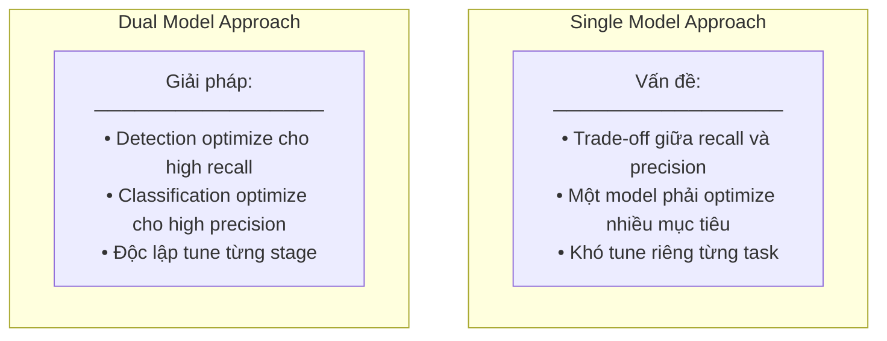
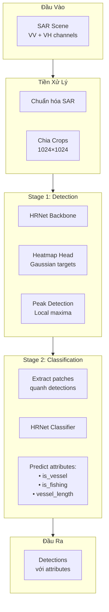
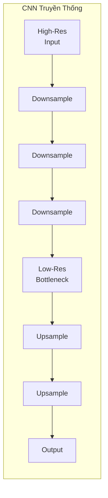
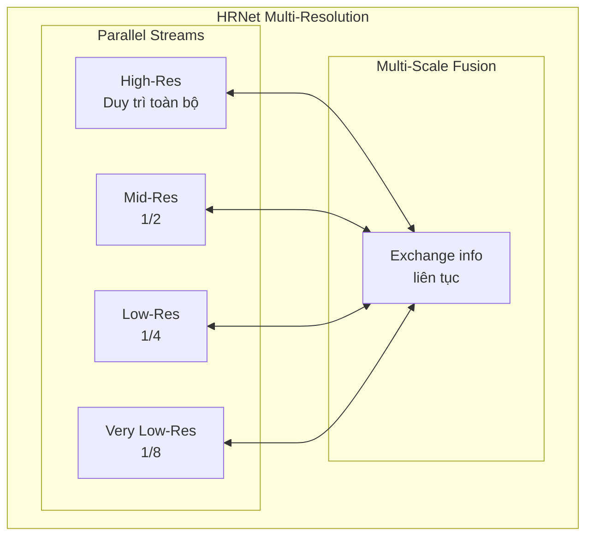
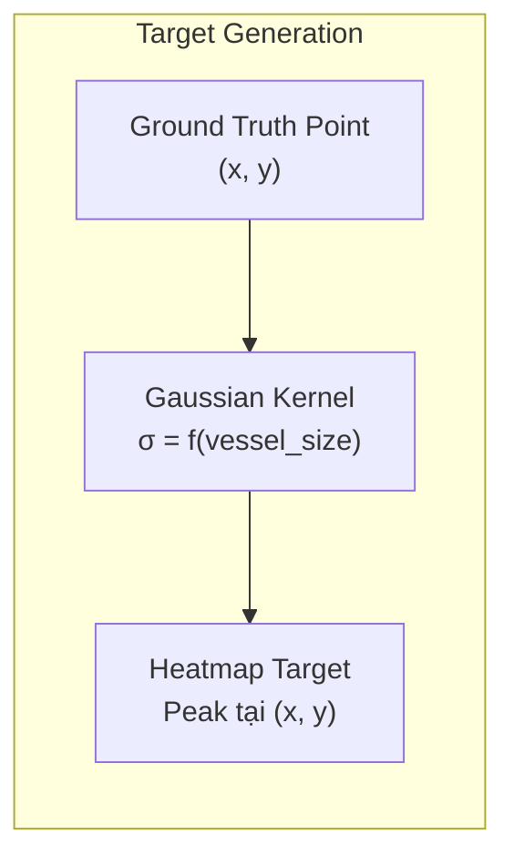
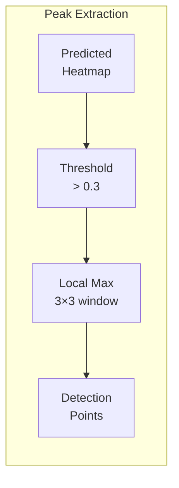
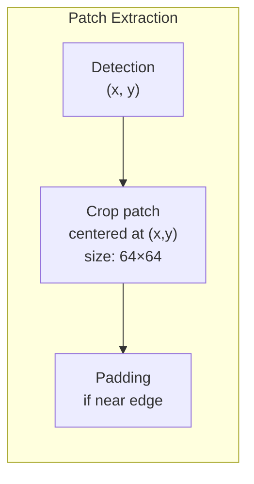
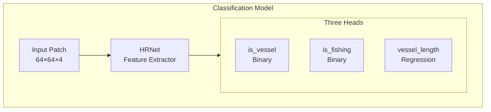
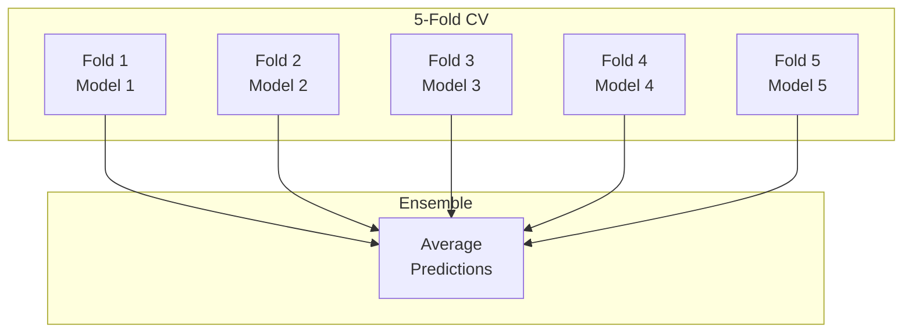
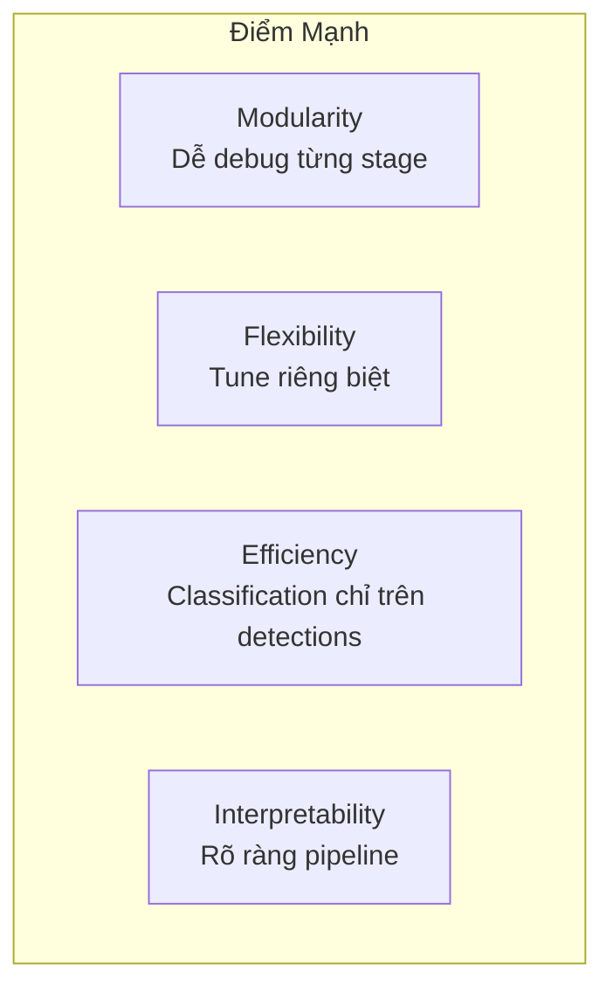

# 6.3.4 Giải Pháp Hạng Ba xView3: Dual-Model Pipeline và HRNet

## Lời Dẫn

Giải pháp hạng ba của Tumenn nổi bật với triết lý thiết kế khác biệt: tách hoàn toàn nhiệm vụ phát hiện và phân loại thành hai mô hình riêng biệt. Trong khi hầu hết các giải pháp khác sử dụng single unified model, Tumenn nhận ra rằng detection và classification có yêu cầu kỹ thuật khác nhau - detection cần context rộng và receptive field lớn, trong khi classification cần chi tiết cục bộ và features discriminative. Kết hợp với HRNet backbone duy trì độ phân giải cao xuyên suốt, giải pháp đạt được sự cân bằng tối ưu giữa recall và precision.

| Thuộc tính | Giá trị |
|-----------|---------|
| **Xếp hạng** | 3/1,900+ đội |
| **Tác giả** | Tumenn |
| **Đóng góp chính** | Dual-model pipeline, HRNet backbone |
| **Phương pháp** | Detection riêng, Classification riêng |
| **Hardware** | RTX 3090 |

---

## 1. Triết Lý Dual-Model

### 1.1 Tại Sao Tách Riêng

### 1.2 So Sánh Yêu Cầu

| Khía cạnh | Detection Model | Classification Model |
|-----------|-----------------|----------------------|
| **Mục tiêu** | Không bỏ sót vessel | Phân loại chính xác |
| **Receptive field** | Lớn (context rộng) | Vừa (chi tiết local) |
| **Output** | High recall | High precision |
| **Input** | Full scene crops | Detected patches |

---

## 2. Pipeline Tổng Thể

### 2.1 Kiến Trúc Hai Giai Đoạn

### 2.2 Lợi Ích Computational

| Aspect | Single Model | Dual Model |
|--------|--------------|------------|
| Detection | Run on full scene | Run on full scene |
| Classification | Run on full scene | **Chỉ run trên detections** |
| Efficiency | Lower | **Higher** |

Classification chỉ chạy trên các detected regions, tiết kiệm đáng kể computation.

---

## 3. HRNet Backbone

### 3.1 Vấn Đề Với CNN Truyền Thống

**Vấn đề**: Mất thông tin spatial qua downsampling, upsampling không recover hoàn toàn.

### 3.2 HRNet Solution

### 3.3 Tại Sao HRNet Phù Hợp SAR Ship Detection

| Đặc điểm HRNet | Lợi ích cho SAR |
|----------------|-----------------|
| **Maintain high-res** | Vessels nhỏ (10-100 pixels) không bị mất |
| **Multi-scale fusion** | Kết hợp global context và local detail |
| **Rich semantics** | Features mạnh cho classification |
| **Spatial precision** | Localization chính xác |

---

## 4. Stage 1: Heatmap-Based Detection

### 4.1 Gaussian Heatmap Targets

Thay vì dùng anchor-based detection, Tumenn sử dụng heatmap regression:

### 4.2 Ưu Điểm Heatmap

| Khía cạnh | Anchor-Based | Heatmap-Based |
|-----------|--------------|---------------|
| **Hyperparameters** | Nhiều anchor configs | Ít (chỉ σ) |
| **Localization** | Discrete | Continuous |
| **Small objects** | Khó tune anchors | Natural fit |
| **Training** | Complex matching | Simple regression |

### 4.3 Peak Detection

Sau khi có heatmap predictions, extract detections qua local maxima:

---

## 5. Stage 2: Classification Pipeline

### 5.1 Patch Extraction

Với mỗi detection từ Stage 1:

### 5.2 Classification Heads

### 5.3 Training Strategy

| Task | Loss | Pos Weight |
|------|------|------------|
| is_vessel | BCE | 5.0 (vessel rare) |
| is_fishing | BCE | 3.0 |
| vessel_length | Smooth L1 | - |

---

## 6. Huấn Luyện

### 6.1 Detection Model

| Hyperparameter | Value |
|----------------|-------|
| **Input size** | 1024×1024 |
| **Batch size** | 8 |
| **Epochs** | 80 |
| **Optimizer** | AdamW |
| **LR** | 0.001 → 0.00001 |
| **Scheduler** | Cosine Annealing |

### 6.2 Classification Model

| Hyperparameter | Value |
|----------------|-------|
| **Input size** | 64×64 |
| **Batch size** | 32 |
| **Epochs** | 50 |
| **Optimizer** | AdamW |
| **LR** | 0.0001 |

### 6.3 K-Fold Cross-Validation

---

## 7. So Sánh Với Các Giải Pháp Khác

### 7.1 Architecture Comparison

| Khía cạnh | Hạng 1 | Hạng 2 | **Hạng 3** |
|-----------|--------|--------|------------|
| **Paradigm** | End-to-end | Segmentation | **Dual-model** |
| **Backbone** | EfficientNet | EfficientNet-V2 | **HRNet** |
| **Pipeline** | Single | Single | **Two-stage** |
| **Focus** | High-res output | Data quality | **Task separation** |

### 7.2 Điểm Mạnh Của Dual-Model

---

## 8. Bài Học Rút Ra

### 8.1 Khi Nào Dùng Dual-Model

1. **Tasks có yêu cầu khác nhau**: Detection cần recall, Classification cần precision

2. **Debug dễ hơn**: Có thể phân tích từng stage độc lập

3. **Computational efficiency**: Khi classification expensive và có thể giới hạn regions

### 8.2 HRNet Cho Dense Prediction

1. **Small objects**: HRNet duy trì high-res, phù hợp với objects nhỏ

2. **SAR imagery**: Đặc tính SAR cần spatial precision cao

3. **Multi-task**: Rich features từ multi-scale fusion phục vụ nhiều tasks

---

## Tài Liệu Tham Khảo

1. Wang, J., et al. (2020). Deep High-Resolution Representation Learning for Visual Recognition. IEEE PAMI.

2. Sun, K., et al. (2019). High-Resolution Representations for Labeling Pixels and Regions. CVPR.

3. Law, H., & Deng, J. (2018). CornerNet: Detecting Objects as Paired Keypoints. ECCV.

---

*Mục tiếp theo sẽ trình bày giải pháp hạng tư của AI2 Skylight với kỹ thuật Self-Training cho SAR vessel detection.*
