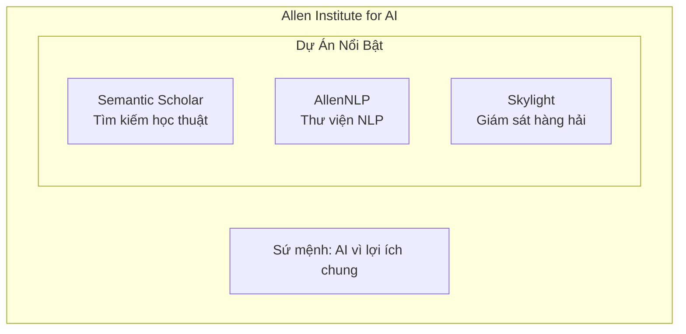
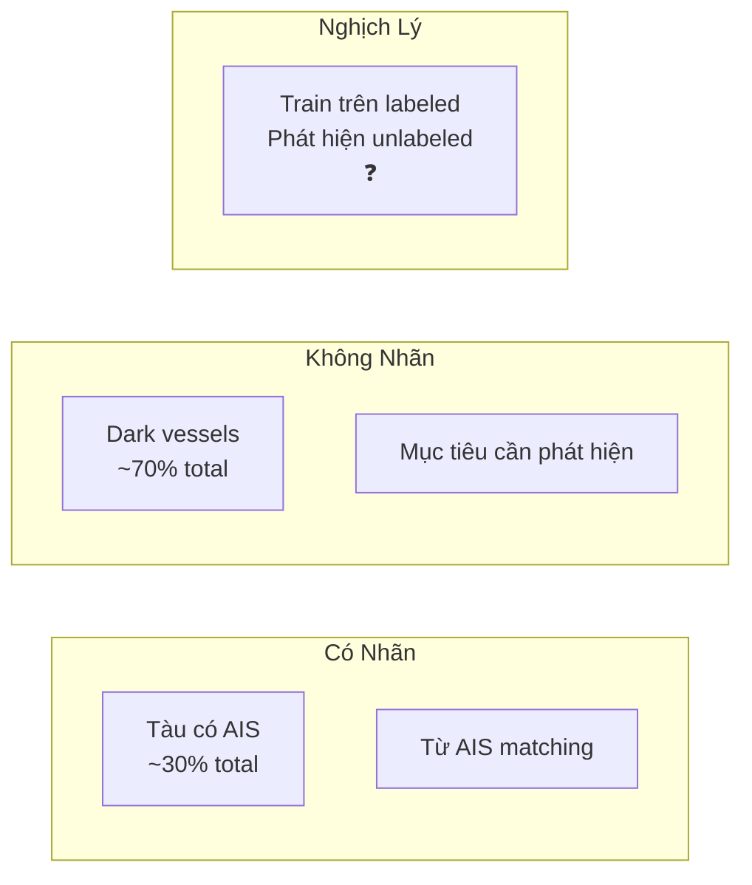
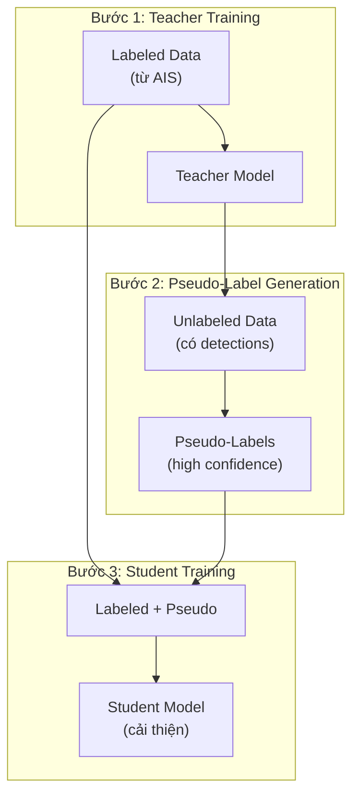
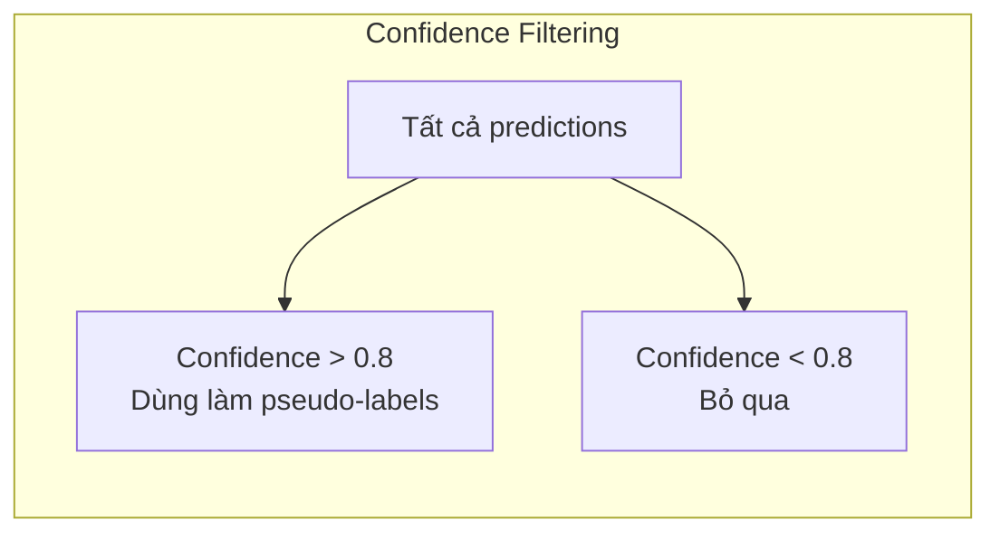
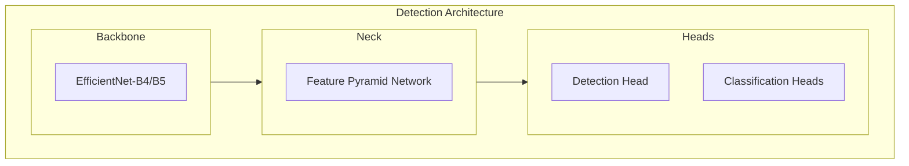
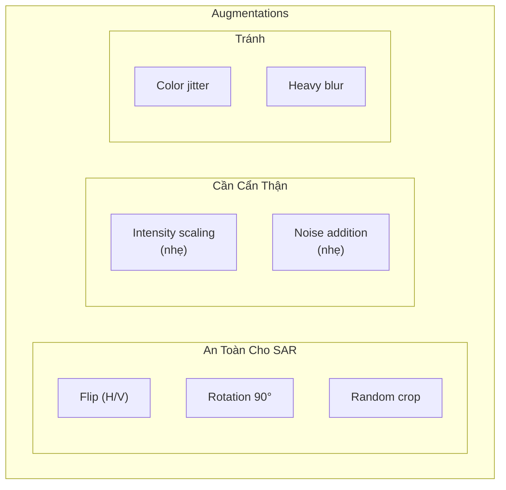
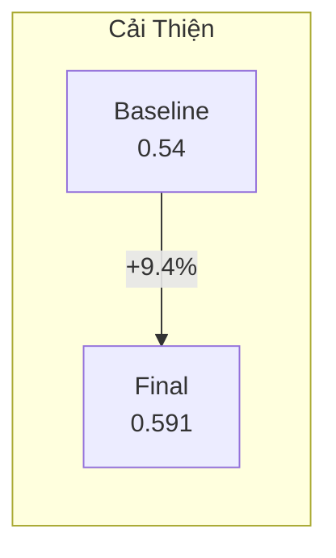
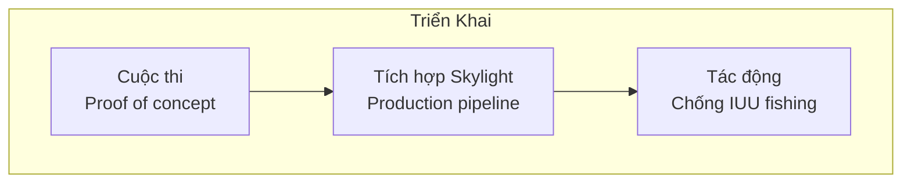
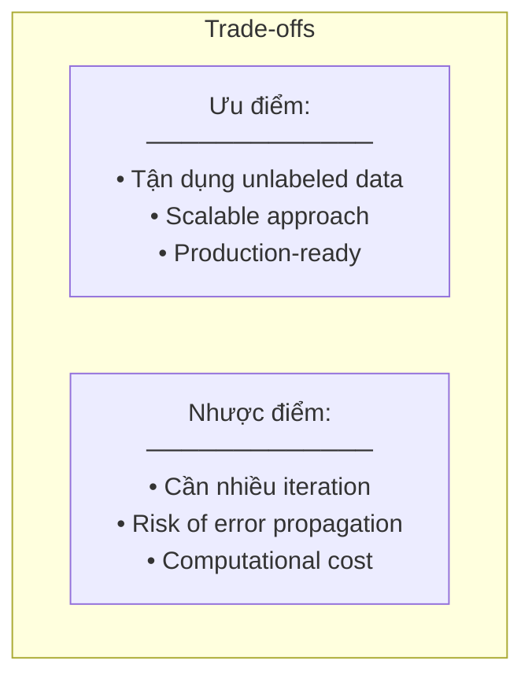

# 6.3.5 Giải Pháp Hạng Tư xView3: Self-Training và AI2 Skylight

## Lời Dẫn

Giải pháp hạng tư đến từ AI2 Skylight - một dự án của Allen Institute for AI - nổi bật không chỉ vì kết quả kỹ thuật mà còn vì đội ngũ đứng sau. AI2 là tổ chức nghiên cứu AI phi lợi nhuận hàng đầu, và dự án Skylight tập trung vào giám sát hàng hải để chống IUU fishing. Điều đặc biệt là giải pháp sử dụng kỹ thuật self-training để tận dụng dữ liệu không có nhãn - chính xác là những "tàu tối" mà cuộc thi hướng đến. Đây cũng là giải pháp đoạt giải đặc biệt dành cho đội đứng đầu tại Mỹ.

| Thuộc tính | Giá trị |
|-----------|---------|
| **Xếp hạng** | 4/1,900+ đội |
| **Tổ chức** | Allen Institute for AI |
| **Dự án** | AI2 Skylight |
| **Giải đặc biệt** | Đội đứng đầu tại Mỹ |
| **Đóng góp chính** | Self-training, Semi-supervised learning |

---

## 1. Bối Cảnh AI2 Skylight

### 1.1 Allen Institute for AI

### 1.2 Dự Án Skylight

Skylight là nền tảng giám sát hàng hải của AI2 với các mục tiêu:

| Mục tiêu | Mô tả |
|----------|-------|
| **IUU Detection** | Phát hiện đánh cá bất hợp pháp |
| **MPA Monitoring** | Giám sát khu bảo tồn biển |
| **Dark Vessel Tracking** | Theo dõi tàu tắt AIS |
| **Policy Support** | Hỗ trợ cơ quan quản lý |

Việc tham gia xView3 phù hợp trực tiếp với sứ mệnh của Skylight.

---

## 2. Thách Thức Nhãn Không Đầy Đủ

### 2.1 Vấn Đề Core

Đây là insight quan trọng nhất: nhãn training được tạo từ AIS, nhưng mục tiêu là phát hiện tàu không có AIS. Đây là nghịch lý vốn có của bài toán.

### 2.2 Self-Training Giải Quyết

AI2 đề xuất: dùng model predictions trên unlabeled data làm pseudo-labels để train tiếp.

---

## 3. Self-Training Pipeline

### 3.1 Ý Tưởng Cốt Lõi

### 3.2 Chi Tiết Các Bước

| Bước | Mô tả | Output |
|------|-------|--------|
| **1. Train Teacher** | Train trên labeled data | Model v1 |
| **2. Generate Pseudo-Labels** | Predict trên unlabeled, lọc high-confidence | Pseudo-labels |
| **3. Combine Data** | Merge labeled + pseudo-labeled | Extended dataset |
| **4. Train Student** | Train trên combined data | Model v2 (improved) |
| **5. Iterate** | Lặp lại nếu cần | Model v3, v4... |

---

## 4. Confidence Filtering

### 4.1 Tại Sao Cần Lọc

Không phải tất cả predictions đều đáng tin cậy. Pseudo-labels từ low-confidence predictions có thể là noise và làm hại training.

### 4.2 Threshold Selection

| Threshold | Pseudo-Labels | Quality | Recall |
|-----------|---------------|---------|--------|
| 0.9 | Ít | Rất cao | Thấp |
| **0.8** | **Vừa** | **Cao** | **Cân bằng** |
| 0.7 | Nhiều | Trung bình | Cao |
| 0.6 | Rất nhiều | Có noise | Rất cao |

Threshold 0.8 được chọn để cân bằng quality và quantity.

---

## 5. Kiến Trúc Detection

### 5.1 Base Architecture

AI2 sử dụng kiến trúc detection tiêu chuẩn với một số modifications:

### 5.2 Multi-Task Heads

| Head | Output | Loss |
|------|--------|------|
| **Detection** | Heatmap | Focal Loss |
| **is_vessel** | Binary | BCE |
| **is_fishing** | Binary | BCE |
| **vessel_length** | Continuous | L1 |

---

## 6. Chiến Lược Augmentation

### 6.1 SAR-Specific Augmentations

### 6.2 Lý Do

| Augmentation | Lý do an toàn/nguy hiểm |
|--------------|------------------------|
| Flip | SAR invariant dưới rotation |
| Color jitter | SAR intensity có ý nghĩa vật lý |
| Heavy blur | Có thể xóa small vessels |

---

## 7. Kết Quả Self-Training

### 7.1 Cải Thiện Qua Iterations

| Round | F1 Detection | Overall Score |
|-------|--------------|---------------|
| Baseline (no self-training) | 0.65 | 0.54 |
| Round 1 | 0.68 | 0.57 |
| Round 2 | 0.70 | 0.59 |
| **Final** | **0.70** | **0.591** |

### 7.2 Đóng Góp Từ Self-Training

Self-training mang lại cải thiện 9.4% overall score.

---

## 8. Ý Nghĩa Rộng Hơn

### 8.1 Triển Khai Thực Tế

Khác với các giải pháp khác chỉ tập trung vào cuộc thi, AI2 có kế hoạch triển khai thực tế:

### 8.2 Đối Tác Chính Phủ

AI2 Skylight làm việc với:
- U.S. Coast Guard
- National Oceanic and Atmospheric Administration (NOAA)
- Các cơ quan quản lý nghề cá quốc tế

---

## 9. So Sánh Với Các Giải Pháp Khác

### 9.1 Điểm Khác Biệt

| Khía cạnh | Các đội khác | AI2 Skylight |
|-----------|--------------|--------------|
| **Focus** | Competition score | Real-world deployment |
| **Training** | Supervised only | **Semi-supervised** |
| **Unlabeled data** | Không dùng | **Tận dụng** |
| **Long-term** | One-off | Continuous improvement |

### 9.2 Trade-offs

---

## 10. Bài Học Rút Ra

### 10.1 Về Semi-Supervised Learning

1. **Unlabeled data có giá trị**: Đặc biệt khi labeled data bias (như trường hợp AIS-only labels)

2. **Confidence filtering quan trọng**: Threshold phù hợp để balance quality/quantity

3. **Iterative refinement**: Có thể lặp nhiều rounds nếu có đủ compute

### 10.2 Về Triển Khai Thực Tế

1. **Mission alignment**: Chọn bài toán phù hợp với mục tiêu tổ chức

2. **Beyond competition**: Nghĩ đến production từ đầu

3. **Partnership**: Làm việc với end-users (coast guard, agencies)

---

## Tài Liệu Tham Khảo

1. Lee, D. H. (2013). Pseudo-Label: The Simple and Efficient Semi-Supervised Learning Method. ICML Workshop.

2. Xie, Q., et al. (2020). Self-Training with Noisy Student Improves ImageNet Classification. CVPR.

3. AI2 Skylight. Maritime Domain Awareness Platform. Allen Institute for AI.

---

*Mục tiếp theo sẽ trình bày giải pháp hạng năm với kỹ thuật Multi-Scale Ensemble và Attention Mechanisms.*
